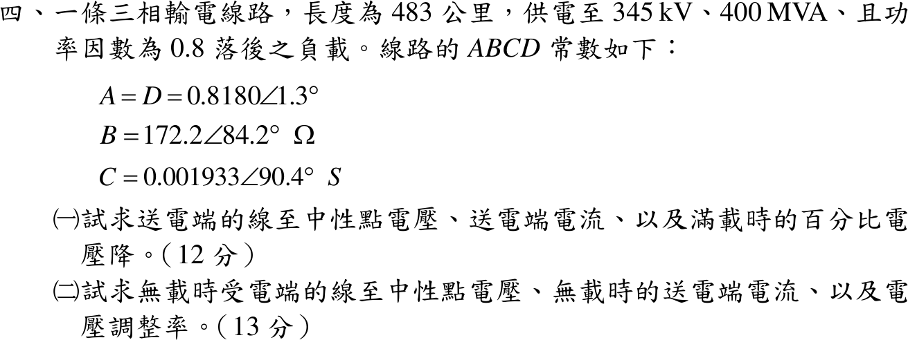

# 111 年第 4 題｜長程輸電線 ABCD 參數與送受電端量

## 已知與所求

483 km 三相線路，受電端 345 kV、400 MVA、pf 0.8 落後。\(A=D=0.8180\angle1.3^\circ\)，\(B=172.2\angle84.2^\circ\ \Omega\)，\(C=0.001933\angle90.4^\circ\ \mathrm S\)。求（一）滿載送電端相電壓、送電端電流、百分比電壓降；（二）無載受電端相電壓、無載送電端電流、電壓調整率。

## 考場標準作答

每相計算，以 \(V_R\) 為參考：
\[
V_R=\frac{345}{\sqrt3}=199.186\angle0^\circ\ \mathrm{kV},\qquad
I_R=\frac{400\times10^6}{\sqrt3(345\times10^3)}\angle-36.87^\circ=669.39\angle-36.87^\circ\ \mathrm A
\]

### （一）滿載

\[
\boxed{V_S=AV_R+BI_R=241.02+j88.45=256.74\angle20.15^\circ\ \mathrm{kV}}
\]
（線電壓 \(\sqrt3\times256.74=444.7\) kV）
\[
\boxed{I_S=CV_R+DI_R=442.70+j66.50=447.67\angle8.54^\circ\ \mathrm A}
\]
\[
\boxed{\%VD=\frac{|V_S|-|V_R|}{|V_R|}\times100\%=\frac{256.74-199.19}{199.19}\times100\%=28.89\%}
\]

### （二）無載

送電端電壓維持 \(V_S\)，\(I_R=0\) 時 \(V_S=AV_{R,NL}\)：
\[
\boxed{V_{R,NL}=\frac{V_S}{A}=313.86\angle18.85^\circ\ \mathrm{kV}}
\]
\[
\boxed{I_{S,NL}=CV_{R,NL}=606.69\angle109.25^\circ\ \mathrm A}
\]
\[
\boxed{VR=\frac{|V_{R,NL}|-|V_{R,FL}|}{|V_{R,FL}|}\times100\%=\frac{313.86-199.19}{199.19}\times100\%=57.57\%}
\]

## 驗算

互易線路 \(AD-BC=0.9998\approx1\)；以反矩陣 \(V_R=DV_S-BI_S\)、\(I_R=-CV_S+AI_S\) 回代滿載結果，得回 \(199.19\angle0^\circ\) kV 與 \(669.4\angle-36.87^\circ\) A。送電端三相實功率 \(3\,\mathrm{Re}(V_SI_S^*)=337.7\) MW 大於受電端 320 MW，差值為線路損失，方向合理。

## 失分點

- \(V_R\) 必須用相電壓 \(345/\sqrt3\)；直接代 345 kV 會把 \(V_S\) 放大 \(\sqrt3\) 倍。
- 無載時送電端電壓不變，\(V_{R,NL}=V_S/A\)，不是 \(V_S\) 本身；長線路的 \(|A|<1\) 使無載受電端電壓升高（Ferranti 效應）。
- 落後功因的 \(I_R\) 角度為 \(-36.87^\circ\)，取正號會使 \(|V_S|\) 明顯偏小。
