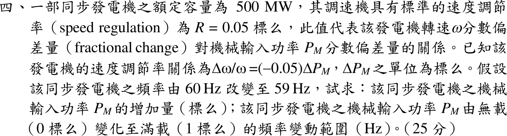

# 113 年電力系統第 4 題｜速度調節率

## 考場標準作答

\(\Delta\omega/\omega=(59-60)/60=-1/60\)，代入 \(\Delta\omega/\omega=-0.05\Delta P_M\)：
\[
\boxed{\Delta P_M=\frac{1/60}{0.05}=0.3333\ \mathrm{pu}}\ (=166.7\ \mathrm{MW})
\]
無載至滿載 \(\Delta P_M=1\)：\(\Delta f=0.05(60)\)，
\[
\boxed{\Delta f=3\ \mathrm{Hz}}
\]
若無載運轉於 60 Hz，滿載降至 57 Hz。

## 驗算

下垂斜率 \(Rf_0=3\) Hz/pu，降 1 Hz 對應 \(1/3=0.3333\) pu。
