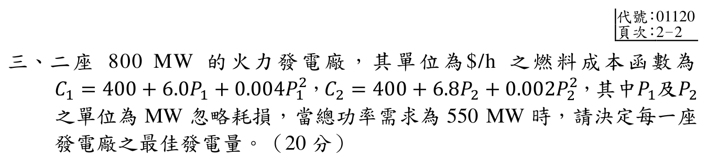

# 114 年電力系統第 3 題：經濟調度

## 考場標準作答

忽略損失時，最佳調度滿足增量成本相等及功率平衡：
\[
\frac{dC_1}{dP_1}=6+0.008P_1,
\qquad
\frac{dC_2}{dP_2}=6.8+0.004P_2,
\qquad P_1+P_2=550.
\]
令兩者相等，代入 \(P_2=550-P_1\)：
\[
6+0.008P_1=6.8+0.004(550-P_1)=9-0.004P_1,
\]
\[
\boxed{P_1=250\ \mathrm{MW}},\qquad
\boxed{P_2=300\ \mathrm{MW}}.
\]
共同增量成本為
\[
\boxed{\lambda=8\ \$/\mathrm{MWh}}.
\]

## 得分點拆解

- 從兩個燃料成本函數正確微分，保留 \(\$/\mathrm{MWh}\) 單位。
- 寫出忽略損失時的等增量成本條件。
- 與 \(P_1+P_2=550\ \mathrm{MW}\) 聯立，不可只靠平均分配。
- 回代檢查兩座機組均在 0–800 MW 可行範圍內，且共同增量成本均為 8。

## 完整教學推導

官方裁切圖給定兩座 800 MW 火力機組的成本函數（\(P_1,P_2\) 以 MW 計）：
\[
C_1=400+6.0P_1+0.004P_1^2,
\qquad
C_2=400+6.8P_2+0.002P_2^2.
\]
總需求為 550 MW，且忽略輸電損失。由拉格朗日條件或等增量成本原理，內點最佳解需滿足
\[
6+0.008P_1=6.8+0.004P_2.
\]
功率平衡給出 \(P_2=550-P_1\)，所以
\[
6+0.008P_1=6.8+0.004(550-P_1)
=9-0.004P_1.
\]
因此 \(0.012P_1=3\)，得 \(P_1=250\ \mathrm{MW}\)，進而 \(P_2=300\ \mathrm{MW}\)。
兩台的增量成本分別為
\[
6+0.008(250)=8,
\qquad 6.8+0.004(300)=8\quad(\$/\mathrm{MWh}).
\]
若需總成本，
\[
C_1=400+6(250)+0.004(250)^2=2150\ \$/h,
\]
\[
C_2=400+6.8(300)+0.002(300)^2=2620\ \$/h,
\]
\[
C_{total}=4770\ \$/h.
\]
因二階導數 \(0.008,0.004>0\)，成本函數為凸函數；所得內點符合容量限制，故為全域最小解。

## 獨立驗算

功率平衡：
\[
250+300=550\ \mathrm{MW}.
\]
增量成本回代：
\[
\frac{dC_1}{dP_1}=6+0.008(250)=8,
\qquad
\frac{dC_2}{dP_2}=6.8+0.004(300)=8\ \$/\mathrm{MWh}.
\]
兩台容量均為 800 MW，故 \(0\le250,300\le800\)；凸性又排除更低的可行內點。官方裁切來源為 `依考科分類/05_電力系統/images/questions/PE_114年_電力系統_Q03.png`。

## 常見失分

- 將二次項微分時漏掉係數 2。
- 忘記忽略損失時是 \(P_1+P_2=550\)，而不是各自等於 550。
- 把成本函數值 \(C_i\) 與增量成本 \(dC_i/dP_i\) 混為一談。
- 只寫等增量成本卻不檢查容量範圍與功率平衡。
