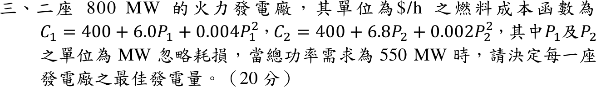

# 114 年電力系統第 3 題｜經濟調度

## 已知與所求

\(C_1=400+6.0P_1+0.004P_1^2\)、\(C_2=400+6.8P_2+0.002P_2^2\)（\(\$/\mathrm h\)，\(P\) 以 MW 計），兩廠各 800 MW，總需求 550 MW，忽略耗損。求兩廠最佳發電量。

## 考場標準作答

等增量成本與功率平衡：
\[
6+0.008P_1=6.8+0.004P_2,\qquad P_1+P_2=550
\]
代入 \(P_2=550-P_1\) 得 \(6+0.008P_1=9-0.004P_1\)：
\[
\boxed{P_1=250\ \mathrm{MW}},\qquad \boxed{P_2=300\ \mathrm{MW}}
\]
共同增量成本 \(\lambda=6+0.008(250)=8\ \$/\mathrm{MWh}\)；成本函數凸且兩解均在 0–800 MW 內，故為全域最小。

## 驗算

\(6.8+0.004(300)=8=\lambda\)，\(250+300=550\)。

## 失分點

- 兩個二次項都漏乘 2（寫成 \(6+0.004P_1=6.8+0.002P_2\)）會得 \(P_1=316.7,\ P_2=233.3\ \mathrm{MW}\)。
- 平均分配 275／275 MW 時 \(\lambda_1=8.2\neq\lambda_2=7.9\)，不是最佳解。
