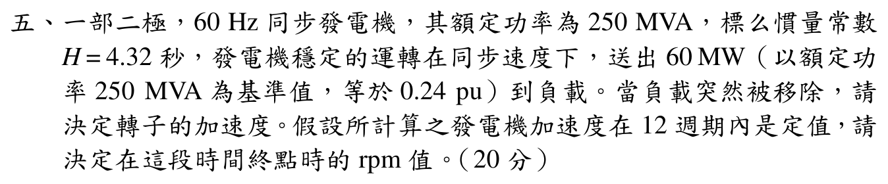

# 114 年電力系統第 5 題：搖擺方程式

## 考場標準作答

負載移除後，機械輸入暫時不變而電氣輸出為 0，故加速功率
\[
P_a=P_m-P_e=0.24-0=0.24\,\mathrm{pu}.
\]
同步電氣角速度 \(\omega_s=2\pi f=120\pi\,\mathrm{rad/s}\)，由搖擺方程
\[
\boxed{\alpha=\frac{\omega_s}{2H}P_a
=\frac{120\pi}{2(4.32)}(0.24)
=\frac{10\pi}{3}
=10.472\,\mathrm{rad/s^2}}.
\]
二極、60 Hz 的同步轉速為
\[
N_s=\frac{120f}{P}=3600\,\mathrm{rpm}.
\]
角加速度換成轉速加速度：
\[
\frac{dN}{dt}=\alpha\frac{60}{2\pi}=100\,\mathrm{rpm/s}.
\]
12 週期所需時間為 \(t=12/60=0.2\,\mathrm s\)，故
\[
\boxed{N(0.2)=3600+(100)(0.2)=3620\,\mathrm{rpm}}.
\]

## 得分點拆解

- 負載突然移除後取 \(P_e=0\)，而原動機機械輸入在短時間內仍為 \(P_m=0.24\,\mathrm{pu}\)。
- 在 250 MVA 額定基準下直接使用題給的 \(0.24\,\mathrm{pu}\)，不再重複換基準。
- 寫出搖擺方程 \(2H\alpha/\omega_s=P_a\)，並使用 \(\omega_s=2\pi60\)。
- 二極機同步轉速為 3600 rpm；將 \(\mathrm{rad/s^2}\) 正確換成 \(\mathrm{rpm/s}\)。
- 12 週期是 \(0.2\,\mathrm s\)，再用等加速度求終點轉速。

## 完整教學推導

慣量常數的搖擺方程可寫成
\[
\frac{2H}{\omega_s}\frac{d^2\delta}{dt^2}=P_m-P_e=P_a.
\]
卸除負載前，發電機穩態送出 \(60\,\mathrm{MW}\)，因此
\[
P_m=P_e=\frac{60}{250}=0.24\,\mathrm{pu}.
\]
負載突然移除的瞬間，調速機尚未改變機械輸入，但 \(P_e\) 降為 0，故
\[
P_a=0.24\,\mathrm{pu}.
\]
代入 \(H=4.32\,\mathrm s\) 與 \(\omega_s=120\pi\,\mathrm{rad/s}\)：
\[
\frac{d^2\delta}{dt^2}
=\frac{\omega_sP_a}{2H}
=\frac{(120\pi)(0.24)}{8.64}
=\frac{10\pi}{3}\,\mathrm{rad/s^2}.
\]

由於題目假設 12 週期內加速度不變，轉速增量可直接由
\[
\Delta\omega=\alpha t
=\frac{10\pi}{3}(0.2)
=\frac{2\pi}{3}\,\mathrm{rad/s}
\]
求得。換算為 rpm：
\[
\Delta N=\Delta\omega\frac{60}{2\pi}=20\,\mathrm{rpm}.
\]
故終點轉速為 \(3600+20=3620\,\mathrm{rpm}\)。

## 獨立驗算

直接先將角加速度換算：
\[
10.472\frac{\mathrm{rad}}{\mathrm{s^2}}
\left(\frac{60\,\mathrm{rpm}}{2\pi\,\mathrm{rad/s}}\right)
=100\,\mathrm{rpm/s}.
\]
在 \(0.2\,\mathrm s\) 內增加 20 rpm，與完整推導一致。

另由等加速度可得 12 週期內轉子相對同步軸的角位移
\[
\Delta\delta=\frac12\alpha t^2
=\frac12\left(\frac{10\pi}{3}\right)(0.2)^2
=\frac\pi{15}\,\mathrm{rad}=12^\circ,
\]
其微分終值正是 \(\Delta\omega=2\pi/3\,\mathrm{rad/s}\)，兩者自洽。

## 常見失分

- 負載移除後把 \(P_m\) 也立即設成 0，因而錯算成無加速度。
- 將 \(H=4.32\,\mathrm s\) 當成機械時間常數，未使用搖擺方程的 \(2H\)。
- 把 12 週期誤當 12 秒，或誤算成 \(12/3600\) 秒。
- 忘記本題是二極機，誤用 1800 rpm 當同步轉速。
- 把 \(10.472\,\mathrm{rad/s^2}\) 直接加到 rpm，混用角速度與轉速單位。
