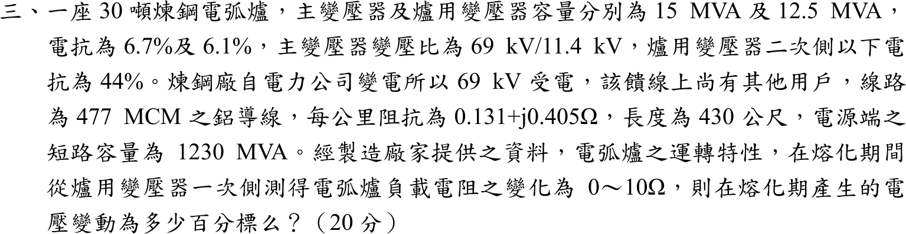
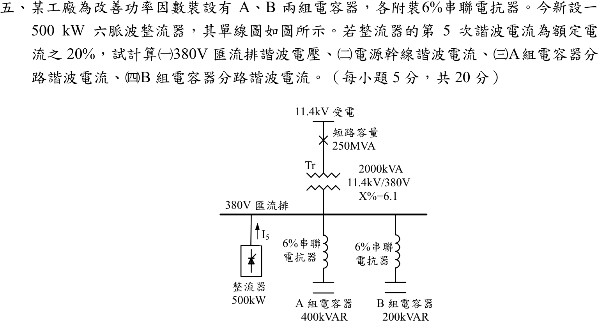

# 📝 104 年電機工程技師｜工業配電逐題詳解

> 本頁由題級 canonical 筆記組合；每題保留官方裁切圖、校驗狀態與可追溯的推導。

## 題目導覽
- [[#一、104 年第 1 題｜供電方式與責任分界（規章版校驗）|第 1 題：供電方式與責任分界（規章版校驗）]]
- [[#二、104 年工業配電第 2 題｜參差因數與線路損失容量設計|第 2 題：參差因數與線路損失容量設計]]
- [[#三、104 年工業配電第 3 題｜電弧爐熔化期電壓變動|第 3 題：電弧爐熔化期電壓變動]]
- [[#四、104 年工業配電第 4 題｜短路容量與對稱成分等效阻抗|第 4 題：短路容量與對稱成分等效阻抗]]
- [[#五、104 年工業配電第 5 題｜六脈波整流器第 5 次諧波|第 5 題：六脈波整流器第 5 次諧波]]

---

## 一、104 年第 1 題｜供電方式與責任分界（規章版校驗）

> 題級識別：EE-104-06-1
> canonical 來源：[[canonical/EE-104-06-1.md]]
> 題級校驗狀態：verified

### 已知與所求

（一）說明台電高壓及特高壓用戶的供電方式，以及供電方式依什麼決定（16 分）；（二）說明責任分界點（4 分）。

### 考場標準作答

#### （一）供電方式與決定因素

| 類別 | 常見電壓（三相三線） | 用戶端設備 |
| --- | --- | --- |
| 高壓 | 11.4 kV、22.8 kV（部分地區 3.3 kV） | 自備受電站與主變壓器，降至 380／220 V 或其他利用電壓 |
| 特高壓 | 69 kV、161 kV 以上 | 自備變電所（一次變電），多採專用線路 |

供電方式由下列條件綜合核定，非單看一個容量門檻：

1. **契約容量與最大需量**：容量愈大，愈需提高供電電壓或設專用線路。
2. **負載特性**：大型馬達啟動、電弧爐等衝擊負載，以及功率因數、電壓變動、諧波要求，可能須提高電壓等級或設專用饋線。
3. **供電地區與系統條件**：附近線路電壓與容量、短路容量、路權、工程成本與期程。
4. **可靠度需求**：單路、雙路、備用或二次側經常並聯等，由供電契約與核准圖說載明。

\[
\boxed{\text{供電方式}=f(\text{契約容量、負載特性、地區系統條件、可靠度})}
\]

#### （二）責任分界點

責任分界點是台電供電設備與用戶用電設備在**所有權、操作維護與事故責任**上的界面：上游（電源側）由台電負責，下游（負載側）由用戶負責，並須設置可安全隔離的開關設備。實際位置依供電契約與核准單線圖而定，常見於引接線終端、受電站進線開關或計量設備端子。

\[
\boxed{\text{責任分界點}=\text{台電與用戶設備在所有權、操作維護與事故責任上的界面}}
\]

### 驗算

以功因 0.9 概估線電流，歷史參考門檻（11.4 kV、5,000 kW；22.8 kV、10,000 kW）對應的電流相同：
\[
\frac{5000}{\sqrt3(11.4)(0.9)}=\frac{10000}{\sqrt3(22.8)(0.9)}\approx 281\ \mathrm{A}
\]
可見提高電壓等級是為了讓線路電流與電壓降維持在可供電範圍，與「容量、負載特性」決定供電方式的敘述一致。

### 失分點

- 只列電壓等級而未說明「契約容量、負載特性、地區條件、可靠度」才是決定因素。
- 把責任分界點寫成固定的「電表位置」，未說明以契約與核准圖說為準，也未交代上、下游的責任歸屬。

### 條件與疑義

本題屬規章申論，容量門檻隨公告版本、地區網路與特殊負載條款變動，不可脫離當年度規章硬套；分界點的實際位置因供電方式與契約而異。因此作答採規章中性答案，不寫唯一的門檻數字或位置。

---

## 二、104 年工業配電第 2 題｜參差因數與線路損失容量設計

> 題級識別：EE-104-06-2
> canonical 來源：[[canonical/EE-104-06-2.md]]
> 題級校驗狀態：needs_manual_review
> [!WARNING] 本題仍有官方資料缺口或事件定義歧義；請以 canonical 條件式解答為準。

### 已知與所求

三相配電線路，馬達與電燈負載間參差因數 \(1.1\)，配電線路電力損失 \(10\%\)。裝接負載表：

| 負載 | 設備容量 | 需量因數 | 參差因數 | 功因（滯後） |
| --- | --- | --- | --- | --- |
| 電燈 | 150 kW | 100% | 3 | 0.95 |
| 馬達 | 200 kW | 100% | 2 | 0.80 |

求變電站應備 kVA 容量（20 分）。

### 考場標準作答

各類負載的最大需量 \(=\) 設備容量 \(\times\) 需量因數 \(\div\) 該類參差因數：
\[
P_L=\frac{150(1.0)}{3}=50\ \mathrm{kW},\quad Q_L=50\tan(\cos^{-1}0.95)=16.434\ \mathrm{kvar}
\]
\[
P_M=\frac{200(1.0)}{2}=100\ \mathrm{kW},\quad Q_M=100\tan(\cos^{-1}0.80)=75\ \mathrm{kvar}
\]
兩類負載的最大需量相加（複數功率）：
\[
S_{sum}=\sqrt{(50+100)^2+(16.434+75)^2}=175.67\ \mathrm{kVA}
\]
電燈與馬達間參差因數 1.1，同時最大需量：
\[
S_{coin}=\frac{175.67}{1.1}=159.70\ \mathrm{kVA}
\]
線路損失為變電站輸出功率的 10%，變電站容量：
\[
\boxed{S_{sub}=\frac{159.70}{1-0.10}=177.45\ \mathrm{kVA}}
\]
向上取標準容量（例如 200 kVA）。

### 驗算

分別算 kW 與 kvar：
\[
P=\frac{150}{1.1(0.9)}=151.52\ \mathrm{kW},\quad Q=\frac{91.434}{1.1(0.9)}=92.36\ \mathrm{kvar},\quad
\sqrt{P^2+Q^2}=177.45\ \mathrm{kVA}
\]
上限檢查：各負載 kVA 直接相加 \((50/0.95+100/0.80)/0.99=179.4\ \mathrm{kVA}\) 大於 177.45，符合「相量和不大於算術和」。

### 失分點

- 漏用表內參差因數 3 與 2、以 350 kW 的設備容量直接計算，會得約 407 kVA，為正確值的 2.3 倍。
- 將電燈與馬達的 kVA 以算術和相加（\(50/0.95+100/0.80\)，再除 \(1.1\times0.9\) 得 179.4 kVA），忽略兩者功因角不同，結果偏大。
- 1.1 是參差因數，須除而非乘；誤乘會得 \(175.67\times1.1/0.9=214.7\ \mathrm{kVA}\)，反而偏大。

### 條件與疑義

1. 題目未定義表內「參差因數 3、2」；本解採通用定義：參差因數 \(=\) 各負載最大需量總和 \(\div\) 該群同時最大需量，故表內值為各類負載內部的參差因數，1.1 為電燈與馬達兩群之間的參差因數。
2. 「電力損失 10%」未說明分母。本解取變電站輸出的 10%（\(\div0.9\)）；若指負載端需量的 10%（\(\times1.1\)），則為 \(159.70\times1.1=175.67\ \mathrm{kVA}\)。

---

## 三、104 年工業配電第 3 題｜電弧爐熔化期電壓變動

> 題級識別：EE-104-06-3
> canonical 來源：[[canonical/EE-104-06-3.md]]
> 題級校驗狀態：verified

### 已知與所求

30 噸煉鋼電弧爐；主變壓器 \(15\,\mathrm{MVA}\)、\(X=6.7\%\)、\(69/11.4\,\mathrm{kV}\)；爐用變壓器 \(12.5\,\mathrm{MVA}\)、\(X=6.1\%\)，二次側以下電抗 \(44\%\)。69 kV 饋線 477 MCM 鋁線、\(0.131+j0.405\,\Omega/\mathrm{km}\)、長 430 m；電源端短路容量 \(1230\,\mathrm{MVA}\)。熔化期電弧爐電阻在爐變一次側量測為 \(0\sim10\,\Omega\)。求熔化期電壓變動百分標么值。

### 考場標準作答

取 \(S_b=15\,\mathrm{MVA}\)：\(Z_{b,69}=69^2/15=317.4\,\Omega\)，\(Z_{b,11.4}=11.4^2/15=8.664\,\Omega\)。

上游阻抗（電源＋線路＋主變，到爐變一次側匯流排）：
\[
Z_{up}=\frac{0.43(0.131+j0.405)}{317.4}+j\left(\frac{15}{1230}+0.067\right)=0.0001775+j0.0797438\ \mathrm{pu}
\]
爐變與其二次側以下電抗換至 15 MVA 基準：
\[
X_{down}=(0.061+0.44)\frac{15}{12.5}=0.6012\ \mathrm{pu}
\]
電弧電阻 \(R_{pu}=R/8.664\)，匯流排電壓（電源 \(1\angle0^\circ\,\mathrm{pu}\)）：
\[
V(R)=\frac{R_{pu}+jX_{down}}{Z_{up}+R_{pu}+jX_{down}}
\]
\[
|V(0)|=0.882892,\qquad |V(10)|=\frac{|1.154201+j0.6012|}{|1.154379+j0.680944|}=\frac{1.30139}{1.34025}=0.971006
\]
\[
\boxed{\Delta V=0.971006-0.882892=0.088114\ \mathrm{pu}=8.81\%}
\]

### 驗算

歐姆法（11.4 kV 側）：\(Z_{up}=0.001538+j0.69090\,\Omega\)，\(X_{down}=5.2088\,\Omega\)。
\[
|V(0)|=\frac{5.2088}{|0.001538+j5.8997|}=0.88289,\qquad
|V(10)|=\frac{|10+j5.2088|}{|10.0015+j5.8997|}=\frac{11.2753}{11.6119}=0.97101
\]
忽略線路電阻只取 \(jX_{up}\) 時 \(\Delta V=8.82\%\)，與 8.81% 相差 0.01 個百分點，線路電阻影響可忽略但保留較完整。

### 失分點

- 430 m 未換成 0.43 km；短路容量 1230 MVA 直接當阻抗，未用 \(X=S_b/S_{sc}\)。
- 44% 與 6.1% 只取其一；兩者皆為爐用變壓器（12.5 MVA）基準，須同乘 \(15/12.5\) 後相加。
- 10 Ω 以 69 kV 側基準換算，或只比較電壓的實部而未取大小。

### 條件與疑義

量測點取爐變一次側（主變 11.4 kV 側）匯流排；電源視為理想電壓源串聯短路電抗，忽略故障前負載電流；電壓變動定義為 \(R=10\,\Omega\) 與 \(R=0\) 兩端的電壓大小差。電抗與電阻依題意視為「44% 在爐變二次側以下」且「電阻在爐變一次側量測」，若改以 44% 已含爐變漏抗，結果會不同（約 10.41%）。

題幹提到 69 kV 饋線上尚有其他用戶，若改以 69 kV 受電點（公共耦合點，電源電抗之後、線路之前）計算，\(|V(0)|=0.98209\)、\(|V(10)|=0.99541\)，\(\Delta V\approx1.33\%\)。本解取 11.4 kV 匯流排為主解，因為電弧電阻在爐用變壓器一次側量測，該匯流排即爐變供電點，也是電弧爐電壓閃爍最直接的量測位置。

---

## 四、104 年工業配電第 4 題｜短路容量與對稱成分等效阻抗

> 題級識別：EE-104-06-4
> canonical 來源：[[canonical/EE-104-06-4.md]]
> 題級校驗狀態：verified

### 已知與所求

供電電壓 \(22.8\,\mathrm{kV}\)，三相短路容量 \(448\,\mathrm{MVA}\)，單相（接地）短路容量 \(470\,\mathrm{MVA}\)；電阻忽略。求正序、負序、零序等效阻抗。

### 考場標準作答

三相短路只含正序：\(S_{3\phi}=V_{LL}^2/Z_1\)，且靜止網路 \(Z_2=Z_1\)：
\[
\boxed{Z_1=Z_2=\frac{22.8^2}{448}=j1.16036\ \Omega}
\]
單相接地短路 \(I_f=\dfrac{3V_\phi}{Z_1+Z_2+Z_0}\)，\(S_{1\phi}=\sqrt3V_{LL}I_f=\dfrac{3V_{LL}^2}{Z_1+Z_2+Z_0}\)：
\[
Z_1+Z_2+Z_0=\frac{3(22.8)^2}{470}=3.31813\ \Omega
\]
\[
\boxed{Z_0=3.31813-2(1.16036)=j0.99741\ \Omega}
\]

### 驗算

取 \(S_b=100\,\mathrm{MVA}\)：\(X_1=X_2=100/448=0.223214\,\mathrm{pu}\)，\(X_0=300/470-2(0.223214)=0.191869\,\mathrm{pu}\)；\(Z_b=22.8^2/100=5.1984\,\Omega\)，故 \(Z_1=0.223214(5.1984)=1.16036\,\Omega\)，\(Z_0=0.191869(5.1984)=0.99741\,\Omega\)，與歐姆法一致。

### 失分點

- 單相短路容量漏掉因數 3（寫成 \(V^2/S_{1\phi}\)），會得 \(Z_1+Z_2+Z_0=1.106\,\Omega<2Z_1\)，零序為負值，不合理。
- 把三相短路容量用 \(V_{LL}^2/S\) 時誤用相電壓。

### 條件與疑義

單相短路容量依 \(S_{1\phi}=\sqrt3V_{LL}I_f\) 定義，其中 \(I_f\) 為單相接地短路電流。

---

## 五、104 年工業配電第 5 題｜六脈波整流器第 5 次諧波

> 題級識別：EE-104-06-5
> canonical 來源：[[canonical/EE-104-06-5.md]]
> 題級校驗狀態：needs_manual_review
> [!WARNING] 本題仍有官方資料缺口或事件定義歧義；請以 canonical 條件式解答為準。

### 已知與所求

380 V 匯流排；電源 11.4 kV、短路容量 \(250\,\mathrm{MVA}\)；變壓器 \(2000\,\mathrm{kVA}\)、\(11.4\,\mathrm{kV}/380\,\mathrm V\)、\(X=6.1\%\)；A 組電容器 \(400\,\mathrm{kvar}\)、B 組 \(200\,\mathrm{kvar}\)，各串聯 6% 電抗器；新設 500 kW 六脈波整流器，第 5 次諧波電流為額定電流的 20%。求（一）匯流排諧波電壓、（二）電源幹線諧波電流、（三）A 組、（四）B 組分路諧波電流（各 5 分）。

基準分支（題目未給功因與效率，詳見「條件與疑義」）：500 kW 為 AC 側有功輸入、\(\mathrm{pf}_1=1\)，電阻忽略。

### 考場標準作答

基準 \(S_b=2\,\mathrm{MVA}\)、\(V_b=380\,\mathrm V\)：\(I_b=\dfrac{2\times10^6}{\sqrt3(380)}=3038.69\ \mathrm A\)。

第 5 次諧波阻抗（電感 \(\times h\)、電容 \(\div h\)，\(X_C=V^2/Q_C\)，\(X_L=0.06X_C\)）：

| 支路 | 基頻 | 第 5 次 |
| --- | --- | --- |
| 電源＋變壓器 | \(X_s=2/250=0.008\)、\(X_T=0.061\) | \(Z_{up,5}=j5(0.069)=j0.345\ \mathrm{pu}\) |
| A 組 | \(X_C=5\)、\(X_L=0.3\) | \(Z_{A,5}=j(1.5-1)=j0.5\ \mathrm{pu}\) |
| B 組 | \(X_C=10\)、\(X_L=0.6\) | \(Z_{B,5}=j(3-2)=j1.0\ \mathrm{pu}\) |

整流器注入點看到三支路並聯：
\[
Z_{bus,5}=j\left(\frac1{1/0.345+1/0.5+1/1.0}\right)=j0.169533\ \mathrm{pu}
\]
整流器 AC 側額定電流與第 5 次電流：
\[
I_{1,\mathrm{AC}}=\frac{500\ \mathrm{kW}}{\sqrt3(380\ \mathrm V)}=759.67\ \mathrm A,\qquad I_5=0.2I_{1,\mathrm{AC}}=151.93\ \mathrm A=0.05\ \mathrm{pu}
\]

#### （一）匯流排第 5 次諧波電壓
\[
V_{5,pu}=0.05(0.169533)=0.0084767\ \mathrm{pu}\Rightarrow \boxed{V_5=0.0084767(380)=3.2211\ \mathrm V}
\]

#### （二）電源幹線電流
\[
\boxed{I_{source,5}=\frac{0.0084767}{0.345}I_b=74.6606\ \mathrm A}
\]

#### （三）A 組分路電流
\[
\boxed{I_{A,5}=\frac{0.0084767}{0.5}I_b=51.5158\ \mathrm A}
\]

#### （四）B 組分路電流
\[
\boxed{I_{B,5}=\frac{0.0084767}{1.0}I_b=25.7579\ \mathrm A}
\]

三條支路在第 5 次均為感性（\(5X_L>X_C/5\)），電流同相，大小可直接相加。

### 驗算

KCL：\(74.6606+51.5158+25.7579=151.9343\ \mathrm A=I_5\)。
電流分配法：\(I_{A}=I_5\dfrac{Z_{bus}}{Z_A}=151.93(0.169533/0.5)=51.52\ \mathrm A\)，與上列一致。

### 失分點

- 6% 串聯電抗器在第 5 次 \(5X_L>X_C/5\)（A 組 \(1.5>1\)），支路為淨感性 \(j0.5\)；若把支路當純電容 \(-jX_C/5\)，符號與大小皆錯。
- 電源側阻抗須乘 \(h=5\)（\(0.069\to0.345\)），並與兩電容支路並聯，不可只用變壓器 \(X_T\)。
- 電流基準以 380 V、2 MVA 換算 \(I_b\)；以 11.4 kV 側基準會差 \(\sqrt3\) 與電壓比。

### 條件與疑義

題目沒有說明 500 kW 是整流器 DC 輸出或 AC 側有功輸入，也未給基波功因 \(\mathrm{pf}_1\) 與效率 \(\eta\)，更未明定「額定電流」的分母是 AC 基波、AC 總 RMS 或 DC 額定電流。上列為「500 kW 為 AC 側有功、\(\mathrm{pf}_1=1\)」的基準分支。

500 kW 若為 DC 輸出，由 DC 功率反推的仍是 AC 輸入側線電流，不是 DC 電流：
\[
I_{L,\mathrm{AC,in}}^{(P_{DC})}=\frac{500\,\mathrm{kW}}{\eta\,\mathrm{pf}_1\sqrt3(380\,\mathrm V)},\qquad I_5=0.2I_{L,\mathrm{AC,in}}^{(P_{DC})}
\]
因網路與支路阻抗不變，所有四個輸出依同一比例縮放。（500 kW 為 AC 側有功時除以 \(\mathrm{pf}_1\)；為 DC 輸出時除以 \(\eta\,\mathrm{pf}_1\)。）令基準向量 \(\mathbf y_0=(|V_5|,|I_{source,5}|,|I_{A,5}|,|I_{B,5}|)=(3.2211,74.6606,51.5158,25.7579)\)，則
\[
\mathbf y=\frac{\mathbf y_0}{\mathrm{pf}_1}\ \ (\text{AC 側有功}),\qquad
\mathbf y=\frac{\mathbf y_0}{\eta\,\mathrm{pf}_1}\ \ (\text{DC 輸出})
\]
即所有輸出乘 \(1/\mathrm{pf}_1\) 或 \(1/(\eta\,\mathrm{pf}_1)\)。例：500 kW 為 AC 側有功、\(\mathrm{pf}_1=0.95\) 時為 \((3.3907\ \mathrm V,\,78.5901,\,54.2272,\,27.1136\ \mathrm A)\)；500 kW 為 DC 輸出、\(\eta=0.90\)、\(\mathrm{pf}_1=0.95\) 時為 \((3.7674\ \mathrm V,\,87.3223,\,60.2524,\,30.1262\ \mathrm A)\)。

另一個題面未定的量是電容器標示 kvar：本解取 \(X_C=V^2/Q_C\)；若 400／200 kvar 為串聯電抗器後的淨輸出（\(X_C-X_L=V^2/Q\)），\(Z_{A,5}=j0.5319\)、\(Z_{B,5}=j1.0638\)，基準分支的輸出約為 \(3.32\ \mathrm V\)、\(77.0\)、\(49.9\)、\(25.0\ \mathrm A\)。

因上述條件未唯一指定，維持人工複核。

---
