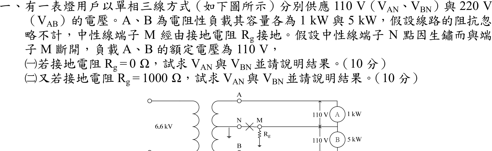
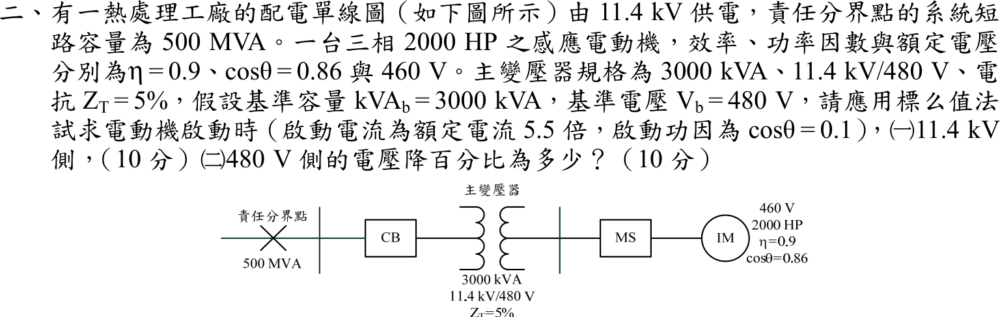
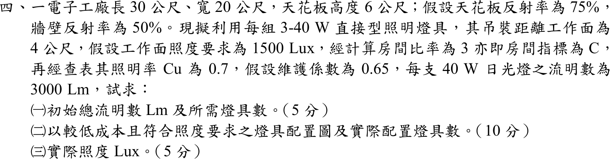

# 📝 105 年電機工程技師｜工業配電逐題詳解

> 本頁由題級 canonical 筆記組合；每題保留官方裁切圖、校驗狀態與可追溯的推導。

## 題目導覽
- [[#一、105 年工業配電第 1 題｜單相三線中性線開路與接地電阻|第 1 題：單相三線中性線開路與接地電阻]]
- [[#二、105 年工業配電第 2 題｜感應電動機啟動電壓降與標么值|第 2 題：感應電動機啟動電壓降與標么值]]
- [[#三、105 年工業配電第 3 題｜低壓匯流排三相短路與電源並聯|第 3 題：低壓匯流排三相短路與電源並聯]]
- [[#四、105 年工業配電第 4 題｜流明法照明設計與燈具配置|第 4 題：流明法照明設計與燈具配置]]
- [[#五、105 年工業配電第 5 題｜諧波等效電路與並聯共振|第 5 題：諧波等效電路與並聯共振]]

---

## 一、105 年工業配電第 1 題｜單相三線中性線開路與接地電阻

> 題級識別：EE-105-06-1
> canonical 來源：[[canonical/EE-105-06-1.md]]
> 題級校驗狀態：verified



### 已知與所求

單相三線 110／220 V，A、B 為電阻性負載 1 kW 與 5 kW（額定 110 V）；線路阻抗忽略。中性線端子 N 與 M 斷開，M（負載中點）經 \(R_g\) 接地，變壓器中心抽頭 N 接地。求（一）\(R_g=0\)、（二）\(R_g=1000\,\Omega\) 時負載電壓 \(V_{AN}\)、\(V_{BN}\)（圖中 A 在上、B 在下，各量取負載兩端電壓）並說明結果。

### 考場標準作答

\[
R_A=\frac{110^2}{1000}=12.1\ \Omega,\qquad R_B=\frac{110^2}{5000}=2.42\ \Omega
\]
以變壓器中心抽頭 N 為參考，A 端 \(+110\,\mathrm V\)、B 端 \(-110\,\mathrm V\)；設負載中點電位 \(V_M\)，在 M 點列 KCL（A、B 流入的電流經 \(R_g\) 流向大地）：
\[
\frac{110-V_M}{R_A}+\frac{-110-V_M}{R_B}=\frac{V_M}{R_g}
\]

#### （一）\(R_g=0\)

\(V_M=0\)，M 點被拉到大地電位，與 N 同電位：
\[
\boxed{V_{AN}=+110\,\mathrm V},\qquad \boxed{V_{BN}=-110\,\mathrm V}
\]
兩負載皆為額定 110 V（大小）；N–M 斷開但 \(R_g=0\) 等同接地線補回中性線，負載不受影響。

#### （二）\(R_g=1000\,\Omega\)

\[
V_M\left(\frac1{12.1}+\frac1{2.42}+\frac1{1000}\right)=\frac{110}{12.1}-\frac{110}{2.42}
\Rightarrow V_M=-73.186\ \mathrm V
\]
\[
\boxed{V_{AN}=110-V_M=183.186\ \mathrm V},\qquad \boxed{V_{BN}=-110-V_M=-36.8143\ \mathrm V}
\]
即 A 負載承受 183.19 V（約額定的 1.67 倍，過電壓），B 負載僅 36.81 V（欠電壓）。輕載 A 過壓、重載 B 欠壓，是中性線開路、接地回路阻抗過大的典型危險。

### 驗算

\(I_A=183.186/12.1=15.139\ \mathrm A\)，\(I_B=36.814/2.42=15.213\ \mathrm A\)，接地電流 \(I_g=I_B-I_A=0.0731\ \mathrm A\)，且 \(I_gR_g=73.1\ \mathrm V=|V_M|\)。
極限：\(R_g\to\infty\) 時為單純串聯分壓 \(220\times12.1/(12.1+2.42)=183.33\ \mathrm V\)，\(R_g=1000\,\Omega\) 的 183.19 V 略低且趨近此值。

### 失分點

- \(R_g=0\) 時仍照浮接串聯分壓（183.33 V／36.67 V），忽略接地線已把 M 點鉗位在 0 V。
- KCL 中 \(R_g\) 電流方向反號會得 \(183.482\,\mathrm V\)／\(36.5185\,\mathrm V\)，且比 \(R_g=\infty\) 的 183.33 V 還大，不合物理。
- 只寫大小不說明 A 過壓、B 欠壓。

### 條件與疑義

若 \(V_{AN}\)、\(V_{BN}\) 解讀為變壓器端子 A、B 對中心抽頭 N 的電壓，則恆為 \(\pm110\,\mathrm V\)；題意著眼於負載是否承受額定電壓，故本解取負載兩端電壓。

---

## 二、105 年工業配電第 2 題｜感應電動機啟動電壓降與標么值

> 題級識別：EE-105-06-2
> canonical 來源：[[canonical/EE-105-06-2.md]]
> 題級校驗狀態：verified



### 已知與所求

11.4 kV 供電，責任分界點短路容量 \(500\,\mathrm{MVA}\)；主變壓器 \(3000\,\mathrm{kVA}\)、\(11.4\,\mathrm{kV}/480\,\mathrm V\)、\(Z_T=5\%\)；三相感應電動機 \(2000\,\mathrm{HP}\)、\(\eta=0.9\)、\(\cos\theta=0.86\)、額定電壓 \(460\,\mathrm V\)。基準 \(\mathrm{kVA}_b=3000\)、\(V_b=480\,\mathrm V\)。啟動電流為額定 5.5 倍、啟動功因 0.1（滯後）。求啟動時（一）11.4 kV 側、（二）480 V 側的電壓降百分比（各 10 分）。

### 考場標準作答

#### 啟動電流（標么）

\[
S_{rated}=\frac{2000(0.746)}{0.9(0.86)}=1927.65\ \mathrm{kVA},\qquad
I_{rated}=\frac{1927.65}{\sqrt3(0.46)}=2419.41\ \mathrm A
\]
\[
I_{start}=5.5I_{rated}=13306.75\ \mathrm A,\qquad I_b=\frac{3000}{\sqrt3(0.48)}=3608.44\ \mathrm A
\]
\[
I_{pu}=\frac{13306.75}{3608.44}=3.68768\angle\left[-\cos^{-1}(0.1)\right]\ \mathrm{pu}=3.68768\angle-84.26^\circ
\]

#### 上游電抗

\[
X_{sys}=\frac{3000}{500\,000}=0.006\ \mathrm{pu},\qquad X_T=0.05\ \mathrm{pu}
\]
電源電壓 \(E=1\angle0^\circ\,\mathrm{pu}\)，壓降 \(\Delta V=jXI\)。

#### （一）11.4 kV 側

\[
V_{11.4}=1-j0.006I_{pu}=0.977985-j0.002213,\quad |V_{11.4}|=0.977987
\]
\[
\boxed{\%\Delta V_{11.4}=(1-0.977987)\times100\%=2.2013\%}
\]

#### （二）480 V 側

\[
V_{480}=1-j(0.006+0.05)I_{pu}=0.794525-j0.020651,\quad |V_{480}|=0.794794
\]
\[
\boxed{\%\Delta V_{480}=(1-0.794794)\times100\%=20.5206\%}
\]

### 驗算

壓降近似式 \(\Delta V\approx X I\sin\phi\)（\(R=0\)）：\(0.006(3.68768)(0.99499)=2.2015\%\)、\(0.056(3.68768)(0.99499)=20.55\%\)，與相量解 \(2.2013\%\)、\(20.5206\%\) 相符。串聯 KVL：\(1-0.977987=0.0220\) 為 \(X_{sys}\) 所佔壓降，變壓器再增加 \(0.1832\)，合計 \(0.2052\)。

### 失分點

- 額定電流須以 460 V 電動機額定電壓計算，標么化時才以 480 V、3000 kVA 為基準電流。
- 11.4 kV 側只含 \(X_{sys}\)，480 V 側含 \(X_{sys}+X_T\)。

### 條件與疑義

圖中只給系統短路容量，未給 \(X/R\)，故將電源與變壓器視為純電抗並忽略開關、電纜阻抗；若取得 \(X/R\) 或變壓器電阻，應改用完整 \(R+jX\) 相量。電壓降以受電端電壓大小 \(1-|V|\) 定義；若取壓降向量大小 \(|XI|\)，則為 \(2.2126\%\) 與 \(20.651\%\)。

若把電動機視為定阻抗 \(Z_m=\dfrac{460/480}{3.68768}\angle84.26^\circ=0.2599\ \mathrm{pu}\) 與系統串聯，啟動電流降為約 3.17 pu，壓降為 \(1.89\%\)／\(17.67\%\)；本解依題意取指定的啟動電流 \(5.5I_{rated}\)（定電流）。

---

## 三、105 年工業配電第 3 題｜低壓匯流排三相短路與電源並聯

> 題級識別：EE-105-06-3
> canonical 來源：[[canonical/EE-105-06-3.md]]
> 題級校驗狀態：verified


### 已知與所求

22.8 kV 受電，責任分界點短路容量 \(200\,\mathrm{MVA}\)；主變 \(2000\,\mathrm{kVA}\)、\(22.8\,\mathrm{kV}/480\,\mathrm V\)、\(Z_T=6\%\)；發電機 \(500\,\mathrm{kVA}\)、\(480\,\mathrm V\)、\(Z_G''=20\%\)。F 點為 480 V 匯流排三相短路，基準 \(2000\,\mathrm{kVA}\)、\(480\,\mathrm V\)。求（一）CB1 閉合、CB2 開路，（二）CB1、CB2 皆閉合時的對稱故障電流（kA）（各 10 分）。

### 考場標準作答

\[
I_b=\frac{2000}{\sqrt3(0.48)}=2405.63\ \mathrm A,\qquad
X_{sys}=\frac{2000}{200\,000}=0.01\ \mathrm{pu}
\]
CB1 支路（系統＋主變）：\(X_1=0.01+0.06=0.07\ \mathrm{pu}\)；
CB2 支路（發電機換基準）：\(X_2=0.20\times\dfrac{2000}{500}=0.80\ \mathrm{pu}\)。

#### （一）CB1 閉合、CB2 開路
\[
\boxed{I_{F1}=\frac{1}{0.07}I_b=14.2857(2405.63)=34.37\ \mathrm{kA}}
\]

#### （二）CB1、CB2 皆閉合
\[
X_{eq}=0.07\parallel0.80=0.0643678\ \mathrm{pu},\qquad
\boxed{I_{F2}=\frac{I_b}{0.0643678}=15.5357(2405.63)=37.37\ \mathrm{kA}}
\]

### 驗算

支路電流疊加：\(1/0.07+1/0.80=14.2857+1.25=15.5357\ \mathrm{pu}\)，與 \(1/X_{eq}\) 相同；CB1 單獨 34.366 kA、加上發電機貢獻 \(1.25(2.40563)=3.007\ \mathrm{kA}\)，合計 37.373 kA。

### 失分點

- 未先換到題給 2000 kVA 基準就把標么電抗相加；發電機 20% 須乘 \(2000/500\)。
- CB2 開路時仍把發電機電抗併入，或兩斷路器閉合時忘記並聯。
- 480 V 為線電壓，基準電流用 \(S_b/(\sqrt3V_b)\)。

### 條件與疑義

題目只給電抗，採正序純電抗、故障前各電源內電勢皆為 \(1\angle0^\circ\,\mathrm{pu}\)、不計負載電流；若需計入電阻或電源相角差，應以完整相量重算。

---

## 四、105 年工業配電第 4 題｜流明法照明設計與燈具配置

> 題級識別：EE-105-06-4
> canonical 來源：[[canonical/EE-105-06-4.md]]
> 題級校驗狀態：verified



### 已知與所求

廠房 \(30\ \mathrm m\times20\ \mathrm m\)，天花板高 6 m，吊裝距離工作面 4 m；要求照度 \(E=1500\ \mathrm{lx}\)；照明率 \(C_u=0.7\)、維護係數 \(M=0.65\)；每組燈具為 3-40 W 日光燈（每支 3000 lm）。求（一）初始總流明及燈具數（5 分）、（二）低成本且合格的配置圖與實際燈具數（10 分）、（三）實際照度（5 分）。

### 考場標準作答

#### （一）初始總流明與燈具數

\[
\boxed{\Phi_{total}=\frac{EA}{C_uM}=\frac{1500(30\times20)}{0.7(0.65)}=1{,}978{,}022\ \mathrm{lm}}
\]
每具燈具 \(3\times3000=9000\ \mathrm{lm}\)：
\[
N=\frac{1{,}978{,}022}{9000}=219.8\Rightarrow \boxed{220\ \text{具}}
\]

#### （二）配置圖與實際燈具數

燈具數取剛好滿足照度的最小值 \(220\)（成本最低，219 具不足），排成 \(20\times11\) 均勻矩形陣列：沿 30 m 方向 20 具（間距 1.5 m），沿 20 m 方向 11 排（間距 1.82 m），牆邊留半間距 0.75 m／0.91 m。
```
 30 m →
  .75  1.5 m 間距 × 19            .75
  [ ]--[ ]--[ ]-- ... --[ ]--[ ]     ← 第 1 排（20 具）
  [ ]--[ ]--[ ]-- ... --[ ]--[ ]     ← 共 11 排，排距 1.82 m，牆邊 0.91 m
   ⋮
  [ ]--[ ]--[ ]-- ... --[ ]--[ ]     ← 第 11 排（20 具）
 20 m ↓
```
\[
\boxed{N_{actual}=20\times11=220\ \text{具}}
\]

#### （三）實際照度

\[
\boxed{E_{actual}=\frac{220(9000)(0.7)(0.65)}{600}=1501.5\ \mathrm{lx}\ \ge\ 1500\ \mathrm{lx}}
\]

### 驗算

最大間距 1.82 m 小於吊裝高度 4 m（間距／高度 0.46），且縱橫間距比 \(1.82/1.5=1.21\)，照度均勻。反向檢查：219 具僅 \(219(9000)(0.455)/600=1494.7\ \mathrm{lx}<1500\ \mathrm{lx}\)，故 220 為最小合格數。

### 失分點

- 每組燈具含 3 支燈管，光通量為 9000 lm 而非 3000 lm（若用 3000 lm 會得 660 具）。
- 燈具數無條件進位（219.8 取 220），不可四捨五入成不足照度的 219。
- 配置須整數具數且均勻排列；矩形陣列只需 \(n_xn_y\ge220\)，取 \(20\times11=220\) 最省。

### 條件與疑義

房間比率 3、\(C_u=0.7\)、\(M=0.65\) 均為題目給定，不另查表；配置圖的行列數不唯一，凡 \(n_x n_y\ge220\) 且間距不超過約 1～1.5 倍吊裝高度均可，取 220 具最省。

---

## 五、105 年工業配電第 5 題｜諧波等效電路與並聯共振

> 題級識別：EE-105-06-5
> canonical 來源：[[canonical/EE-105-06-5.md]]
> 題級校驗狀態：verified


### 已知與所求

責任分界點短路容量 \(100\,\mathrm{MVA}\)、\(X/R=2.5\)；主變壓器 \(2000\,\mathrm{kVA}\)、\(11.4\,\mathrm{kV}/480\,\mathrm V\)、\(Z_T=j0.06\,\mathrm{pu}\)；低壓側功因補償電容 \(600\,\mathrm{kvar}\)。求（一）諧波等效電路並標示 \(R_T\)、\(jX_T\)、\(C\)（10 分）；（二）並聯共振頻率 \(f_r\) 與諧波階次（10 分）。

### 考場標準作答

#### （一）等效電路

基準 \(2\,\mathrm{MVA}\)、\(480\,\mathrm V\)：\(Z_b=0.48^2/2=0.1152\ \Omega\)。
\[
Z_s=\frac{2}{100}=0.02\ \mathrm{pu},\quad R_s=\frac{0.02}{\sqrt{1+2.5^2}}=0.007428,\quad X_s=2.5R_s=0.018570
\]
折算到 480 V 側（變壓器電阻忽略）：
\[
R_T=0.007428(0.1152)=0.000856\ \Omega,\qquad X_T=(0.018570+0.06)(0.1152)=0.00905\ \Omega
\]
電容器：
\[
X_C=\frac{0.48^2}{0.6}=0.384\ \Omega,\qquad C=\frac1{2\pi(60)(0.384)}=6908\ \mu\mathrm F
\]
等效電路：諧波電流源（諧波負載）接在匯流排；電源側 \(R_T+jX_T\)（由 \(R_S+jX_S\) 加變壓器 \(jX_{Tr}\)）與電容 \(C\)（\(-jX_C/h\)）並聯於 480 V 匯流排。
```
 諧波負載 I_h ──┬──────────┬────────── 480 V 匯流排
                │          │
           R_T + jX_T      C (X_C = 0.384 Ω @60 Hz)
                │          │
              電源(短路)    地
```

#### （二）並聯共振

\(h\) 次諧波電感抗 \(hX_T\)，電容抗 \(X_C/h\)，並聯共振：
\[
\boxed{h_r=\sqrt{\frac{X_C}{X_T}}=\sqrt{\frac{0.384}{0.0090512}}=6.5135}
\]
\[
\boxed{f_r=h_rf_1=6.5135\times60=390.8\ \mathrm{Hz}\approx391\ \mathrm{Hz}}
\]
\(h_r\approx6.5\) 介於 6、7 次之間，最接近的整數特徵諧波為**第 7 次**。

### 驗算

kVA 公式：匯流排短路容量 \(2000/(0.01857+0.06)=25\,455\ \mathrm{kVA}\)，\(h_r=\sqrt{25\,455/600}=6.51\)，與上式一致。含 \(R_T\) 時令導納虛部為零，\(h_r\) 無可辨差異（\(R_T^2\ll X_TX_C\)）。

### 失分點

- 只用變壓器 \(X_T=0.06\) 而漏掉系統電抗 \(0.0186\)，\(h_r\) 會高估為 \(\sqrt{0.384/0.00691}=7.45\)。
- \(X_C\) 須以線電壓 \(V_{LL}^2/Q_C\) 計算，不可混用相電壓。
- 只寫 \(f_r\) 不說明階次與第 7 次特徵諧波的關係。

### 條件與疑義

變壓器電阻未給，視為零；\(R_T\) 僅來自系統 \(X/R\)。\(h_r=6.51\) 恰超過 6.5，視為最接近第 7 次，但實務上 6 次與 7 次附近均有放大風險。

---
