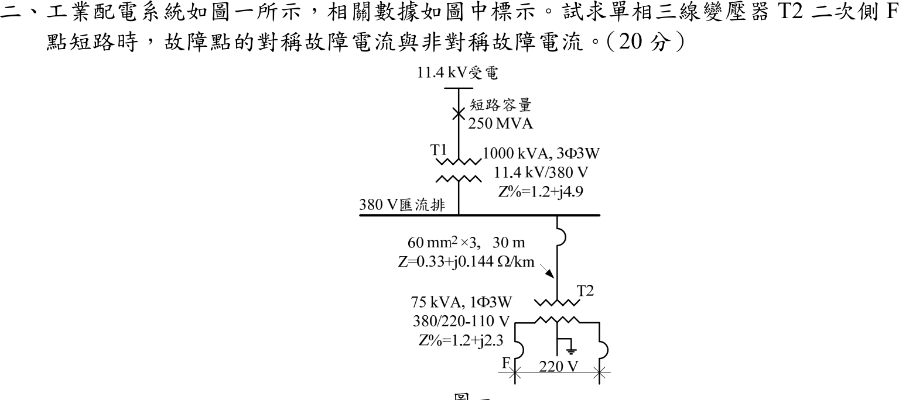
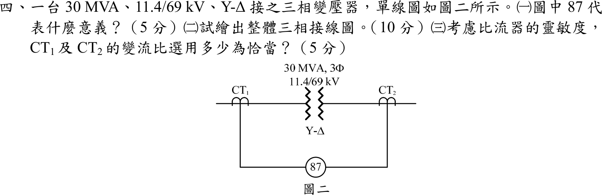
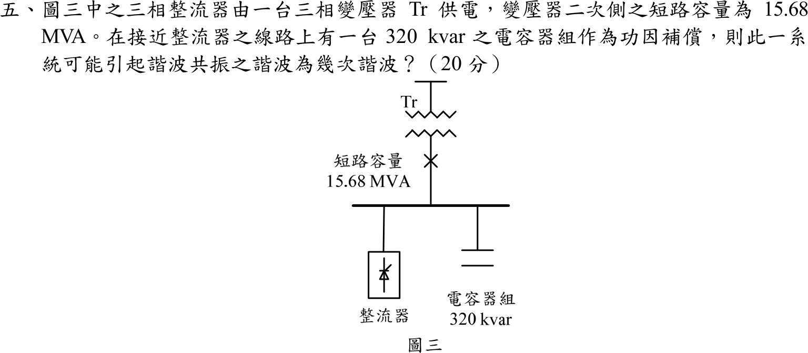

# 📝 106 年電機工程技師｜工業配電逐題詳解

> 本頁由題級 canonical 筆記組合；每題保留官方裁切圖、校驗狀態與可追溯的推導。

## 題目導覽
- [[#一、106 年工業配電第 1 題｜短路電流計算與設備接地|第 1 題：短路電流計算與設備接地]]
- [[#二、106 年第 2 題｜單相三線變壓器 F 點短路（參考書主解）|第 2 題：單相三線變壓器 F 點短路（參考書主解）]]
- [[#三、106 年工業配電第 3 題｜三相變壓器組接線與分接頭選擇|第 3 題：三相變壓器組接線與分接頭選擇]]
- [[#四、106 年工業配電第 4 題｜Y–Δ 變壓器差動保護與 CT 比選定|第 4 題：Y–Δ 變壓器差動保護與 CT 比選定]]
- [[#五、106 年工業配電第 5 題｜電容器與系統諧波共振|第 5 題：電容器與系統諧波共振]]

---

## 一、106 年工業配電第 1 題｜短路電流計算與設備接地

> 題級識別：EE-106-06-1
> canonical 來源：[[canonical/EE-106-06-1.md]]
> 題級校驗狀態：verified


### 已知與所求

申論題，無數據。（一）試述設計工業配電系統計算短路電流的目的（10 分）；（二）試述設備接地之目的及其重要性（10 分）。

### 考場標準作答

#### （一）計算短路電流的目的

1. **選設備額定**：以最大故障電流選斷路器、保險絲的遮斷容量，及開關、母線、CT 的熱穩定（\(I^2t\)）與動穩定（電磁力）額定。
2. **整定保護協調**：以最大、最小故障電流整定過電流、接地、差動電驛的動作值與時間，使故障點上游保護延時、下游先動作，維持選擇性。
3. **校核導體與變壓器耐受**：確認電纜、母線在保護切除時間內承受短路熱效應，避免絕緣燒毀或變形。
4. **評估電壓驟降與電弧閃絡**：故障期間母線電壓降、電弧能量與人員安全距離，皆以故障電流為輸入。
5. **規劃擴充**：新增電源、電動機回饋或變壓器並聯時，確認既有設備仍不超過額定遮斷能力。

\[
\boxed{\text{目的：選設備遮斷與耐受額定、整定保護協調、校核導體耐受與安全}}
\]

#### （二）設備接地的目的與重要性

1. **人員安全**：外殼與大地等電位，限制接觸電壓與跨步電壓；絕緣破壞時外殼電位為 \(I_gR_g\)，接地電阻愈低愈安全。
2. **保護動作**：提供低阻抗故障回路，使接地故障電流足以讓保護裝置迅速切除，避免外殼長時間帶電。
3. **過電壓與雷擊**：提供突波、雷擊、靜電泄放路徑，穩定系統對地電位，降低絕緣應力。
4. **系統穩定與設備保護**：控制系統中性點電位，抑制間歇電弧過電壓；導體須具足夠截面與連續性。

\[
\boxed{\text{目的：限制接觸電壓保障人身、使保護迅速動作、洩放雷擊突波與靜電}}
\]

### 驗算

兩項論述各以一個定量關係檢查：（一）三相故障電流 \(I_{sc}=S_{sc}/(\sqrt3V)\)，例如 11.4 kV、250 MVA 系統為 \(12.66\,\mathrm{kA}\)，選用斷路器遮斷容量須大於此值；（二）框架電位 \(V=I_gR_g\)，同一接地故障電流下接地電阻由 \(25\,\Omega\) 降到 \(5\,\Omega\)，接觸電壓降為 \(1/5\)。

### 失分點

- 只答「計算短路電流為了選斷路器」，漏掉保護整定協調與設備熱、動穩定校核。
- 把接地說成只為雷擊防護；漏掉使故障電流足以跳脫保護的功能。
- 論述接地電阻愈小愈好，卻未交代還需確認故障迴路阻抗與切除時間。

---

## 二、106 年第 2 題｜單相三線變壓器 F 點短路（參考書主解）

> 題級識別：EE-106-06-2
> canonical 來源：[[canonical/EE-106-06-2.md]]
> 題級校驗狀態：reference_book_verified



### 已知與所求

圖一：11.4 kV 受電，短路容量 \(250\,\mathrm{MVA}\)；T1 為 \(1000\,\mathrm{kVA}\) 三相三線、\(11.4\,\mathrm{kV}/380\,\mathrm V\)、\(Z\%=1.2+j4.9\)；380 V 匯流排至 T2 的饋線 60 mm²×3、30 m、\(Z=0.33+j0.144\,\Omega/\mathrm{km}\)；T2 為 \(75\,\mathrm{kVA}\) 單相三線、\(380/220\text{-}110\,\mathrm V\)、\(Z\%=1.2+j2.3\)；F 為 T2 二次側短路。求故障點的對稱與非對稱故障電流（20 分）。題幹未給非對稱倍率，見「條件與疑義」。

### 考場標準作答

參考書主解（reference_book evidence，not official）：F 點按 220 V 線間短路，由三相 380 V 側換算得 \(Z_f=0.057\,\mathrm{pu}\)（以 \(75\,\mathrm{kVA}\)、\(220\,\mathrm V\) 為基準，\(I_b=75\,000/220=340.9\,\mathrm A\)）：
\[
\boxed{I_{sym}=\frac{340.9}{0.057}=5.98\ \mathrm{kA}}
\]
非對稱故障電流取倍率 \(K=1.25\)：
\[
\boxed{I_{asym}=1.25(5.98)=7.475\ \mathrm{kA}}
\]

### 驗算

僅能核對算術：\(340.9/0.057=5980\,\mathrm A\)，\(1.25\times5.98=7.475\,\mathrm{kA}\)。\(Z_f=0.057\,\mathrm{pu}\) 是參考書值，無法由題給數字重建；以題給阻抗在同一基準上直接合成得 \(0.0343\,\mathrm{pu}\)，兩者差異見「條件與疑義」。

### 失分點

- 阻抗未折算到同一電壓級：T1 與饋線在 380 V 側，T2 的百分阻抗在 110 V 半繞組或 220 V 全繞組各有其基準。
- 把 \(K=1.25\) 當題目給定；題幹並未給倍率，須註明為採用的慣例。
- 單相三線的線間短路電流不可套用三相公式 \(S/(\sqrt3V)\)。

### 條件與疑義

圖中 F 標在 T2 左側 110 V 導體端，另一個故障符號在右側導體端，兩符號間標 220 V；若只取 F 一點，則為左 110 V 導體對中性點故障（原有模型）。阻抗是否為每導體或往返值，題幹也未說明。用題給阻抗（折算到 110 V 半繞組）：\(Z_{sys,110}=j0.0000484\)、\(Z_{T1,110}=0.0001452+j0.0005929\)、\(Z_{L,110}=0.000830+j0.000362\)、\(Z_{T2,half}=0.003872+j0.007421\,\Omega\)。各模型的對稱電流：

| 模型 | 對稱電流 |
|---|---:|
| 參考書：220 V 線間，\(Z_f=0.057\,\mathrm{pu}\)（主解） | 5.98 kA |
| 原有模型：左 110 V 導體對中性點，\(Z_\Sigma=Z_{sys,110}+Z_{T1,110}+Z_{L,110}+Z_{T2,half}\) | \(11.318\,\mathrm{kA}\) |
| 220 V 線間，\(Z_{main}=Z_{T2,half}+2(Z_{sys,110}+Z_{T1,110}+Z_{L,110})\) | \(I_{sym,LL}=9.927\,\mathrm{kA}\) |
| 線間環路再把一次側各元件按往返加倍：\(Z_{T2,half}+4(\cdots)\) | 7.958 kA |

參考書值 5.98 kA 低於三個以題給數字合成的模型（7.958–11.318 kA），且 \(Z_f=0.057\) 無法由題幹重建，此處僅作 reference_book evidence，不宣稱為官方答案。

非對稱電流不能只乘固定 1.25：故障電流 \(i_f(t)=\sqrt2I_{sym}\left[\sin(\omega t+\alpha-\phi)-\sin(\alpha-\phi)e^{-t/\tau}\right]\)，\(\tau=X/(\omega R)\)，峰值取決於故障相角、觀察時刻與系統頻率，題目均未給。以 60 Hz、\(\alpha=0\)、線間主模型 \(X/R=1.6195\)（\(\tau=4.296\,\mathrm{ms}\)）為例：四分之一週期近似 \(\sqrt2I_{sym,LL}\left(1+e^{-\pi/(2X/R)}\right)=19.36\,\mathrm{kA}\)；此低 \(X/R\) 網路的精確第一峰值由 \(\cos u+\kappa\sin u-e^{-u/\kappa}=0\)（\(\kappa=X/R\)，\(u=\omega t\)）求得 \(u=2.474\)，
\[
\boxed{I_{peak,exact,LL}=16.5404\ \mathrm{kA}}
\]
若採原有模型（\(X/R=1.7382\)、\(11.318\,\mathrm{kA}\)），精確第一峰值為 \(19.1841\,\mathrm{kA}\)，四分之一週期近似為 \(22.49\,\mathrm{kA}\)。倍率 \(K=1.25\) 取自參考書慣例，不是題給量。

---

## 三、106 年工業配電第 3 題｜三相變壓器組接線與分接頭選擇

> 題級識別：EE-106-06-3
> canonical 來源：[[canonical/EE-106-06-3.md]]
> 題級校驗狀態：verified


### 已知與所求

三台相同單相 \(200\,\mathrm{kVA}\) 變壓器，規格 \((3450\text{-}3300\text{-}3150)\,\mathrm V/(110\text{-}220)\,\mathrm V\)，電源側三相 \(3.3\,\mathrm{kV}\)，供三相 \(380\,\mathrm V\) 電動機。求（一）接線圖、極性與電壓；（二）一台故障，借用 \((3450\text{-}3300\text{-}3150)\,\mathrm V/(105\text{-}210)\,\mathrm V\) 單相變壓器代用時，如何選分接頭使二次側三相電壓接近平衡（各 10 分）。

### 考場標準作答

#### （一）Δ–Y 接線

```text
一次側 Δ（3300 V 分接頭）                       二次側 Y（220 V 繞組）
L1 ─┬─ T1[H1 ─ H2] ─┬─ L2     a ── X1[T1]X2 ─┐
L2 ─┬─ T2[H1 ─ H2] ─┬─ L3     b ── X1[T2]X2 ─┼── N（中性點，可接地）
L3 ─┬─ T3[H1 ─ H2] ─┬─ L1     c ── X1[T3]X2 ─┘
減極性：H1 與 X1 同名端；Δ 由 T1.H2→T2.H1、T2.H2→T3.H1、T3.H2→T1.H1 首尾相接
```
一次繞組各承受線電壓 \(3300\,\mathrm V\)，選 3300 V 分接頭；匝比 \(3300/220=15\)。二次三個 220 V 繞組同名端共接成 Y：
\[
\boxed{\text{Δ–Y；一次每繞組 }3300\,\mathrm V，\ V_{\phi}=220\,\mathrm V，\ V_{LL}=\sqrt3(220)=381\,\mathrm V\approx380\,\mathrm V}
\]

#### （二）代用機分接頭

另兩台匝比為 15，代用機的有效匝比也須為 15：

| 一次分接頭 | 二次分接頭 | 匝比 | 3.3 kV 時二次電壓 |
|---|---|---:|---:|
| 3150 V | 210 V | 15.00 | 220 V |
| 3300 V | 210 V | 15.71 | 210 V |
| 3450 V | 210 V | 16.43 | 200.9 V |

\[
\boxed{\text{一次 }3150\,\mathrm V\text{ 分接頭、二次 }210\,\mathrm V\text{ 分接頭}}
\]

### 驗算

選 3150 V 一次分接頭、210 V 二次分接頭時，代用機二次電壓 \(3300\times\dfrac{210}{3150}=220\,\mathrm V\)，與另兩台相等，三個相電壓 \(220\,\mathrm V\)、線電壓 \(381\,\mathrm V\) 平衡。若用 3300 V／210 V，一相只有 210 V（低 4.5%），線電壓出現不平衡。

### 失分點

- 一次側接 Y：每繞組只承受 \(3300/\sqrt3=1905\,\mathrm V\)，僅額定的 58%，二次電壓不足。
- 代用機仍選 3300 V 一次分接頭，二次只有 210 V，三相電壓不平衡。
- 把 \(\sqrt3\times220=381\,\mathrm V\) 寫成 \(220\,\mathrm V\) 線電壓；380 V 動力負載要接線電壓端。

### 條件與疑義

3150 V 分接頭承受 3300 V，磁通密度比該分接頭額定高約 4.8%（過激磁）；題目要求二次電壓平衡，故取匝比相等的分接頭，實際施用需確認製造廠對分接頭的容許電壓。

---

## 四、106 年工業配電第 4 題｜Y–Δ 變壓器差動保護與 CT 比選定

> 題級識別：EE-106-06-4
> canonical 來源：[[canonical/EE-106-06-4.md]]
> 題級校驗狀態：verified



### 已知與所求

\(30\,\mathrm{MVA}\)、\(11.4/69\,\mathrm{kV}\)、Y–Δ 三相變壓器；\(\mathrm{CT}_1\) 在 11.4 kV 側（Y 繞組），\(\mathrm{CT}_2\) 在 69 kV 側（Δ 繞組），兩者二次接差動電驛 87。求（一）87 的意義（5 分）；（二）整體三相接線圖（10 分）；（三）考慮靈敏度，\(\mathrm{CT}_1\)、\(\mathrm{CT}_2\) 的變流比（5 分）。

### 考場標準作答

#### （一）87 的意義

\[
\boxed{\text{87 為差動保護電驛（變壓器差動 87T）：比較保護區兩端電流，區內故障時差流超過整定值跳脫兩側斷路器}}
\]

#### （二）三相接線圖

```text
11.4 kV 側（Y）          變壓器          69 kV 側（Δ）
A,B,C ─ CT₁ ─┐        Y ═══ Δ        ┌─ CT₂ ─ A,B,C
CT₁ 二次：接 Δ（輸出 Δ 三端 → 87 之 A、B、C 線圈）
CT₂ 二次：接 Y（三端 → 87 之 A、B、C 線圈，中性點共接接地）
87（每相一套）：R₁（來自 CT₁）── OP ── R₂（來自 CT₂），正常時兩側電流在 OP 相消
```
變壓器 Y–Δ 兩側線電流有 \(30^\circ\) 相位差，CT 接法與變壓器相反：Y 繞組側 CT 接 Δ、Δ 繞組側 CT 接 Y，所有 CT 極性一致，使正常負載與區外故障時差流近似為零。
\[
\boxed{\mathrm{CT}_1\ \text{二次接 }\Delta，\ \mathrm{CT}_2\ \text{二次接 }Y}
\]

#### （三）CT 變流比

額定線電流 \(I_1=\dfrac{30\times10^6}{\sqrt3(11\,400)}=1519.3\,\mathrm A\)，\(I_2=\dfrac{30\times10^6}{\sqrt3(69\,000)}=251.0\,\mathrm A\)。選法：CT 一次額定不小於額定電流，且額定負載時電驛電流不超過 5 A，在此條件下取最小變比（靈敏度最高）。

- \(\mathrm{CT}_2\)（Y 接）：標準比 250/5 小於 251 A；取 \(300/5\)，電驛電流 \(5\cdot251.0/300=4.184\,\mathrm A\)。
- \(\mathrm{CT}_1\)（Δ 接，電驛電流為二次的 \(\sqrt3\) 倍）：需 \(\sqrt3\cdot5\cdot1519.3/N\le5\Rightarrow N\ge2631\)，故取 \(3000/5\)，電驛電流 \(\sqrt3(5\cdot1519.3/3000)=4.385\,\mathrm A\)。
\[
\boxed{\mathrm{CT}_1=3000/5,\quad \mathrm{CT}_2=300/5}
\]
兩側電驛電流 4.385 A 與 4.184 A，差 \(4.8\%\)，由電驛匹配抽頭吸收。

### 驗算

匹配比理想值 \(N_1^\star=\sqrt3\,\dfrac{69}{11.4}\cdot60=629\)，即 \(\mathrm{CT}_1\) 一次額定約 3145 A，選標準比 3000/5 最接近且不使電驛超過 5 A。改選 \(2500/5\)：\(\sqrt3(5\cdot1519.3/2500)=5.26\,\mathrm A>5\,\mathrm A\)，二次過載；改選 \(2000/5\)：6.58 A，與 4.184 A 差 57%。

### 失分點

- \(\mathrm{CT}_1\) 選 \(2000/5\)：Δ 接使電驛電流達 6.58 A，超過 5 A 且兩側失衡 57%。
- 把 CT 接法與變壓器同型（Y 側接 Y、Δ 側接 Δ），沒有補償 \(30^\circ\)。
- 選 CT 比時忘記 Δ 接多出 \(\sqrt3\)，直接以 \(1519.3/251.0\) 比例配對。

### 條件與疑義

標準 CT 比取 5 A 二次的常用系列（50、100、150、200、250、300、400、500、600、800、1000、1200、1500、2000、2500、3000…）；「恰當」的判準取 CT 一次不小於額定電流、二次不超過 5 A、比值最小。若判準改為允許較大失配，結果可不同。

---

## 五、106 年工業配電第 5 題｜電容器與系統諧波共振

> 題級識別：EE-106-06-5
> canonical 來源：[[canonical/EE-106-06-5.md]]
> 題級校驗狀態：verified



### 考場標準作答

整流器由變壓器 Tr 供電，變壓器二次側短路容量 \(S_{sc}=15.68\,\mathrm{MVA}\)，電容器組 \(Q_c=320\,\mathrm{kvar}=0.320\,\mathrm{Mvar}\)。系統電感（\(X_s=V^2/S_{sc}\)）與電容器（\(X_c=V^2/Q_c\)）在第 \(h\) 次諧波發生並聯共振，\(hX_s=X_c/h\)：
\[
h_r=\sqrt{\frac{S_{sc}}{Q_c}}=\sqrt{\frac{15.68}{0.320}}=\boxed{\sqrt{49}=7}
\]
最可能引起共振的是**第 7 次諧波**；六脈波整流器的特徵諧波為 \(h=6k\pm1\)（5、7、11、13…），第 7 次正落在其中。

### 驗算

\(X_c/X_s=S_{sc}/Q_c=15.68/0.320=49\)；第 7 次時 \(7X_s=X_c/7\Rightarrow X_c/X_s=49\)，成立。

### 失分點

- 把 \(320\,\mathrm{kvar}\) 與 \(15.68\,\mathrm{MVA}\) 直接相除（\(15.68/320\)），單位差 \(10^3\)。
- 忘記開根號而答第 49 次諧波。

---
