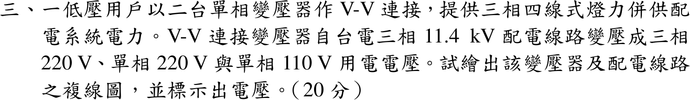

# 📝 108 年電機工程技師｜工業配電逐題詳解

> 本頁由題級 canonical 筆記組合；每題保留 QID、官方裁切、校驗狀態與完整得分型解答。

## 題目導覽
- [[#一、108 年工業配電第 1 題｜電容式比壓器比壓式|第 1 題：電容式比壓器比壓式]]
- [[#二、108 年工業配電第 2 題｜電弧爐電壓突降與串聯電抗器|第 2 題：電弧爐電壓突降與串聯電抗器]]
- [[#三、108 年工業配電第 3 題｜V-V 連接三相四線式燈力併供|第 3 題：V-V 連接三相四線式燈力併供]]
- [[#四、108 年工業配電第 4 題｜F 點三相短路|第 4 題：F 點三相短路]]
- [[#五、108 年工業配電第 5 題｜並聯電容器的效益|第 5 題：並聯電容器的效益]]

---

## 一、108 年工業配電第 1 題｜電容式比壓器比壓式

> 題級識別：`EE-108-06-1`
> canonical 來源：`canonical/EE-108-06-1.md`
> 題級校驗狀態：`verified`

![[依考科分類/06_工業配電/images/questions/PE_108年_工業配電_Q01.png]]

> 官方裁切來源：`依考科分類/06_工業配電/images/questions/PE_108年_工業配電_Q01.png`


### 已知與所求

圖一：\(V_1\) 加在串聯的 \(C_1\)（上）與 \(C_2\)（下）兩端，下端接地；\(C_1\)、\(C_2\) 的中點經補償電抗器 \(L\) 串接負載 \(Z_B\) 到地，輸出 \(V_2\) 跨在 \(Z_B\) 兩端。求比壓式 \(V_2/V_1\)。

### 考場標準作答

令 \(Z_1=\dfrac1{sC_1}\)、\(Z_2=\dfrac1{sC_2}\)。把 \(L\)–\(Z_B\) 支路拿掉，對 \(C_1,C_2\) 中點作戴維寧等效：
\[
V_{th}=V_1\frac{Z_2}{Z_1+Z_2}=V_1\frac{C_1}{C_1+C_2},\qquad
Z_{th}=Z_1\parallel Z_2=\frac1{s(C_1+C_2)}
\]
接回 \(L\) 與 \(Z_B\) 串聯支路，\(V_2\) 為 \(Z_B\) 的分壓：
\[
\boxed{\frac{V_2}{V_1}=\frac{C_1}{C_1+C_2}\cdot\frac{Z_B}{Z_{th}+sL+Z_B}
=\frac{sC_1Z_B}{1+s(C_1+C_2)Z_B+s^2L(C_1+C_2)}}
\]
工頻 \(s=j\omega\) 時分母為 \(1-\omega^2L(C_1+C_2)+j\omega(C_1+C_2)Z_B\)。取
\[
\boxed{L=\frac{1}{\omega^2(C_1+C_2)}}
\]
則 \(Z_{th}+j\omega L=0\)，\(V_2/V_1=C_1/(C_1+C_2)\) 且與 \(Z_B\) 無關，負載不再造成比差與角差。

### 驗算

直接對中點節點列 KCL（與上面的戴維寧法不同）：
\[
\frac{V_a-V_1}{Z_1}+\frac{V_a}{Z_2}+\frac{V_a}{sL+Z_B}=0,\qquad V_2=V_a\frac{Z_B}{sL+Z_B}
\]
解得 \(V_2/V_1=\dfrac{Z_2Z_B}{Z_1Z_2+(Z_1+Z_2)(sL+Z_B)}\)，分子分母同乘 \(s^2C_1C_2\) 即得上式。極限 \(Z_B\to\infty\) 時 \(V_2/V_1\to C_1/(C_1+C_2)\)，為理想電容分壓。

### 失分點

- 把 \(L\) 與 \(Z_B\) 畫成並聯；圖中兩者串聯在同一支路。
- 以電容值直接分壓寫成 \(C_2/(C_1+C_2)\)；阻抗分壓 \(Z_2/(Z_1+Z_2)\) 化簡後是 \(C_1/(C_1+C_2)\)。
- 只寫 \(C_1/(C_1+C_2)\)，沒有交代它只在 \(Z_B\to\infty\) 或補償諧振時成立。


---

## 二、108 年工業配電第 2 題｜電弧爐電壓突降與串聯電抗器

> 題級識別：`EE-108-06-2`
> canonical 來源：`canonical/EE-108-06-2.md`
> 題級校驗狀態：`verified`

![[依考科分類/06_工業配電/images/questions/PE_108年_工業配電_Q02.png]]

> 官方裁切來源：`依考科分類/06_工業配電/images/questions/PE_108年_工業配電_Q02.png`


### 已知與所求

電源短路容量 \(2500\,\mathrm{MVA}\)；測定點位於 69 kV 電源側、主變壓器之前；69 kV 線路 \(Z_L=j0.405\,\Omega\)；主變壓器 \(30\,\mathrm{MVA}\)、69/11.4 kV、\(Z=7\%\)；爐用變壓器 \(15\,\mathrm{MVA}\)、11.4 kV/300 V、\(Z=6\%\)；電弧爐 \(12.5\,\mathrm{MVA}\)、\(Z_F=8\%\)。以主變額定 \(S_b=30\,\mathrm{MVA}\) 為基準，求（一）系統阻抗圖（6 分）；（二）電弧爐運轉的電壓突降百分率（6 分）；（三）突降超過 1.5% 時，11.4 kV 側串聯電抗器之 \(\Omega\)/相（8 分）。

### 考場標準作答

#### （一）系統阻抗圖

\(Z_{b,69}=69^2/30=158.7\,\Omega\)、\(Z_{b,11.4}=11.4^2/30=4.332\,\Omega\)：
\[
X_S=\frac{30}{2500}=0.012,\quad X_L=\frac{0.405}{158.7}=0.002552,\quad X_{T1}=0.07,\quad
X_{T2}=0.06\frac{30}{15}=0.12,\quad X_F=0.08\frac{30}{12.5}=0.192
\]

```text
E=1∠0° ─ j0.012 ─(測定點，69 kV)─ j0.002552 ─ j0.07 ─(11.4 kV 母線)─ j0.12 ─ j0.192 ─ 地
          X_S                       X_L        X_T1                    X_T2    X_F
```
\[
\boxed{X_S=0.012,\ X_L=0.002552,\ X_{T1}=0.07,\ X_{T2}=0.12,\ X_F=0.192\ \mathrm{pu}}
\]

#### （二）電壓突降

測定點位於 69 kV 電源側，其上游只有電源電抗 \(X_S\)；下游 \(X_{down}=0.002552+0.07+0.12+0.192=0.384552\)。電弧爐以定阻抗代表，source/PCC 電壓為分壓：
\[
\boxed{\frac{\Delta V}{V}=\frac{X_S}{X_S+X_{down}}=\frac{0.012}{0.396552}=3.0261\%}
\]

#### （三）11.4 kV 側串聯電抗器

電抗器加在下游，令突降為 1.5%：
\[
0.015=\frac{0.012}{0.396552+X_R}\Rightarrow X_R=0.403448\ \mathrm{pu}
\]
\[
\boxed{X_R=0.403448(4.332)=1.748\ \Omega/\text{相}}
\]

### 驗算

不經標么，全部折算到 11.4 kV 側的歐姆值：電源 \(11.4^2/2500=0.05198\,\Omega\)；下游 \(0.405(11.4/69)^2+0.07\dfrac{11.4^2}{30}+0.06\dfrac{11.4^2}{15}+0.08\dfrac{11.4^2}{12.5}=1.6659\,\Omega\)。突降 \(=0.05198/(0.05198+1.6659)=3.0261\%\)。降到 1.5% 需總電抗 \(0.05198/0.015=3.4656\,\Omega\)，故 \(X_R=3.4656-1.7179=1.748\,\Omega\)，與標么法相同。

### 失分點

- 把測定點放到主變二次側，上游阻抗與分壓位置全錯；圖上 × 在 69 kV 電源之後、主變之前。
- 15 MVA 爐用變壓器與 12.5 MVA 電弧爐阻抗未換到 30 MVA 基準。
- 串聯電抗器裝在 11.4 kV 側，屬測定點下游，應加進分母；只加到 \(X_S\) 會得到相反方向的結果。

### 條件與疑義

題圖只給電抗值，全部忽略電阻；突降定義為測定點（source/PCC）電壓相對於電源電動勢的下降，電弧爐以其標示阻抗 \(Z_F=8\%\) 的定阻抗負載代表，所得 3.0261% 為此模型值，並非閃爍（flicker）量測值。


---

## 三、108 年工業配電第 3 題｜V-V 連接三相四線式燈力併供

> 題級識別：`EE-108-06-3`
> canonical 來源：`canonical/EE-108-06-3.md`
> 題級校驗狀態：`verified`

![[依考科分類/06_工業配電/images/questions/PE_108年_工業配電_Q03.png]]

> 官方裁切來源：`依考科分類/06_工業配電/images/questions/PE_108年_工業配電_Q03.png`



### 已知與所求

低壓用戶以兩台單相變壓器作 V-V 連接，自台電三相 \(11.4\,\mathrm{kV}\) 配電線路取電，供三相 220 V、單相 220 V、單相 110 V，為三相四線式燈力併供。繪出變壓器與配電線路複線圖，並標示電壓。

### 考場標準作答

兩台相同的單相變壓器，二次側為 110–220 V 中點抽頭繞組。

```text
一次側 11.4 kV（線間）                 二次側（V-V 開放三角）
A ──[H1  T1  H2]── B        X ──[T1 上半 110 V]── N ──[T1 下半 110 V]── Y
B ──[H1  T2  H2]── C                                                      │（共接點）
                            Z ──────────[T2 220 V]──────────────────────── Y
輸出四線：X、Y、Z、N（N 接地）；X、Z 之間不接繞組（開口）
```
接線：\(T_1\) 一次跨 \(A\)–\(B\)，\(T_2\) 一次跨 \(B\)–\(C\)；二次側 \(T_1\) 的 \(X\)–\(Y\) 與 \(T_2\) 的 \(Y\)–\(Z\) 以相同極性首尾串接，中性線 \(N\) 只由 \(T_1\) 的中點抽頭引出。令 \(\widetilde V_{XY}=220\angle0^\circ\)、\(\widetilde V_{YZ}=220\angle{-120^\circ}\)，則 \(\widetilde V_{ZX}=-(\widetilde V_{XY}+\widetilde V_{YZ})\)，各端子電壓為：

| 端子 | 電壓 | 用途 |
|---|---:|---|
| \(X\)–\(Y\)、\(Y\)–\(Z\)、\(Z\)–\(X\) | 220 V | 三相 220 V 動力；任兩線間為單相 220 V |
| \(X\)–\(N\)、\(Y\)–\(N\) | 110 V | 單相 110 V 燈與插座 |
| \(Z\)–\(N\) | 190.526 V | 高腳相，不接 110 V 負載 |

\[
\boxed{V_{XY}=V_{YZ}=V_{ZX}=220\,\mathrm V,\quad V_{XN}=V_{YN}=110\,\mathrm V,\quad V_{ZN}=110\sqrt3=190.526\,\mathrm V}
\]

### 驗算

\(\widetilde V_{ZN}=\widetilde V_{ZY}+\widetilde V_{YN}=-220\angle{-120^\circ}-110=j190.526\,\mathrm V\)，\(|V_{ZN}|^2=36300=3(110)^2\)。三個線電壓之和 \(\widetilde V_{XY}+\widetilde V_{YZ}+\widetilde V_{ZX}=0\)，且 \(|V_{ZX}|=|220\angle0^\circ+220\angle{-120^\circ}|=220\,\mathrm V\)，三相線電壓平衡。

### 失分點

- 兩台一次側接成同一對線電壓，二次側失去 \(120^\circ\) 相位，合成不出三相。
- 把兩個二次中點同時接成 \(N\)；中性線只能取自一台的中點。
- 把 \(Z\)–\(N\) 當成 110 V 使用，或漏標 190.526 V 的高腳相。


---

## 四、108 年工業配電第 4 題｜F 點三相短路

> 題級識別：`EE-108-06-4`
> canonical 來源：`canonical/EE-108-06-4.md`
> 題級校驗狀態：`verified`

![[依考科分類/06_工業配電/images/questions/PE_108年_工業配電_Q04.png]]

> 官方裁切來源：`依考科分類/06_工業配電/images/questions/PE_108年_工業配電_Q04.png`


### 已知與所求

11.4 kV 電源短路容量 \(20\,\mathrm{MVA}\)；主變壓器 \(5\,\mathrm{MVA}\)、11,400/480 V、\(X=5.5\%\)；F 點（480 V 母線）接集總電機 \(750\,\mathrm{kVA}\)、\(X''_d=25\%\)；\(V_{b1}=11.4\,\mathrm{kV}\)，低壓側 \(V_{b2}=480\,\mathrm V\)。求（一）標么阻抗圖；（二）F 點三相短路對稱故障電流；（三）\(K=1.25\) 時的非對稱故障電流。基準容量的讀法見「條件與疑義」。

### 考場標準作答

#### （一）標么阻抗圖（\(S_b=20\,\mathrm{MVA}\)）

\[
X_S=\frac{20}{20}=1.000,\quad X_T=0.055\frac{20}{5}=0.220,\quad X_M=0.25\frac{20}{0.75}=6.6667\ \mathrm{pu}
\]

```text
E=1∠0° ─ j1.000 ─ j0.220 ─┬─ F（480 V 母線）
(電源)    X_S      X_T    │
E=1∠0° ───── j6.6667 ─────┘   (電機 X''d 支路，與電源支路在 F 並聯)
```
\[
\boxed{X_S=1.000,\ X_T=0.220,\ X_M=6.6667\ \mathrm{pu}}
\]

#### （二）對稱故障電流

\(X_{th}=(1.000+0.220)\parallel6.6667=\dfrac{1.22(6.6667)}{7.8867}=1.03128\), \(I_{f,pu}=0.96967\)。\(I_b=\dfrac{20\times10^6}{\sqrt3(480)}=24\,056\,\mathrm A\)：
\[
\boxed{I_{f,sym}=0.96967(24.056)=23.327\ \mathrm{kA}}
\]

#### （三）非對稱故障電流

\[
\boxed{I_{f,asym}=K\,I_{f,sym}=1.25(23.327)=29.158\ \mathrm{kA}}
\]

### 驗算

不用標么，直接用 480 V 側歐姆：\(X_S=480^2/20\mathrm{M}=0.01152\,\Omega\)、\(X_T=0.055(480^2)/5\mathrm{M}=0.002534\,\Omega\)、\(X_M=0.25(480^2)/750\mathrm{k}=0.0768\,\Omega\)。電源支路電流 \((277.13)/0.014054=19.72\,\mathrm{kA}\)，電機支路 \(277.13/0.0768=3.608\,\mathrm{kA}\)，KCL 相加 \(=23.33\,\mathrm{kA}\)，與標么法一致。

### 失分點

- 用 11.4 kV 的基準電流 \(1013\,\mathrm A\)（\(20\,\mathrm{MVA}\)）回答；F 點在 480 V 側，須乘 480 V 的 \(I_b\)。
- 電機 \(25\%\) 是以 750 kVA 為基準，要乘 \(S_b/0.75\,\mathrm{MVA}\) 換算；漏換會使電機支路電抗偏小。
- 把電源支路與電機支路串聯；故障時兩者各自供電，在 F 並聯。

### 條件與疑義

題幹將共同基準容量 \(S_b\) 印成 \(20\,\mathrm{kVA}\)，但電源短路容量為 \(20\,\mathrm{MVA}\)，本解讀為 \(S_b=20\,\mathrm{MVA}\)。基準容量只是換算尺度：以 \(20\,\mathrm{kVA}\) 為基準時 \(X_S=0.001\)、\(X_T=0.00022\)、\(X_M=0.006667\ \mathrm{pu}\)，\(I_b=24.056\,\mathrm A\)，故障電流同為 \(23.327\,\mathrm{kA}\)，答案不受影響。


---

## 五、108 年工業配電第 5 題｜並聯電容器的效益

> 題級識別：`EE-108-06-5`
> canonical 來源：`canonical/EE-108-06-5.md`
> 題級校驗狀態：`verified`

![[依考科分類/06_工業配電/images/questions/PE_108年_工業配電_Q05.png]]

> 官方裁切來源：`依考科分類/06_工業配電/images/questions/PE_108年_工業配電_Q05.png`


### 已知與所求

11.4 kV 配電線路，負載三相 \(800\,\mathrm{kVA}\)、功因 0.8 落後，並聯 \(Q_c=120\,\mathrm{kvar}\) 電容器組，線路阻抗 \(Z=0.26+j0.72\,\Omega\)（取為每相值）。求加裝後（一）減少的線路電流；（二）減少的線路壓降；（三）減少的線路損失；（四）可增加的系統供電容量（各 5 分）。

### 考場標準作答

\(P=800(0.8)=640\,\mathrm{kW}\)，\(Q_1=800(0.6)=480\,\mathrm{kvar}\)；電容器只抵銷無效功率，\(Q_2=480-120=360\,\mathrm{kvar}\)，\(S_2=\sqrt{640^2+360^2}=734.30\,\mathrm{kVA}\)，\(\mathrm{pf}_2=0.8716\)。

#### （一）線路電流

\[
I_1=\frac{800\,000}{\sqrt3(11\,400)}=40.516\,\mathrm A,\quad I_2=\frac{734\,302}{\sqrt3(11\,400)}=37.189\,\mathrm A,\quad
\boxed{\Delta I=3.327\ \mathrm A}
\]

#### （二）線路壓降

\(\Delta V=\sqrt3I(R\cos\phi+X\sin\phi)\)：
\[
\Delta V_1=\sqrt3(40.516)(0.26\cdot0.8+0.72\cdot0.6)=44.912\,\mathrm V,\quad
\Delta V_2=\sqrt3(37.189)(0.26\cdot0.8716+0.72\cdot0.4903)=37.333\,\mathrm V
\]
\[
\boxed{\Delta(\Delta V)=7.579\ \mathrm V}
\]

#### （三）線路損失

\[
P_{loss,1}=3(40.516)^2(0.26)=1280.4\,\mathrm W,\quad P_{loss,2}=3(37.189)^2(0.26)=1078.7\,\mathrm W,\quad
\boxed{\Delta P_{loss}=201.66\ \mathrm W}
\]

#### （四）可增加的系統供電容量

供電設備原承載 \(800\,\mathrm{kVA}\)；有功 \(640\,\mathrm{kW}\) 不變而視在功率降為 \(S_2\)，釋出
\[
\boxed{\Delta S=800-734.30=65.70\ \mathrm{kVA}}
\]

### 驗算

壓降改用 \(\Delta V=(PR+QX)/V_{LL}\)：\(Q\) 由 480 降到 360 kvar，只有 \(\Delta Q\cdot X/V=120\,000(0.72)/11\,400=7.579\,\mathrm V\)，與（二）一致。損失改用 \(S^2R/V^2\)：\(\Delta P_{loss}=(800^2-734.30^2)\times10^6(0.26)/11\,400^2=201.66\,\mathrm W\)。

### 失分點

- 把 120 kvar 加到 480 kvar 上；電容器供應落後無效功率，應相減。
- 壓降公式的 \(\sin\phi\) 仍用補償前的 0.6；補償後 \(\sin\phi_2=0.4903\)，\(\cos\phi_2=0.8716\)。
- 三相電流漏掉 \(\sqrt3\)，或把 \(\Delta P\) 寫成單相的 \(I^2R\)（少乘 3）。

### 條件與疑義

「可增加的系統供電容量」題幹未定義；本解取設備電流上限不變、有功負載不變時釋出的 kVA。若改定義為在 800 kVA 上限內再加掛功因 0.8 的負載，可增加 66.22 kVA（新增 52.98 kW）。線路阻抗取為每相值，壓降採標準近似式（沿電壓軸分量），端電壓視為定值 11.4 kV。
