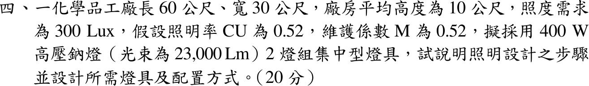
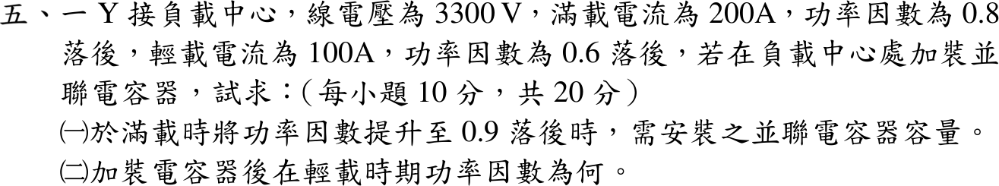

# 📝 109 年電機工程技師｜工業配電逐題詳解

> 本頁由題級 canonical 筆記組合；每題保留官方裁切圖、校驗狀態與可追溯的推導。

## 題目導覽
- [[#一、109 年工業配電第 1 題：變壓器與契約容量規劃|第 1 題：109 年工業配電第 1 題：變壓器與契約容量規劃]]
- [[#二、109 年工業配電第 2 題：三相配電線路電壓降|第 2 題：109 年工業配電第 2 題：三相配電線路電壓降]]
- [[#三、109 年工業配電第 3 題｜主幹線三相短路|第 3 題：主幹線三相短路]]
- [[#四、109 年工業配電第 4 題｜化學品工廠照明設計|第 4 題：化學品工廠照明設計]]
- [[#五、109 年工業配電第 5 題｜負載中心功率因數改善|第 5 題：負載中心功率因數改善]]

---

## 一、109 年工業配電第 1 題：變壓器與契約容量規劃

> 題級識別：EE-109-06-1
> canonical 來源：[[canonical/EE-109-06-1.md]]
> 題級校驗狀態：verified

### 已知與所求

工廠設廠初期擬申請台電高壓電力二段式時間電價。說明（一）如何決定變壓器裝置容量；（二）如何決定契約容量（最大需用電力）。題目無數值資料，屬規劃說明題。

### 考場標準作答

#### （一）變壓器裝置容量

1. **負載清冊**：列各設備額定 \(P_i\)、功因 \(\mathrm{pf}_i\)、運轉時段，換算 \(S_i=P_i/\mathrm{pf}_i\)。
2. **需量與參差**：各設備乘需量因數 \(f_{D,i}\)，同群除以參差因數 \(f_{div}\)，得最大需量 \(S_{MD}=\sum S_if_{D,i}/f_{div}\)；不可直接加總銘牌容量。
3. **檢核**：大型馬達啟動壓降、短路容量與保護協調、諧波與環境溫度降額、單台或多台（備援）配置。
4. **裕度與標準額定**：
\[
\boxed{S_{T,\mathrm{rated}}\ge S_{MD}(1+m)}
\]
\(m\) 依 3～5 年擴充計畫訂定，最後取不小於計算值的標準容量。

#### （二）契約容量（二段式時間電價）

1. 由生產排程建立 15 分鐘需量曲線 \(P(t)\)（kW），分時段求最大需量：
\[
\boxed{D_{\mathrm{經常}}=\max_{t\in\text{尖峰}}P(t),\qquad D_{\mathrm{離峰}}=\max_{t\in\text{離峰}}P(t)}
\]
2. 經常契約容量涵蓋尖峰時段必要負載；可移轉負載排到離峰，以離峰契約容量涵蓋其增量，降低經常契約。
3. 經濟性檢核：契約過高增加基本電費，過低在超約時加收超約附加費；以當期費率比較年總成本，並配合需量控制。

### 驗算

以示意負載（四台、\(f_D=0.6\sim0.9\)、\(f_{div}=1.3\)）計算，\(S_{MD}\) 低於銘牌加總；隨機 96 點日需量曲線的尖、離峰最大值中較大者即全日最大需量，說明契約容量依時段 kW 最大需量決定，與變壓器 kVA 是不同量。

### 失分點

- 以變壓器 kVA 作為契約容量；契約容量是 kW 最大需量（15 分鐘平均）。
- 未分尖峰、離峰兩段，或未利用負載移轉降低經常契約。
- 變壓器容量直接加總銘牌，未用需量與參差因數。

---

## 二、109 年工業配電第 2 題：三相配電線路電壓降

> 題級識別：EE-109-06-2
> canonical 來源：[[canonical/EE-109-06-2.md]]
> 題級校驗狀態：verified

### 已知與所求

220 V、Δ 接，導線 \((0.1+j0.2)\,\Omega/\mathrm{km}\)、長 50 m，供 100 kVA、PF 0.9 落後平衡負載。求（一）額定穩態線間百分壓降；（二）改 380 V、Y 接時的線間百分壓降。

### 考場標準作答

每線 \(Z=(0.1+j0.2)(0.05)=0.005+j0.010\,\Omega\)，
\[
R\cos\phi+X\sin\phi=0.005(0.9)+0.010(0.4359)=0.008859\,\Omega
\]
線間壓降以線電流計：\(\Delta V_{LL}=\sqrt3I_L(R\cos\phi+X\sin\phi)\)。

#### （一）220 V

\[
I_L=\frac{100000}{\sqrt3(220)}=262.43\,\mathrm A,\qquad \Delta V=\sqrt3(262.43)(0.008859)=4.027\,\mathrm V
\]
\[
\Delta V\%=\frac{4.027}{220}=\boxed{1.830\%}
\]

#### （二）380 V

\[
I_L=\frac{100000}{\sqrt3(380)}=151.93\,\mathrm A,\qquad \Delta V=2.331\,\mathrm V,\qquad \Delta V\%=\boxed{0.6135\%}
\]

### 驗算

精確相量（受電端相電壓為參考）：220 V 時 \(|V_s|=\big|127.017+262.43\angle{-25.84^\circ}(0.005+j0.01)\big|\sqrt3=224.05\,\mathrm V\)，壓降 1.840%；380 V 時 0.6146%，與近似式相差約 0.5%。且 \(0.6135/1.830=(220/380)^2\)。

### 失分點

- Δ 接誤用相電流 151.5 A 算壓降，得 0.610%；線路壓降看線電流。
- 50 m 未換成 0.05 km。

---

## 三、109 年工業配電第 3 題｜主幹線三相短路

> 題級識別：EE-109-06-3
> canonical 來源：[[canonical/EE-109-06-3.md]]
> 題級校驗狀態：verified

### 已知與所求

責任分界點短路容量 \(100\,\mathrm{MVA}\)；主變壓器 \(1000\,\mathrm{kVA}\)、\(11.4\,\mathrm{kV}/220\,\mathrm V\)、\(X_2=5\%\)；主幹線 \(0.11+j0.13\,\Omega/\mathrm{km}\)；基準 \(1000\,\mathrm{kVA}\)、\(220\,\mathrm V\)。求（一）等效標么阻抗圖；（二）主幹線 50 m 處對稱三相短路電流。

### 考場標準作答

#### （一）標么阻抗圖

\[
Z_b=\frac{220^2}{1000\times10^3}=0.0484\,\Omega,\qquad X_s=\frac{1}{100}=0.01,\qquad X_2=0.05
\]
\[
Z_3=\frac{(0.11+j0.13)(0.05)}{0.0484}=0.113636+j0.134298\,\mathrm{pu}
\]
\[
\boxed{E=1\angle0^\circ\to j0.01\to j0.05\to(0.113636+j0.134298)\to F}
\]

#### （二）三相短路電流

\[
Z_{th}=0.113636+j0.194298,\qquad |Z_{th}|=0.225088\,\mathrm{pu}
\]
\[
I_b=\frac{1000}{\sqrt3(0.22)}=2.62432\,\mathrm{kA},\qquad I_{3\phi}=\frac{2.62432}{0.225088}=\boxed{11.659\,\mathrm{kA}}
\]

### 驗算

改用歐姆值：\(Z=0.0055+j(0.000484+0.00242+0.0065)=0.0055+j0.009404\,\Omega\)，\(|Z|=0.010894\,\Omega\)，\(I=\dfrac{220/\sqrt3}{0.010894}=11.659\,\mathrm{kA}\)。

### 失分點

- 50 m 未換成 0.05 km，或線路歐姆值未除以 \(Z_b\)。
- 忽略線路電阻只取電抗和，得 \(2.624/0.194=13.51\,\mathrm{kA}\)。
- 把標么電流當 kA，漏乘 \(I_b\)。

---

## 四、109 年工業配電第 4 題｜化學品工廠照明設計

> 題級識別：EE-109-06-4
> canonical 來源：[[canonical/EE-109-06-4.md]]
> 題級校驗狀態：verified

### 已知與所求

廠房 \(60\times30\,\mathrm m\)、平均高 10 m，照度 300 lx，\(CU=0.52\)、\(M=0.52\)；400 W 高壓鈉燈每盞 23000 lm，2 燈組集中型燈具。說明設計步驟並設計燈具數與配置。

### 考場標準作答

**步驟**：確認照度需求與工作面 → 求面積 → 選光源與燈具（查 \(CU\)、\(M\)）→ 流明法求燈具數 → 取整並配置（檢核間距／高度比）→ 回算平均照度。

\[
A=60\times30=1800\,\mathrm{m^2},\qquad F=2(23000)=46000\,\mathrm{lm/具}
\]
\[
N=\frac{EA}{F\cdot CU\cdot M}=\frac{300(1800)}{46000(0.52)(0.52)}=43.41\ \Rightarrow\ \boxed{N=44\text{ 具（88 盞）}}
\]
配置 4 列 × 11 行：橫向間距 \(30/4=7.5\,\mathrm m\)、縱向 \(60/11=5.45\,\mathrm m\)，靠牆取半間距（3.75 m、2.73 m）；間距小於安裝高度 10 m，集中型燈具均勻度可接受。化學品工廠依危險場所選防爆燈具。
\[
E_{avg}=\frac{44(46000)(0.52)(0.52)}{1800}=\boxed{304.05\,\mathrm{lx}}\ge300\,\mathrm{lx}
\]

### 驗算

每具負責面積 \(7.5\times5.45=40.9\,\mathrm{m^2}\)，\(E=46000(0.2704)/40.9=304.05\,\mathrm{lx}\)，與總體回算一致。

### 失分點

- 燈具數 43.41 四捨五入成 43 具，照度只有 297 lx 不足。
- 每具光束用 23000 lm；2 燈組應為 46000 lm。
- 只算數量不給配置與間距檢核。

---

## 五、109 年工業配電第 5 題｜負載中心功率因數改善

> 題級識別：EE-109-06-5
> canonical 來源：[[canonical/EE-109-06-5.md]]
> 題級校驗狀態：verified

### 已知與所求

Y 接負載中心 \(V_{LL}=3300\,\mathrm V\)；滿載 200 A、PF 0.8 落後；輕載 100 A、PF 0.6 落後；於負載中心並聯電容器。求（一）滿載改善至 PF 0.9 落後所需容量；（二）加裝後輕載功因。

### 考場標準作答

#### （一）電容器容量

\[
P_1=\sqrt3(3300)(200)(0.8)=914.523\,\mathrm{kW},\qquad Q_1=914.523(0.75)=685.892\,\mathrm{kvar}
\]
\[
Q_{target}=914.523\tan(\cos^{-1}0.9)=442.924\,\mathrm{kvar}
\]
\[
\boxed{Q_c=685.892-442.924=242.968\,\mathrm{kvar}}
\]

#### （二）輕載功因

\[
P_2=\sqrt3(3300)(100)(0.6)=342.946\,\mathrm{kW},\qquad Q_2=342.946\left(\tfrac{4}{3}\right)=457.261\,\mathrm{kvar}
\]
\[
Q_2'=457.261-242.968=214.293\,\mathrm{kvar},\qquad \mathrm{PF}_2'=\frac{342.946}{\sqrt{342.946^2+214.293^2}}=0.84805
\]
\[
\boxed{\mathrm{PF}_2'=0.848\ \text{落後}}
\]

### 驗算

電容線電流 \(I_c=242968/(\sqrt3\cdot3300)=42.51\,\mathrm A\)；滿載補償後 \(I=\sqrt{160^2+(120-42.51)^2}=177.78\,\mathrm A=200(0.8/0.9)\)，即 PF 0.9。

### 失分點

- 輕載時誤以為電容也按比例減半；固定電容器仍提供 242.968 kvar。
- 補償後 \(Q_2'>0\)，PF 仍為落後，不可寫成超前。

---
