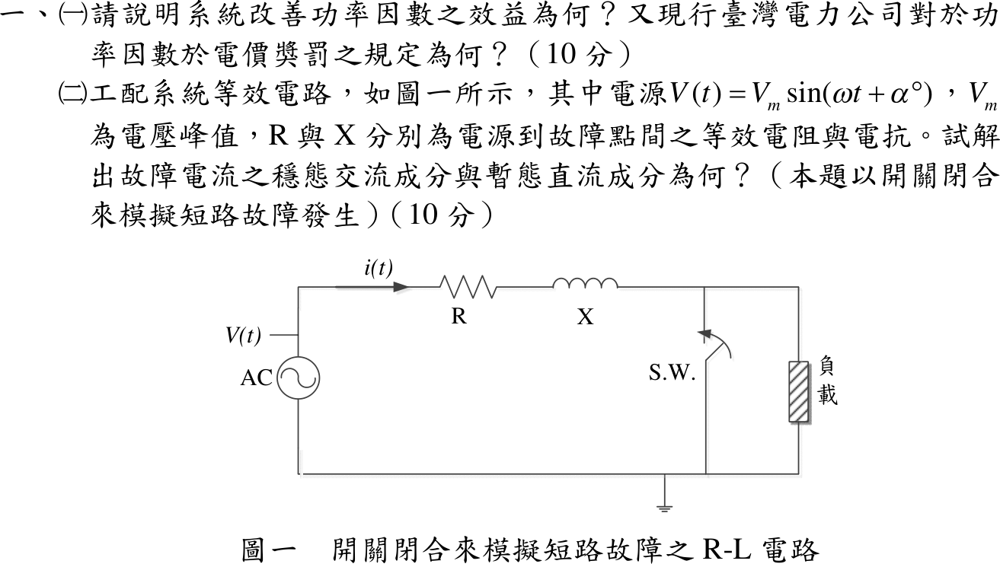
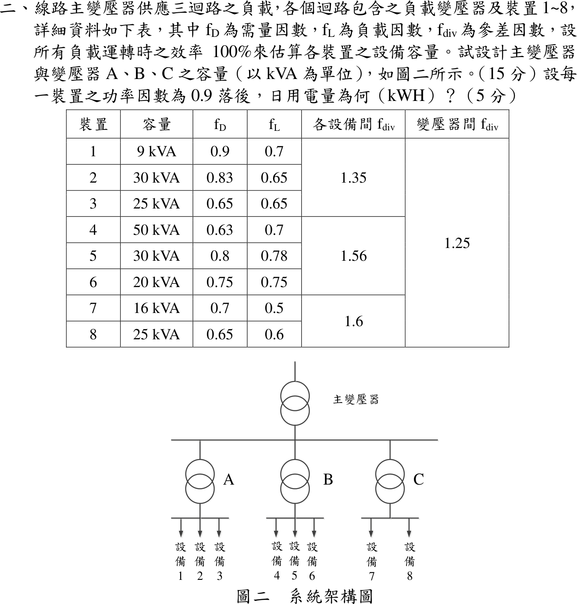
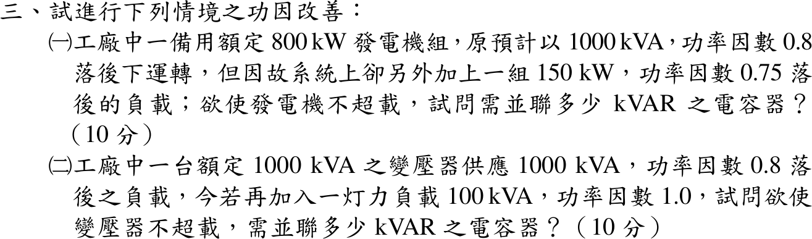
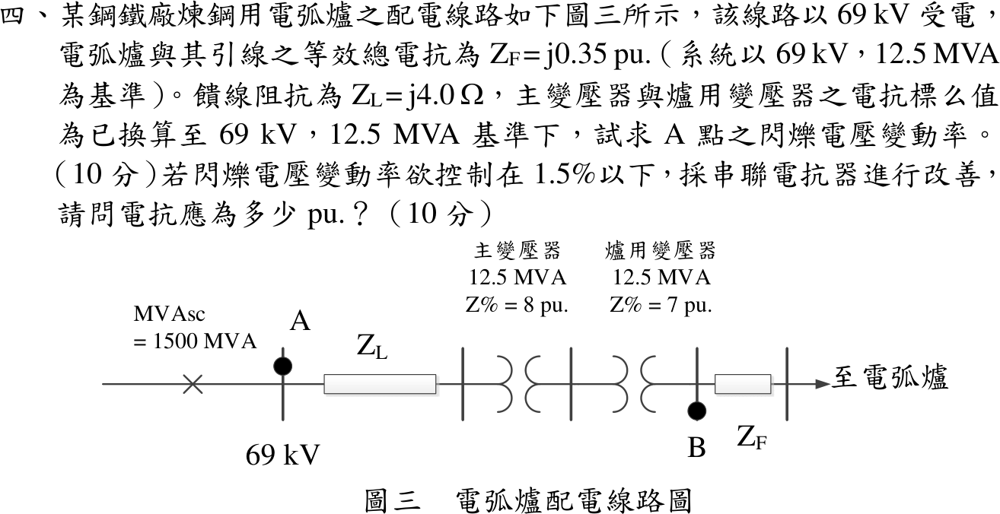
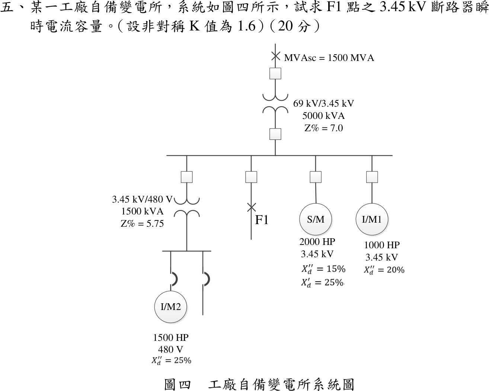

# 📝 110 年電機工程技師｜工業配電逐題詳解

> 本頁由題級 canonical 筆記組合；每題保留官方裁切圖、校驗狀態與可追溯的推導。

## 題目導覽
- [[#一、110 年第 1 題｜功率因數改善與短路暫態|第 1 題：功率因數改善與短路暫態]]
- [[#二、110 年工業配電第 2 題：變壓器容量與日用電量|第 2 題：110 年工業配電第 2 題：變壓器容量與日用電量]]
- [[#三、110 年工業配電第 3 題：功率因數改善與容量約束（含不可行條件證明）|第 3 題：110 年工業配電第 3 題：功率因數改善與容量約束（含不可行條件證明）]]
- [[#四、110 年工業配電第 4 題：電弧爐電壓閃爍|第 4 題：110 年工業配電第 4 題：電弧爐電壓閃爍]]
- [[#五、110 年工業配電第 5 題｜F1 短路與馬達貢獻|第 5 題：F1 短路與馬達貢獻]]

---

## 一、110 年第 1 題｜功率因數改善與短路暫態

> 題級識別：EE-110-06-1
> canonical 來源：[[canonical/EE-110-06-1.md]]
> 題級校驗狀態：verified

### 已知與所求

（一）說明改善功率因數的效益及台電功率因數電價獎罰規定。（二）圖一 R-L 電路，電源 \(v(t)=V_m\sin(\omega t+\alpha)\)，\(R\)、\(X\) 為電源至故障點的等效電阻與電抗，以開關閉合模擬短路，求故障電流的穩態交流成分與暫態直流成分。

### 考場標準作答

#### （一）效益與電價規定

同一有功功率下 \(I=P/(\sqrt3V\,\mathrm{pf})\)，提高功因使電流下降：

1. 線路與變壓器銅損 \(3I^2R\) 降低。
2. 電壓降 \(\Delta V\approx\sqrt3I(R\cos\phi+X\sin\phi)\) 降低，末端電壓改善。
3. 同一變壓器、饋線、開關釋出可用 kVA 容量，可延後擴充。
4. 減少功因附加費並取得電費減收。

台電規定（契約容量適用用戶）：以月平均功因 80% 為基準，

\[
\boxed{\text{每低於 80\% 一個百分點，電費加 0.1\%；每高於 80\% 一個百分點，電費減 0.1\%，超過 95\% 部分不再減}}
\]

#### （二）R-L 短路電流

令 \(|Z|=\sqrt{R^2+X^2}\)、\(\theta=\tan^{-1}(X/R)\)、\(X=\omega L\)。閉合後 \(L\,di/dt+Ri=V_m\sin(\omega t+\alpha)\)，短路前故障支路電流為 0，電感電流連續 \(i(0^+)=0\)。

穩態交流成分（特解）：
\[
\boxed{i_{ac}(t)=\frac{V_m}{\sqrt{R^2+X^2}}\sin(\omega t+\alpha-\theta)}
\]
暫態直流成分（齊次解 \(Ke^{-Rt/L}\)，由 \(i(0)=0\) 定 \(K\)）：
\[
\boxed{i_{dc}(t)=-\frac{V_m}{\sqrt{R^2+X^2}}\sin(\alpha-\theta)\,e^{-Rt/L}}
\]
時間常數 \(\tau=L/R=X/(\omega R)\)；\(\alpha=\theta\) 時無直流偏移，\(\alpha-\theta=\pm90^\circ\) 時偏移最大。

### 驗算

代回原式：\(L\,di_{ac}/dt+Ri_{ac}=|Z|I_m\sin(\omega t+\alpha-\theta+\theta)=V_m\sin(\omega t+\alpha)\)；\(L\,di_{dc}/dt+Ri_{dc}=0\)；\(i_{ac}(0)+i_{dc}(0)=I_m\sin(\alpha-\theta)-I_m\sin(\alpha-\theta)=0\)。電價條文：PF 70% 加 1.0%，PF 99% 只減到 95% 的 1.5%。

### 失分點

- 直流項漏負號或寫成 \(\sin\alpha\)；起始值需同時扣除相角 \(\theta\)。
- 時間常數寫成 \(R/L\)。
- 罰則寫成每 1% 加 0.3%；台電條文為 0.1%，且減收算到 95% 為止。

### 條件與疑義

題圖開關跨接負載，閉合前若負載電流 \(i_0\) 不可忽略，直流項改為 \([i_0-I_m\sin(\alpha-\theta)]e^{-Rt/L}\)；本解依短路分析慣例取故障前電流 0。

---

## 二、110 年工業配電第 2 題：變壓器容量與日用電量

> 題級識別：EE-110-06-2
> canonical 來源：[[canonical/EE-110-06-2.md]]
> 題級校驗狀態：verified

### 已知與所求

主變壓器供 A（裝置 1～3，設備間 \(f_{div}=1.35\)）、B（4～6，1.56）、C（7～8，1.6），變壓器間 \(f_{div}=1.25\)；各裝置容量、\(f_D\)、\(f_L\) 如表，效率 100%。求（一）主變壓器與 A、B、C 容量（kVA）；（二）PF 0.9 落後時日用電量。

### 考場標準作答

#### （一）變壓器容量

各裝置最大需量 \(D_i=S_if_{D,i}\)，群組最大需量 \(=\sum D_i/f_{div}\)：

\[
S_A=\frac{9(0.9)+30(0.83)+25(0.65)}{1.35}=\frac{49.25}{1.35}=\boxed{36.48\,\mathrm{kVA}}
\]
\[
S_B=\frac{50(0.63)+30(0.8)+20(0.75)}{1.56}=\frac{70.5}{1.56}=\boxed{45.19\,\mathrm{kVA}}
\]
\[
S_C=\frac{16(0.7)+25(0.65)}{1.6}=\frac{27.45}{1.6}=\boxed{17.16\,\mathrm{kVA}}
\]
\[
S_{main}=\frac{36.48+45.19+17.16}{1.25}=\boxed{79.06\,\mathrm{kVA}}
\]
選用標準容量：A、B 各 50 kVA，C 20 kVA，主變壓器 100 kVA。

#### （二）日用電量

平均負載 \(=f_L\times\) 最大需量，各裝置 \(\sum S_if_{D,i}f_{L,i}=99.7875\,\mathrm{kVA}\)：
\[
E=24(0.9)(99.7875)=\boxed{2155.41\,\mathrm{kWh}}
\]

### 驗算

分群加總：A \(24(0.9)(5.67+16.185+10.5625)=700.22\)、B \(24(0.9)(22.05+18.72+11.25)=1123.63\)、C \(24(0.9)(5.6+9.75)=331.56\)，合計 \(2155.41\,\mathrm{kWh}\)。

### 失分點

- 參差因數用乘的；\(f_{div}\ge1\)，群組需量應除以它。
- 主變壓器用標準額定（50+50+20）再除 1.25；應以計算需量相加。
- 日用電量漏乘負載因數或功因。

### 條件與疑義

標準容量級距假設為三相 10、15、20、30、50、75、100 kVA；若級距含 37.5 kVA，A 可選 37.5 kVA。

---

## 三、110 年工業配電第 3 題：功率因數改善與容量約束（含不可行條件證明）

> 題級識別：EE-110-06-3
> canonical 來源：[[canonical/EE-110-06-3.md]]
> 題級校驗狀態：needs_manual_review
> [!WARNING] 本題仍有官方資料缺口或事件定義歧義；請以 canonical 條件式解答為準。

### 已知與所求

（一）額定 800 kW 備用發電機組，原以 1000 kVA、PF 0.8 落後運轉，另加 150 kW、PF 0.75 落後負載，求使發電機不超載的並聯電容 kvar。（二）1000 kVA 變壓器供 1000 kVA、PF 0.8 落後負載，再加 100 kVA、PF 1.0 燈力負載，求使變壓器不超載的電容 kvar。

### 考場標準作答

電容只供無效功率：補償後 \(Q\le\sqrt{S_{rated}^2-P^2}\)，\(Q_c=Q-Q_{allow}\)。

#### （一）發電機

\[
P=800+150=950\,\mathrm{kW},\qquad Q=600+150\tan(\cos^{-1}0.75)=600+132.29=732.29\,\mathrm{kvar}
\]
\[
Q_{allow}=\sqrt{1000^2-950^2}=312.25\,\mathrm{kvar},\qquad \boxed{Q_c=420.04\,\mathrm{kvar}}
\]
補償後 PF \(=950/1000=0.95\) 落後，發電機電流回到 1000 kVA 額定內。但 \(950\,\mathrm{kW}>800\,\mathrm{kW}\)，原動機有功仍超載，電容無法改善，須卸載 150 kW 或改用較大機組。

#### （二）變壓器

\[
P=800+100=900\,\mathrm{kW},\qquad Q=600\,\mathrm{kvar},\qquad Q_{allow}=\sqrt{1000^2-900^2}=435.89\,\mathrm{kvar}
\]
\[
\boxed{Q_c=600-435.89=164.11\,\mathrm{kvar}}
\]

### 驗算

（一）\(\sqrt{950^2+(732.29-420.04)^2}=\sqrt{902500+97500}=1000\,\mathrm{kVA}\)。（二）\(\sqrt{900^2+435.89^2}=\sqrt{810000+190000}=1000\,\mathrm{kVA}\)，PF \(=0.90\) 落後。

### 失分點

- 新增負載的 \(Q\) 用 \(150\times0.75\)；應為 \(P\tan\phi=132.29\,\mathrm{kvar}\)。
- 把「改善到某 PF」當目標；本題限制是額定 kVA，所需 PF 由 \(P/S_{rated}\) 決定。

### 條件與疑義

（一）題幹同時給 800 kW 與 1000 kVA。依題意「並聯多少 kvar」取 1000 kVA 為發電機（電樞）容量限制得 420.04 kvar；若「不超載」指原動機 800 kW，則任何電容皆不可行，作答時兩點都要寫明。

---

## 四、110 年工業配電第 4 題：電弧爐電壓閃爍

> 題級識別：EE-110-06-4
> canonical 來源：[[canonical/EE-110-06-4.md]]
> 題級校驗狀態：verified

### 已知與所求

69 kV 受電，\(\mathrm{MVA_{sc}}=1500\,\mathrm{MVA}\)；基準 \(69\,\mathrm{kV}\)、\(12.5\,\mathrm{MVA}\)。饋線 \(Z_L=j4.0\,\Omega\)，主變壓器 \(8\%\)、爐用變壓器 \(7\%\)（已在同一基準），電弧爐與引線 \(Z_F=j0.35\,\mathrm{pu}\)。官方圖說 A 點在 69 kV 母線上（饋線 \(Z_L\) 之前）。求（一）A 點閃爍電壓變動率；（二）控制在 1.5% 以下所需串聯電抗器 pu 值。

### 考場標準作答

\[
X_S=\frac{12.5}{1500}=0.008333,\qquad Z_b=\frac{69^2}{12.5}=380.88\,\Omega,\qquad X_L=\frac{4}{380.88}=0.010502\ \mathrm{pu}
\]
電弧爐電極短路時，由理想電源至爐的總電抗
\[
X_{all}=0.008333+0.010502+0.08+0.07+0.35=0.518835\,\mathrm{pu}
\]

#### （一）A 點閃爍

A 點上游只有 \(X_S\)：
\[
\Delta V_A=\frac{X_S}{X_{all}}=\frac{0.008333}{0.518835}=\boxed{1.606\%}
\]

#### （二）串聯電抗器

電抗器 \(X_R\) 串在 A 點下游的電弧爐回路：
\[
\frac{0.008333}{0.518835+X_R}\le0.015\ \Rightarrow\ \boxed{X_R\ge0.03672\,\mathrm{pu}}
\]

### 驗算

取 \(X_R=0.03672\)：\(I=1/[j(0.518835+0.03672)]=-j1.8000\,\mathrm{pu}\)，\(V_A=1-jX_SI=1-0.008333(1.8)=0.9850\)，變動率恰為 1.5%。

### 失分點

- 把 \(Z_L\) 與主變壓器算進 A 點上游；A 點在饋線之前。
- \(j4\,\Omega\) 未除以 \(Z_b=380.88\,\Omega\) 直接與 pu 相加。
- 電抗器加在分子；串聯電抗是增大分母、降低爐電流。

### 條件與疑義

題目未指定串聯電抗器位置；本解裝在 A 點下游。若裝在 A 點上游，A 點變動率為 \((X_S+X_R)/(X_{all}+X_R)\)，反而變大。

#### 另一觀測點分支：圖示 B 點

若觀測點改為爐用變壓器低壓側 B 點：\(X_{up,B}=X_S+X_L+X_{T1}+X_{T2}=0.168835329\,\mathrm{pu}\)，\(\Delta V_B=0.168835/0.518835=32.5412\%\)，降到 1.5% 需 \(X_R\ge10.736853\,\mathrm{pu}\)。另以 \(X_S+X_L+X_{T1}=0.098835\) 為上游所得的 19.05%／6.07 pu 對應兩變壓器之間的假想觀測點，既非 A 點，也非圖示 B 點。

---

## 五、110 年工業配電第 5 題｜F1 短路與馬達貢獻

> 題級識別：EE-110-06-5
> canonical 來源：[[canonical/EE-110-06-5.md]]
> 題級校驗狀態：reference_book_verified

### 已知與所求

圖四：\(\mathrm{MVA_{sc}}=1500\,\mathrm{MVA}\)；T1 \(69/3.45\,\mathrm{kV}\)、\(5000\,\mathrm{kVA}\)、\(Z=7\%\)；3.45 kV 母線接 S/M \(2000\,\mathrm{HP}\)（\(X_d''=15\%\)）、I/M1 \(1000\,\mathrm{HP}\)（\(X_d''=20\%\)），並經 T2 \(3.45\,\mathrm{kV}/480\,\mathrm V\)、\(1500\,\mathrm{kVA}\)、\(Z=5.75\%\) 接 I/M2 \(1500\,\mathrm{HP}\)（\(X_d''=25\%\)）；F1 在母線饋線上。非對稱 \(K=1.6\)，求 F1 點 3.45 kV 斷路器瞬時電流容量。

### 考場標準作答

採 1 HP≈1 kVA、各內電勢 \(E''=1\,\mathrm{pu}\)（見條件與疑義）。基準 \(100\,\mathrm{MVA}\)、\(3.45\,\mathrm{kV}\)：
\[
I_b=\frac{100}{\sqrt3(3.45)}=16.735\,\mathrm{kA}
\]

| 來源 | 電抗（pu） | 貢獻（pu） |
|---|---:|---:|
| 電力公司＋T1：\(\frac{100}{1500}+0.07\frac{100}{5}\) | 1.4667 | 0.6818 |
| S/M：\(0.15\frac{100}{2}\) | 7.5 | 0.1333 |
| I/M1：\(0.20\frac{100}{1}\) | 20 | 0.0500 |
| T2＋I/M2：\(0.0575\frac{100}{1.5}+0.25\frac{100}{1.5}\) | 20.5 | 0.0488 |

\[
I_{sym}=0.9139(16.735)=\boxed{15.29\,\mathrm{kA}}
\]
\[
I_{mom}=K\,I_{sym}=1.6(15.29)=\boxed{24.47\,\mathrm{kA}}
\]
參考書四捨五入寫成 15.30 kA／24.48 kA。

### 驗算

改用 \(5\,\mathrm{MVA}\) 基準求戴維寧阻抗：\(Z_{th}=0.07333\parallel0.375\parallel1.0\parallel1.025=0.05471\,\mathrm{pu}\)，\(I=\dfrac{5}{\sqrt3(3.45)}\Big/0.05471=0.8367/0.05471=15.29\,\mathrm{kA}\)，與 100 MVA 基準一致。

### 失分點

- 漏掉 480 V 側 I/M2：其經 T2 的反饋仍流到 F1。
- T2 與 I/M2 電抗並聯；兩者應串聯後再與其他來源並聯。
- \(K\) 只乘一次，不得再乘 \(\sqrt2\) 或重複套用。

### 條件與疑義

題目未給 \(K\) 的定義：若 \(K\) 是 RMS 非對稱倍率，24.47 kA 為非對稱 RMS 值；若 \(K\) 是峰值倍率，同一數值為峰值。須先確認是 RMS 非對稱倍率或峰值倍率，不得把同一個 \(K\) 再乘一次。

效率／功因參數化：題目只給 HP，未給效率與功因。若 \(S_i=0.000746\,\mathrm{HP}_i/k_i\)（MVA，\(k=\eta\,\mathrm{pf}\)），三台取相同 \(k\)：

| \(k\) | \(I_{sym}\)（kA） | \(1.6I_{sym}\)（kA） |
|---:|---:|---:|
| 0.80 | 15.0420 | 24.0672 |
| 0.85 | 14.8360 | 23.7376 |
| 0.90 | 14.6522 | 23.4435 |
| 1.00 | 14.3382 | 22.9411 |

1 HP≈1 kVA 相當於 \(k=0.746\)，故主解略大於上表各列。

---
