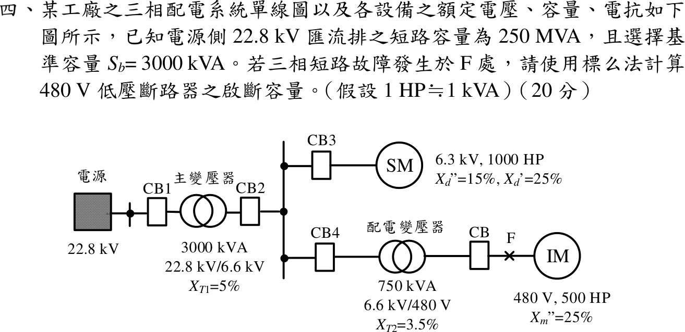

# 📝 113 年電機工程技師｜工業配電逐題詳解

> 本頁由題級 canonical 筆記組合；每題保留官方裁切圖、校驗狀態與可追溯的推導。

## 題目導覽
- [[#一、113 年第 1 題｜日負載曲線與主變壓器容量|第 1 題：日負載曲線與主變壓器容量]]
- [[#二、113 年第 2 題｜單相線路壓降與功率因數校正|第 2 題：單相線路壓降與功率因數校正]]
- [[#三、113 年第 3 題｜電弧爐電壓閃爍與串聯電抗器|第 3 題：電弧爐電壓閃爍與串聯電抗器]]
- [[#四、113 年第 4 題｜480 V 匯流排三相短路啟斷容量|第 4 題：480 V 匯流排三相短路啟斷容量]]
- [[#五、113 年第 5 題｜CO-7 過電流電驛與 CT 比流器|第 5 題：CO-7 過電流電驛與 CT 比流器]]

---

## 一、113 年第 1 題｜日負載曲線與主變壓器容量

> 題級識別：EE-113-06-1
> canonical 來源：[[canonical/EE-113-06-1.md]]
> 題級校驗狀態：verified

### 官方題目（逐題裁切）

某一製造廠設有 A、B、C 三個分廠，使用一台主變壓器供應各分廠用電，由電錶得知各分廠一日內之用電量曲線如下圖所示，試回答下列問題：（20 分）
* **(一)** 若製造廠之總和功率因數為 0.94 落後，則主變壓器之容量最少應為幾 kVA？（10 分）
* **(二)** 此製造廠配電系統之總和日負載因數為何？（10 分）

### 獨立重算

官方裁切圖的縱軸是電錶讀值（「用電量（度）」），因此曲線是累積電能，不是瞬時功率。由相鄰四小時讀值相減，再除以 \(4\,\mathrm{h}\)，得到總負載的區間平均值：

| 區間 | 總電能增量（kWh） | 區間平均負載（kW） |
|---|---:|---:|
| \(0\text{--}4\) h | \(1000\) | \(250\) |
| \(4\text{--}8\) h | \(2000\) | \(500\) |
| \(8\text{--}12\) h | \(4500\) | \(1125\) |
| \(12\text{--}16\) h | \(4100\) | \(1025\) |
| \(16\text{--}20\) h | \(2400\) | \(600\) |
| \(20\text{--}24\) h | \(1000\) | \(250\) |

所以最大需量為

\[
P_{\max}=1125\,\mathrm{kW}
\]

且發生於 \(8\text{--}12\) h。總和功率因數為 \(0.94\) 落後時，主變壓器至少需

\[
S_{\min}=\frac{P_{\max}}{0.94}
 =\frac{1125}{0.94}=1196.8085\,\mathrm{kVA}.
\]

24 小時總用電量由末端累積讀值直接得出：

\[
E_{\mathrm{day}}=4600+3200+7200=15000\,\mathrm{kWh}.
\]

故總和日負載因數為

\[
\mathrm{LF}_{\mathrm{day}}
 =\frac{E_{\mathrm{day}}}{P_{\max}\times24\,\mathrm{h}}
 =\frac{15000}{1125\times24}=0.5555556
 \approx55.56\%.
\]

### 結論

\[
\boxed{S_{\min}=1196.8085\,\mathrm{kVA}}
\quad\text{（選用標準容量 }1250\,\mathrm{kVA}\text{）},\qquad
\boxed{\mathrm{LF}_{\mathrm{day}}\approx55.56\%}.
\]

以累積電錶讀值誤當成瞬時 kW，會把能量與尖峰需量都算錯；上述增量表由官方圖上各時間點重新相減，提供了單位與邊界條件的回算核對。

---

## 二、113 年第 2 題｜單相線路壓降與功率因數校正

> 題級識別：EE-113-06-2
> canonical 來源：[[canonical/EE-113-06-2.md]]
> 題級校驗狀態：verified

### 官方題目（逐題裁切）

有一阻抗為 \(1.68+j1.26\,\Omega\) 之單相兩線負載，經由一電纜線連接於電壓固定為 \(220\,\mathrm{V}\)、\(60\,\mathrm{Hz}\) 之電源，已知電纜線長 \(130\,\mathrm{m}\)，單位長度之阻抗為 \(0.483+j0.1083\,\Omega/\mathrm{km}\)，欲採用並聯電容器進行功率因數校正，並改善電壓降。若負載電壓降百分率之容許值為 \(5\%\)，則功率因數至少需校正至何值，才能使電壓降合乎規定？（20 分）

### 獨立重算

130 m 是單相兩線的線路長度；因此來回線路阻抗為

\[
Z_{\ell}=2(0.130)(0.483+j0.1083)
 =0.12558+j0.028158\,\Omega.
\]

以負載端額定電壓 \(220\,\mathrm{V}\) 計算負載實、虛功率。因
\(|Z_L|^2=1.68^2+1.26^2=4.41\)，有

\[
P=\frac{220^2(1.68)}{4.41}=18438.0952\,\mathrm{W},\qquad
Q_L=\frac{220^2(1.26)}{4.41}=13828.5714\,\mathrm{var}.
\]

並聯電容只提供超前無效功率，不改變 \(P\)。令校正後仍為落後的功率因數 \(p=\cos\phi\)，則

\[
I=\frac{P}{220p},\qquad
\Delta V\simeq I(R_{\ell}p+X_{\ell}\sin\phi)
 =\frac{P}{220}\left(R_{\ell}+X_{\ell}\tan\phi\right).
\]

容許壓降為 \(0.05(220)=11\,\mathrm{V}\)。在臨界條件 \(\Delta V=11\,\mathrm{V}\) 下

\[
\tan\phi
 =\frac{11(220)/P-0.12558}{0.028158}
 =0.2013637,
\]

\[
p=\frac{1}{\sqrt{1+\tan^2\phi}}
 =0.9803227\approx0.9803.
\]

當功率因數高於此值時，線路壓降更小；故應校正至至少 (0.9803) 落後（或更接近 1）。代回可得

\[
\Delta V=\frac{18438.0952}{220}
 (0.12558+0.028158\times0.2013637)=11.0000\,\mathrm{V},
\]

與 5% 邊界一致。

### 結論

\[
\boxed{\mathrm{PF}_{\min}=0.9803\ \text{lagging}}.
\]

---

## 三、113 年第 3 題｜電弧爐電壓閃爍與串聯電抗器

> 題級識別：EE-113-06-3
> canonical 來源：[[canonical/EE-113-06-3.md]]
> 題級校驗狀態：verified

### 考場標準作答

取 \(S_b=3\,\mathrm{MVA}\)，量測點上游電抗與下游電抗為
\[
X_u=\frac{3}{1500}+0.06\frac{3}{7}=0.0277143\,\mathrm{pu},
\qquad X_d=0.05+0.41=0.46\,\mathrm{pu}.
\]
斷弧時量測點電壓為 \(1\,\mathrm{pu}\)，導通時為 \(X_d/(X_u+X_d)\)，故
\[
\boxed{\Delta V=\frac{X_u}{X_u+X_d}=0.0568248\approx5.6825\%}.
\]
若目標為 \(0.45\%=0.0045\)，則
\[
0.0045=\frac{X_u}{X_u+X_d+X_R},\quad
\boxed{X_R=5.6710\,\mathrm{pu}},\quad
\boxed{S_R=X_RS_b\approx17.01\,\mathrm{MVA}}\quad\text{（按基準電流定義的電抗容量）}.
\]

### 得分點拆解

- 依量測點分清上游與下游，統一換算至 \(3\,\mathrm{MVA}\) 基準。
- 用斷弧、導通兩狀態的分壓差求閃爍率。
- 將百分率轉成小數後解新增電抗，最後再換算容量與單位。

### 完整教學推導

#### 官方題目（逐題裁切）

有一煉鋼廠之電弧爐由電網以 \(69\,\mathrm{kV}\) 供電，如下圖所示。已知電源側短路容量為 \(1500\,\mathrm{MVA}\)，電弧爐之總電抗為 \(41\%\)，主變壓器與爐用變壓器之規格如圖所標示。為顧及廠內用電之電力品質，量測點位於主變壓器低壓側匯流排，若選擇基準容量 \(S_b=3\,\mathrm{MVA}\)，試回答下列問題：（20 分）
* **(一)** 電弧爐運轉時所引起之電壓閃爍變動率為何？（10 分）
* **(二)** 若電壓閃爍變動率以台電諧波管制之規定值 0.45% 為目標，欲採用串聯電抗器於爐用變壓器高壓側進行改善至合乎規定，則所需之電抗器容量為何？（10 分）

#### 獨立重算

以 \(S_b=3\,\mathrm{MVA}\) 為基準，並以各變壓器的額定電壓比建立電壓基準。電源等效電抗、主變壓器與爐用變壓器分別為

\[
X_s=\frac{3}{1500}=0.002\,\mathrm{pu},\qquad
X_{T1}=0.06\frac{3}{7}=0.0257143\,\mathrm{pu},
\]
\[
X_{T2}=0.05\frac{3}{3}=0.05\,\mathrm{pu},\qquad
X_F=0.41\,\mathrm{pu}.
\]

量測點在主變低壓側，故其上游電抗為

\[
X_u=X_s+X_{T1}=0.0277143\,\mathrm{pu},
\]

而電弧爐支路（爐變加電弧爐）為 \(X_d=0.46\,\mathrm{pu}\)。電弧爐未導通時量測點電壓為 \(1\,\mathrm{pu}\)；導通時

\[
I=\frac{1}{X_u+X_d},\qquad
V_m=1-I X_u=\frac{X_d}{X_u+X_d}.
\]

因此由斷弧到運轉的電壓閃爍變動率為

\[
\Delta V=1-V_m
 =\frac{X_u}{X_u+X_d}
 =\frac{0.0277143}{0.0277143+0.46}
 =0.0568248\approx5.6825\%.
\]

若在爐用變壓器高壓側串入 \(X_R\)，要求 \(\Delta V=0.0045\)，則

\[
0.0045=\frac{X_u}{X_u+X_d+X_R}
\quad\Longrightarrow\quad
X_R=\frac{X_u}{0.0045}-X_u-X_d
 =5.6710\,\mathrm{pu}.
\]

若以基準電流下的三相電抗容量表示，所需容量為

\[
S_{R,\mathrm{base}}=X_R S_b=5.6710(3)=17.0130\,\mathrm{MVA}
 \approx17.01\,\mathrm{MVA}.
\]

「電抗器容量」若指改善後實際運轉無功，則運轉電流 \(I=1/(X_u+X_d+X_R)\approx0.16237\,\mathrm{pu}\)，故 \(Q_R=I^2X_RS_b\approx0.449\,\mathrm{Mvar}\)。題目未明定容量額定慣例；作答時應寫出採用的電流基準，不能將 17.01 MVA 說成唯一的運轉無功值。

### 獨立驗算

\[
\boxed{\Delta V\approx5.6825\%},\qquad
\boxed{X_R\approx5.6710\,\mathrm{pu}},\qquad
\boxed{S_{R,\mathrm{base}}\approx17.01\,\mathrm{MVA}}.
\]

上述 \(X_R\) 是以 \(3\,\mathrm{MVA}\) 基準表示的標么電抗；以基準電流乘其電抗壓降才得到 \(17.01\,\mathrm{MVA}\) 的基準電流額定表示。直接以 \(X_u/(X_u+X_d)\) 的電壓分壓關係回代，得到同一個閃爍率。

加入電抗器後回代：\(0.0277143/(0.0277143+0.46+5.6710)\approx0.0045\)，符合目標。

### 常見失分

- 把爐用變壓器算在量測點上游，會讓閃爍率分子錯誤。
- 把 \(0.45\%\) 誤代為 \(0.45\) 或 \(0.045\)，容量會嚴重失真。
- 把電抗的 pu 值直接當成 MVA，漏乘基準容量。
- 未交代容量是按基準電流標示，還是改善後的實際運轉無功。

---

## 四、113 年第 4 題｜480 V 匯流排三相短路啟斷容量

> 題級識別：EE-113-06-4
> canonical 來源：[[canonical/EE-113-06-4.md]]
> 題級校驗狀態：needs_manual_review
> [!WARNING] 本題仍有官方資料缺口或事件定義歧義；請以 canonical 條件式解答為準。

### 官方題目（逐題裁切）

某工廠之三相配電系統單線圖以及各設備之額定電壓、容量、電抗如下圖所示，已知電源側 \(22.8\,\mathrm{kV}\) 匯流排之短路容量為 \(250\,\mathrm{MVA}\)，且選擇基準容量 \(S_b=3000\,\mathrm{kVA}\)。若三相短路故障發生於 F 處，請使用標么法計算 \(480\,\mathrm{V}\) 低壓斷路器之啟斷容量。（假設 \(1\,\mathrm{hp}\approx1\,\mathrm{kVA}\)）（20 分）

### 考場標準作答

**條件與作答界線：**以下只作初始對稱次暫態短路估算。取共同容量基準 \(S_b=3\,\mathrm{MVA}\)，電壓基準依變比為 \(22.8/6.6/0.48\,\mathrm{kV}\)；並假設電源、同步馬達與感應馬達的內部電勢均為 \(1\angle0^\circ\,\mathrm{pu}\)，以 \(6.6\,\mathrm{kV}\) 系統電壓基準建立標么值（其他電壓層依變比延伸），忽略電阻。

同步馬達額定電壓為 \(6.3\,\mathrm{kV}\)，不可省略電壓基準平方項：

\[
X_{SM}''=0.15\frac{3}{1}\left(\frac{6.3}{6.6}\right)^2=0.410020661\,\mathrm{pu}.
\]

其餘電抗為 \(X_s=3/250=0.012\)、\(X_{T1}=0.05\)、\(X_{T2}=0.035(3/0.75)=0.14\)、\(X_{IM}''=0.25(3/0.5)=1.50\,\mathrm{pu}\)。由上游電源與同步馬達經 \(T_2\) 到 CB 的等效電抗：

\[
X_u=\left((0.012+0.05)\parallel0.410020661\right)+0.14=0.193856289\,\mathrm{pu}.
\]

因此圖示低壓 CB 支路的初始對稱短路量為

\[
\boxed{S_{\mathrm{CB},F}=\frac{3}{X_u}=15.475381\,\mathrm{MVA}\approx15.48\,\mathrm{MVA}},\qquad
\boxed{I_{\mathrm{CB},F}=\frac{3/X_u}{\sqrt3(0.48)}=18.613991\,\mathrm{kA}\approx18.61\,\mathrm{kA}}.
\]

F 點右側感應馬達另向故障倒灌：

\[
\boxed{S_{F}=15.475381+2.000000=17.475381\,\mathrm{MVA}\approx17.48\,\mathrm{MVA}},\qquad
\boxed{I_{F}=18.613991+2.405626=21.019617\,\mathrm{kA}\approx21.02\,\mathrm{kA}}.
\]

其中 \(S_{IM,F}=3/1.50=2.000000\,\mathrm{MVA}\)，且

\[
I_{IM,F}=\frac{2\times10^6}{\sqrt3(480)}=2405.626\,\mathrm{A}=2.405626\,\mathrm{kA}.
\]

**依原圖拓樸，低壓 CB 位於 \(T_2\) 與 F 之間，感應馬達支路接在 F 點右側；馬達對 F 的倒灌不流經此 CB。**故 CB 支路量與 F 點總量不可混稱。以上是明列條件下的初始次暫態估算，不能宣稱為唯一官方評分口徑。若「啟斷電流」指實際接點分離時刻的電流，題面未給分離時間、衰減／時間常數及故障前運轉資料，故無法唯一求得；單有 \(X_d'=25\%\) 也不能決定該時刻電流。

### 得分點拆解

- 取 \(3\,\mathrm{MVA}\) 共同容量基準，電壓基準依變壓器比設定。
- 同步馬達換基準須乘 \((6.3/6.6)^2\)，得 \(X_{SM}''=0.410020661\,\mathrm{pu}\)。
- 依圖先求經 CB 的上游支路，再另外計 F 點總電流；不可把負載側馬達倒灌算入 CB 接點電流。
- 初始次暫態條件下，分別報 CB 支路 \(15.475381\,\mathrm{MVA}/18.613991\,\mathrm{kA}\) 與 F 點總量 \(17.475381\,\mathrm{MVA}/21.019617\,\mathrm{kA}\)。
- 說明條件解不是已證實的唯一官方答案；實際接點分離電流尚缺必要時序與衰減資料。

### 完整教學推導

取 \(S_b=3\,\mathrm{MVA}\)，並令各電壓層的系統基準為 \(22.8\)、\(6.6\)、\(0.48\,\mathrm{kV}\)。標么電抗換基準公式為

\[
X_{pu,new}=X_{pu,old}\frac{S_{b,new}}{S_{b,old}}\left(\frac{V_{b,old}}{V_{b,new}}\right)^2.
\]

同步馬達以 \(1\,\mathrm{MVA}\)、\(6.3\,\mathrm{kV}\) 為銘牌基準，故

\[
X_{SM}''=0.15\frac{3}{1}\left(\frac{6.3}{6.6}\right)^2=0.410020661\,\mathrm{pu}.
\]

電源與升壓變壓器串聯後為 \(0.012+0.05=0.062\,\mathrm{pu}\)。在 6.6 kV 匯流排與同步馬達電抗並聯，再加上 \(T_2\)：

\[
X_u=(0.062\parallel0.410020661)+0.14=0.193856289\,\mathrm{pu}.
\]

低壓基準電流為

\[
I_b=\frac{3\times10^6}{\sqrt3(480)}=3608.439\,\mathrm{A}.
\]

CB 在該故障下只承載上游支路貢獻：

\[
S_{\mathrm{CB},F}=\frac{S_b}{X_u}=15.475381\,\mathrm{MVA},\qquad
I_{\mathrm{CB},F}=\frac{I_b}{X_u}=18.613991\,\mathrm{kA}.
\]

感應馬達支路電抗 \(X_{IM}''=1.50\,\mathrm{pu}\)，所以

\[
S_{IM,F}=\frac{3}{1.50}=2.000000\,\mathrm{MVA},\qquad
I_{IM,F}=\frac{I_b}{1.50}=\frac{3608.439\,\mathrm{A}}{1.50}=2405.626\,\mathrm{A}=2.405626\,\mathrm{kA}.
\]

所有內部電勢同相且忽略電阻時，F 點總量等於兩支路貢獻相加：

\[
S_F=S_{\mathrm{CB},F}+S_{IM,F}=17.475381\,\mathrm{MVA},\qquad
I_F=I_{\mathrm{CB},F}+I_{IM,F}=21.019617\,\mathrm{kA}.
\]

### 獨立驗算

CB 支路與馬達支路在 F 點並聯，其戴維寧電抗為

\[
X_{th,F}=X_u\parallel X_{IM}''=0.171670073\,\mathrm{pu},\qquad
\frac{3}{X_{th,F}}=17.475381\,\mathrm{MVA}.
\]

此結果與支路短路容量相加 \(15.475381+2.000000=17.475381\,\mathrm{MVA}\) 一致。此驗算確認的是明列同相、純電抗假設下的 F 點初始總量，不會把該總量變成 CB 接點電流，也不會確定實際分離時刻的啟斷電流。

### 常見失分

- 同步馬達電抗換基準漏掉 \((6.3/6.6)^2\)，或把新舊電壓比平方顛倒。
- 把 \(250\,\mathrm{MVA}\) 直接與馬達容量相加，而沒有先換成標么電抗。
- 把 F 點總量 \(17.475381\,\mathrm{MVA}/21.019617\,\mathrm{kA}\) 誤當成圖示 CB 接點電流；CB 支路量為 \(15.475381\,\mathrm{MVA}/18.613991\,\mathrm{kA}\)。
- 未說明內電勢相角、電壓基準及初始次暫態假設，卻把條件數值寫成無條件唯一答案。
- 只因題目同時給 \(X_d''\) 與 \(X_d'\)，便直接把 \(X_d'\) 當作接點分離時電抗；沒有時間及衰減資料不能決定該時刻狀態。

### 未決條件與稽核狀態

依題解規範，題面未指定啟斷程序且缺少接點分離／機器衰減／故障前運轉資料，故本題維持 `needs_manual_review`。現有條件計算可作步驟練習，但不把所選假設或任何一組數值宣稱為唯一官方口徑。補充研究報告檔案位於 repository 的 `reports/113年工業配電Q4啟斷容量口徑研究.md`；為避免工作台出現無法解析的連結，此處只標示路徑，該報告尚未加入 Pages 靜態套件。

---

## 五、113 年第 5 題｜CO-7 過電流電驛與 CT 比流器

> 題級識別：EE-113-06-5
> canonical 來源：[[canonical/EE-113-06-5.md]]
> 題級校驗狀態：verified

### 官方題目（逐題裁切）

有一配電系統之分路採用 CO-7 過電流保護電驛，如下圖 1 所示，而電驛 A 之動作特性曲線如下圖 2 所示。已知故障點 F 之短路電流為 10.8 kA，且電驛 A 之電流分接頭選擇為 6A，時間設定（Time Dial, TD）選擇為 TD5，若電驛 A 於故障發生後 1.0 秒動作，則比流器（CTA）之變流比規格應為何？（20 分）

### 獨立重算

官方裁切圖 2 的橫軸是「電流倍數」（相對於 tap value current），縱軸是秒數。沿 \(t=1.0\,\mathrm{s}\) 水平線讀取 TD5 曲線，交點為

\[
M=\frac{I_{\mathrm{relay}}}{I_{\mathrm{tap}}}\approx6.0.
\]

這也可用圖上的鄰近網格交點核對：\(M=6\) 位於 TD5 曲線的 1 秒刻度附近；圖示解析度不足以支持比 6.0 更細的有效位數。

因此繼電驛二次側故障電流為

\[
I_{\mathrm{relay}}=M I_{\mathrm{tap}}=6.0(6\,\mathrm{A})=36\,\mathrm{A}.
\]

故比流器變流比

\[
\mathrm{CTR}=\frac{I_F}{I_{\mathrm{relay}}}
 =\frac{10.8\,\mathrm{kA}}{36\,\mathrm{A}}=300.
\]

採常見 5 A 二次側規格，即

\[
\boxed{\mathrm{CTA}=1500/5\,\mathrm{A}}.
\]

回代檢查：\(10800/300=36\,\mathrm{A}\)，而 \(36/6=6.0\) 倍 tap，與官方 CO-7、TD5、1 秒曲線讀值一致。

---
