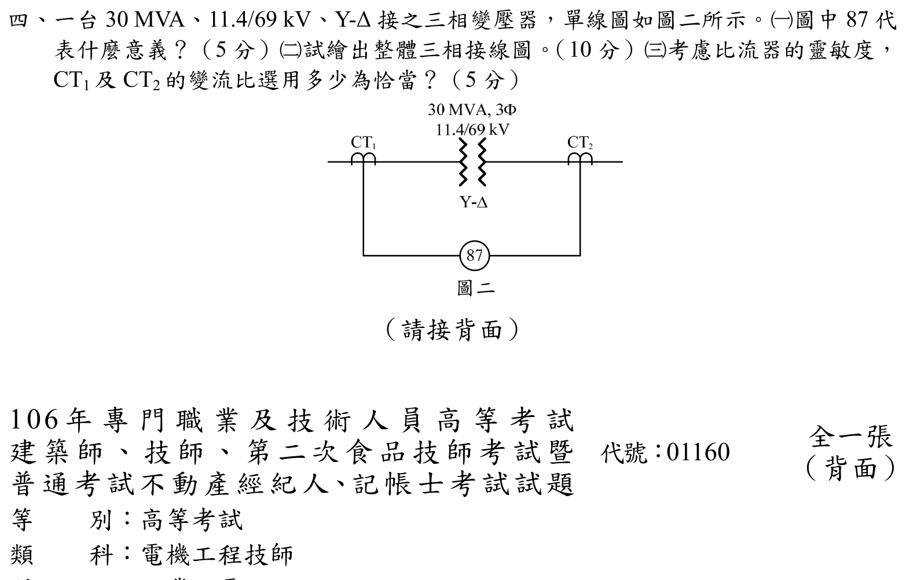

# 106 年工業配電第 4 題｜Y–Δ 變壓器差動保護與 CT 比選定



## 題目與圖面讀取

官方圖為 $30\,\mathrm{MVA}$、$11.4/69\,\mathrm{kV}$、Y–Δ 接三相變壓器。圖面左側 CT1 位於 $11.4\,\mathrm{kV}$ Y 側，右側 CT2 位於 $69\,\mathrm{kV}$ Δ 側；87 為兩側 CT 二次回路所接的差動電驛。題目要求說明 87、畫出三相接線，並在考慮靈敏度下選擇 CT 比。

## (一) ANSI 87 的意義

ANSI device 87 是**差動保護電驛**。它比較保護區兩端折算至同一基準的電流；正常負載或區外故障時二次電流互相抵消，區內故障時差流超過設定值而跳脫兩側斷路器。變壓器專用記號常寫作 87T。

## (二) 三相 CT 接線與相位補償

變壓器 Y–Δ 兩側線電流有 $30^\circ$ 相位差，CT 二次須採與變壓器相反的接法補償：

```text
11.4 kV Y 側 ── CT1（一次串聯）── CT1 二次 Δ ──┐
                                                ├─ 87T（三相差動）
69 kV Δ 側 ── CT2（一次串聯）── CT2 二次 Y ──┘
```

每一相均應使用同名端與一致極性；CT1 二次的三個端點首尾相接成 Δ，三個 Δ 線端分別接 87T 的 A、B、C 電流線圈。CT2 二次三具 CT 的中性點相連並接地，三相線端接 87T 對應線圈。接線方向須使正常負載時兩側折算電流相反，差流近似零；若圖面相序採相反方向，只需整組反接極性，不改變補償原則。

## (三) 額定電流與 CT 比

### 1. 變壓器兩側額定線電流

$$
I_{1N}=\frac{30\times10^6}{\sqrt{3}(11.4\times10^3)}
 =1519.34\,\mathrm A,
$$
$$
I_{2N}=\frac{30\times10^6}{\sqrt{3}(69\times10^3)}
 =251.02\,\mathrm A.
$$

CT 一次額定值應不小於正常最大電流，又要盡量小以保持故障靈敏度。取常見 5 A 二次規格，先選 CT2（高壓 Δ 側）為 $300/5$ A，CT 比 $n_2=60$。

### 2. 依 Δ–Y 補償匹配 CT1

CT1 在 Y 側、二次接 Δ，所以送進單一差動線圈的電流為 $\sqrt3$ 倍 CT1 二次相電流；CT2 在 Δ 側、二次接 Y，送入電驛的電流就是 CT2 二次相電流。額定平衡條件為

$$
\sqrt3\frac{I_{1N}}{n_1}\approx\frac{I_{2N}}{n_2},
\qquad
n_1^\star=\sqrt3\frac{I_{1N}}{I_{2N}}n_2
 =\sqrt3\frac{69}{11.4}(60)=629.2.
$$

因此 CT1 的理想一次額定約為 $5n_1^\star=3146$ A；在常用系列中選 **$3000/5$ A**（$n_1=600$）最接近且一次額定仍高於 $1519$ A。

### 3. 二次電流回代

$$
I_{r1}=\sqrt3\left(5\frac{1519.34}{3000}\right)=4.3849\,\mathrm A,
$$
$$
I_{r2}=5\frac{251.02}{300}=4.1837\,\mathrm A.
$$
$$
\frac{I_{r1}}{I_{r2}}=1.0481,
$$

額定差流約 $4.8\%$，可由 87T 的匹配抽頭或百分比制動設定吸收。若現場標準系列提供 $2500/5$ 與 $250/5$，兩者也能得到約 $4.9\%$ 的差異；重點是按 Δ–Y 的 $\sqrt3$ 因子選比，不能直接以兩側一次額定電流各自四捨五入而忽略 CT 接法。

## 結論與校驗紀錄

- 87：變壓器差動保護電驛（87T）。
- 11.4 kV Y 側 CT1 二次接 Δ；69 kV Δ 側 CT2 二次接 Y，以抵銷變壓器 $30^\circ$ 相移。
- 一組合理且靈敏的常用選擇為 **CT1 = $3000/5$ A、CT2 = $300/5$ A**；額定電驛電流分別 $4.3849$ A、$4.1837$ A，差異可由繼電器匹配設定校正。
- 已依官方裁切圖的側別、Y–Δ 接線、ANSI 87 功能及額定電流逐項回代；原年度解答的 CT1=$2000/5$ A 會造成過大的二次不平衡，已修正，狀態升級為 `verified`。
