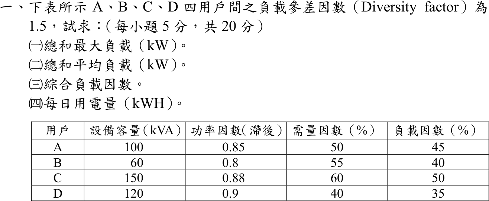

# 107 年工業配電第 1 題｜四用戶負載統計

## 已知與所求

A、B、C、D 四用戶之負載參差因數 \(F_d=1.5\)。設備容量／功率因數（落後）／需量因數／負載因數：A 100 kVA／0.85／50%／45%；B 60／0.80／55%／40%；C 150／0.88／60%／50%；D 120／0.90／40%／35%。求（一）總和最大負載（kW）；（二）總和平均負載（kW）；（三）綜合負載因數；（四）每日用電量（kWh）。

## 考場標準作答

各戶最大需量 \(P_{max,i}=S_i\cdot DF_i\cdot\mathrm{pf}_i\)，平均負載 \(P_{avg,i}=P_{max,i}\cdot LF_i\)：

| 用戶 | \(P_{max}\)（kW） | \(P_{avg}\)（kW） |
|---|---:|---:|
| A | \(100(0.50)(0.85)=42.50\) | \(42.50(0.45)=19.125\) |
| B | \(60(0.55)(0.80)=26.40\) | \(26.40(0.40)=10.560\) |
| C | \(150(0.60)(0.88)=79.20\) | \(79.20(0.50)=39.600\) |
| D | \(120(0.40)(0.90)=43.20\) | \(43.20(0.35)=15.120\) |

### （一）總和最大負載

個別最大合計 \(191.30\,\mathrm{kW}\)；參差因數 \(F_d=\dfrac{\sum P_{max,i}}{P_{max,\text{同時}}}\)，故
\[
\boxed{P_{max}=\frac{191.30}{1.5}=127.533\ \mathrm{kW}}
\]

### （二）總和平均負載

\[
\boxed{P_{avg}=19.125+10.560+39.600+15.120=84.405\ \mathrm{kW}}
\]

### （三）綜合負載因數

\[
\boxed{LF=\frac{P_{avg}}{P_{max}}=\frac{84.405}{127.533}=0.6618=66.18\%}
\]

### （四）每日用電量

\[
\boxed{E=84.405(24)=2025.72\ \mathrm{kWh/day}}
\]

## 驗算

綜合負載因數可由恆等式 \(LF=F_d\dfrac{\sum P_{avg,i}}{\sum P_{max,i}}=1.5\dfrac{84.405}{191.30}=0.6618\)；逐戶計日電量再加總：\(459.0+253.44+950.4+362.88=2025.72\,\mathrm{kWh}\)，與（四）相同。

## 失分點

- 把設備容量 kVA 直接當 kW；須乘需量因數與功率因數才是各戶最大有功需量。
- 參差因數方向相反：同時最大負載是個別最大合計**除以** 1.5，不是乘 1.5。
- 平均負載應按各戶自己的負載因數算，不可用群組合計再乘單一 \(LF\)。

## 條件與疑義

「總和最大負載」讀為四戶同時最大需量 \(191.30/1.5\)；個別最大合計 \(191.30\,\mathrm{kW}\) 為其中間量。
