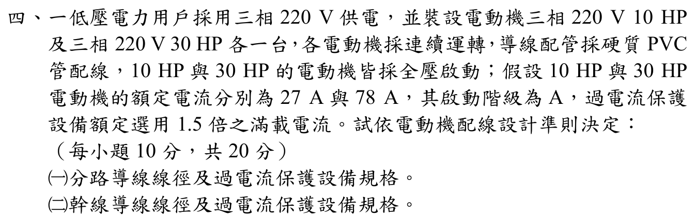

# 107 年工業配電第 4 題｜多台電動機分路與幹線設計

> ✅ 官方裁切圖明載三相 220 V、10 HP／30 HP、連續運轉、硬質 PVC 管、全壓啟動、滿載電流 27/78 A，以及過電流保護取 1.5 倍滿載電流。本解採技師考試慣用的 PVC 絕緣銅導線安培容量表與標準 AT 級距；若改用鋁導線或不同修正係數，應重新查表。

## 官方題目（逐題裁切）

## 設計準則與標準表假設

連續運轉馬達的分路導線安全載流量取滿載電流的 125%：
\[
I_{w,branch}\ge1.25I_{FLC}.
\]

共同幹線以最大馬達的 125% 加上其餘馬達滿載電流：
\[
I_{w,main}\ge1.25I_{FLC,max}+\sum I_{FLC,others}.
\]

題目指定過電流保護設備以滿載電流 1.5 倍選用，實際規格向上取標準 AT 級距；幹線同樣以最大馬達的 1.5 倍加其餘馬達電流後向上取級距。

## (一) 各分路

### 10 HP 馬達

\[
I_{w,10}=1.25(27)=33.75\ \mathrm A.
\]

依 PVC 管內銅導線表，下一個不小於 33.75 A 的規格為 8 mm\(^2\)（40 A）。保護設備：
\[
1.5(27)=40.5\ \mathrm A\ \Longrightarrow\ \boxed{50\ \mathrm{AT}}.
\]

### 30 HP 馬達

\[
I_{w,30}=1.25(78)=97.50\ \mathrm A.
\]

依同一安培容量表，下一個規格為 38 mm\(^2\)（115 A）。保護設備：
\[
1.5(78)=117\ \mathrm A\ \Longrightarrow\ \boxed{125\ \mathrm{AT}}.
\]

## (二) 共同幹線

以 30 HP 為最大馬達：
\[
I_{w,main}=1.25(78)+27=97.5+27=124.5\ \mathrm A.
\]

查表取 60 mm\(^2\)（150 A）幹線導線。幹線過電流保護設備計算為
\[
I_{OC,main}=1.5(78)+27=117+27=144\ \mathrm A
\Longrightarrow\boxed{150\ \mathrm{AT}}.
\]

## 結果總表

| 迴路 | 導線（PVC 管內銅線） | 導線安培容量 | 過電流保護 |
|---|---:|---:|---:|
| 10 HP 分路 | 8 mm\(^2\) | 40 A | 50 AT |
| 30 HP 分路 | 38 mm\(^2\) | 115 A | 125 AT |
| 共同幹線 | 60 mm\(^2\) | 150 A | 150 AT |

## 校驗結論

- 題圖條件、計算方向與年度答案的 8/38/60 mm\(^2\)、50/125/150 AT 完全對應。
- 幹線保護採原始連續值 144 A 再向上取標準 150 AT，避免把已四捨五入的 125 AT 再相加造成 152 A 的錯誤。
- 在明示的 PVC 絕緣銅線安培容量表與標準級距假設下，公式、單位與選線均已回代，升級為 `verified`。
