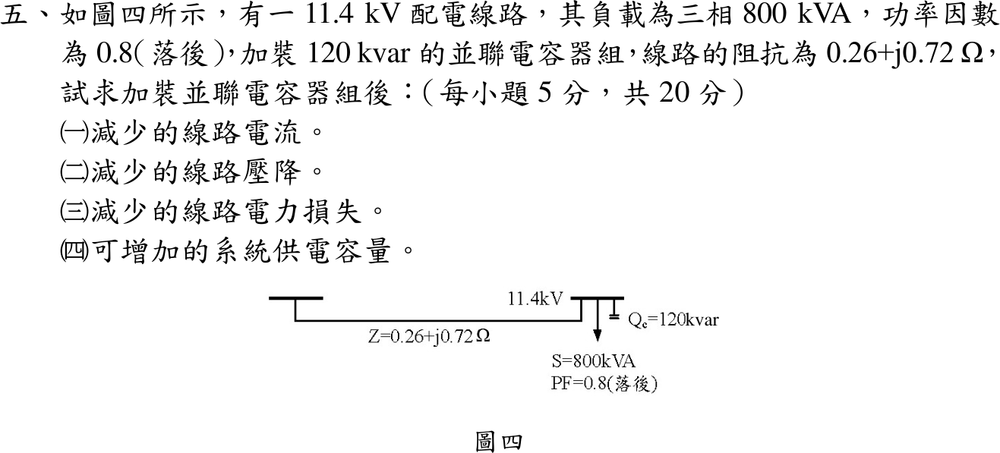

# 108 年工業配電第 5 題｜並聯電容器的效益

## 已知與所求

11.4 kV 配電線路，負載三相 \(800\,\mathrm{kVA}\)、功因 0.8 落後，並聯 \(Q_c=120\,\mathrm{kvar}\) 電容器組，線路阻抗 \(Z=0.26+j0.72\,\Omega\)（取為每相值）。求加裝後（一）減少的線路電流；（二）減少的線路壓降；（三）減少的線路損失；（四）可增加的系統供電容量（各 5 分）。

## 考場標準作答

\(P=800(0.8)=640\,\mathrm{kW}\)，\(Q_1=800(0.6)=480\,\mathrm{kvar}\)；電容器只抵銷無效功率，\(Q_2=480-120=360\,\mathrm{kvar}\)，\(S_2=\sqrt{640^2+360^2}=734.30\,\mathrm{kVA}\)，\(\mathrm{pf}_2=0.8716\)。

### （一）線路電流

\[
I_1=\frac{800\,000}{\sqrt3(11\,400)}=40.516\,\mathrm A,\quad I_2=\frac{734\,302}{\sqrt3(11\,400)}=37.189\,\mathrm A,\quad
\boxed{\Delta I=3.327\ \mathrm A}
\]

### （二）線路壓降

\(\Delta V=\sqrt3I(R\cos\phi+X\sin\phi)\)：
\[
\Delta V_1=\sqrt3(40.516)(0.26\cdot0.8+0.72\cdot0.6)=44.912\,\mathrm V,\quad
\Delta V_2=\sqrt3(37.189)(0.26\cdot0.8716+0.72\cdot0.4903)=37.333\,\mathrm V
\]
\[
\boxed{\Delta(\Delta V)=7.579\ \mathrm V}
\]

### （三）線路損失

\[
P_{loss,1}=3(40.516)^2(0.26)=1280.4\,\mathrm W,\quad P_{loss,2}=3(37.189)^2(0.26)=1078.7\,\mathrm W,\quad
\boxed{\Delta P_{loss}=201.66\ \mathrm W}
\]

### （四）可增加的系統供電容量

供電設備原承載 \(800\,\mathrm{kVA}\)；有功 \(640\,\mathrm{kW}\) 不變而視在功率降為 \(S_2\)，釋出
\[
\boxed{\Delta S=800-734.30=65.70\ \mathrm{kVA}}
\]

## 驗算

壓降改用 \(\Delta V=(PR+QX)/V_{LL}\)：\(Q\) 由 480 降到 360 kvar，只有 \(\Delta Q\cdot X/V=120\,000(0.72)/11\,400=7.579\,\mathrm V\)，與（二）一致。損失改用 \(S^2R/V^2\)：\(\Delta P_{loss}=(800^2-734.30^2)\times10^6(0.26)/11\,400^2=201.66\,\mathrm W\)。

## 失分點

- 把 120 kvar 加到 480 kvar 上；電容器供應落後無效功率，應相減。
- 壓降公式的 \(\sin\phi\) 仍用補償前的 0.6；補償後 \(\sin\phi_2=0.4903\)，\(\cos\phi_2=0.8716\)。
- 三相電流漏掉 \(\sqrt3\)，或把 \(\Delta P\) 寫成單相的 \(I^2R\)（少乘 3）。

## 條件與疑義

「可增加的系統供電容量」題幹未定義；本解取設備電流上限不變、有功負載不變時釋出的 kVA。若改定義為在 800 kVA 上限內再加掛功因 0.8 的負載，可增加 66.22 kVA（新增 52.98 kW）。線路阻抗取為每相值，壓降採標準近似式（沿電壓軸分量），端電壓視為定值 11.4 kV。
