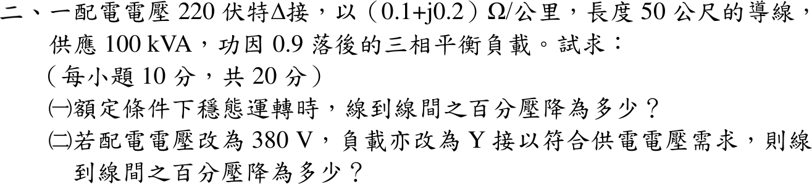

# 109 年工業配電第 2 題｜三相配電線路電壓降

## 已知與所求

220 V、Δ 接，導線 \((0.1+j0.2)\,\Omega/\mathrm{km}\)、長 50 m，供 100 kVA、PF 0.9 落後平衡負載。求（一）額定穩態線間百分壓降；（二）改 380 V、Y 接時的線間百分壓降。

## 考場標準作答

每線 \(Z=(0.1+j0.2)(0.05)=0.005+j0.010\,\Omega\)，
\[
R\cos\phi+X\sin\phi=0.005(0.9)+0.010(0.4359)=0.008859\,\Omega
\]
線間壓降以線電流計：\(\Delta V_{LL}=\sqrt3I_L(R\cos\phi+X\sin\phi)\)。

### （一）220 V

\[
I_L=\frac{100000}{\sqrt3(220)}=262.43\,\mathrm A,\qquad \Delta V=\sqrt3(262.43)(0.008859)=4.027\,\mathrm V
\]
\[
\Delta V\%=\frac{4.027}{220}=\boxed{1.830\%}
\]

### （二）380 V

\[
I_L=\frac{100000}{\sqrt3(380)}=151.93\,\mathrm A,\qquad \Delta V=2.331\,\mathrm V,\qquad \Delta V\%=\boxed{0.6135\%}
\]

## 驗算

精確相量（受電端相電壓為參考）：220 V 時 \(|V_s|=\big|127.017+262.43\angle{-25.84^\circ}(0.005+j0.01)\big|\sqrt3=224.05\,\mathrm V\)，壓降 1.840%；380 V 時 0.6146%，與近似式相差約 0.5%。且 \(0.6135/1.830=(220/380)^2\)。

## 失分點

- Δ 接誤用相電流 151.5 A 算壓降，得 0.610%；線路壓降看線電流。
- 50 m 未換成 0.05 km。
