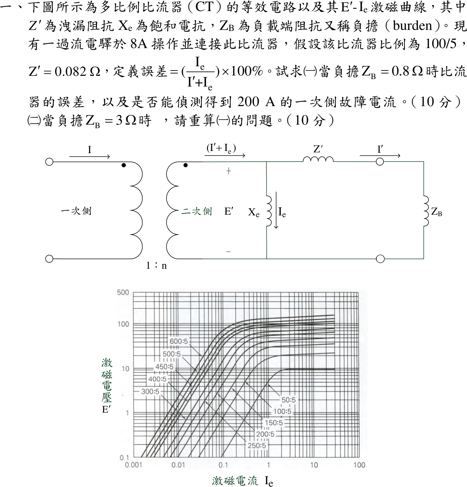

# 111 年工業配電第 1 題｜CT 激磁特性與負擔誤差

## 已知與所求

CT 變比 \(100/5\)（\(n=20\)），漏阻抗 \(Z'=0.082\,\Omega\)，過流電驛於 \(I'=8\,\mathrm A\) 動作；誤差 \(=I_e/(I'+I_e)\times100\%\)。用圖中 100:5 激磁曲線，求（一）\(Z_B=0.8\,\Omega\)、（二）\(Z_B=3\,\Omega\) 時的 CT 誤差，並判斷能否偵測 \(200\,\mathrm A\) 一次側故障電流。

## 考場標準作答

電驛恰動作時負擔支路電流 \(I'=8\,\mathrm A\)，激磁電壓 \(E'=I'(Z'+Z_B)\)；由曲線讀 \(I_e\)，二次總電流 \(I'+I_e\)，一次側最小動作電流 \(I_{p}=n(I'+I_e)\)。

### （一）\(Z_B=0.8\,\Omega\)

\[
E'=8(0.082+0.8)=7.056\,\mathrm V\ \xrightarrow{\text{100:5 曲線}}\ I_e\approx0.4\,\mathrm A
\]
\[
\text{誤差}=\frac{0.4}{8+0.4}\times100\%=\boxed{4.76\%}
\]
\[
I_p=20(8+0.4)=\boxed{168\,\mathrm A}<200\,\mathrm A\ \Rightarrow\ \boxed{\text{可偵測 200 A 故障}}
\]

### （二）\(Z_B=3\,\Omega\)

\[
E'=8(0.082+3)=24.656\,\mathrm V
\]
100:5 曲線已飽和，延伸到圖末 \(I_e=30\,\mathrm A\) 時 \(E'\) 仍只有約 \(22\,\mathrm V\)，故 \(I_e\ge30\,\mathrm A\)：
\[
\text{誤差}\ge\frac{30}{8+30}\times100\%=\boxed{78.9\%}
\]
\[
I_p\ge20(8+30)=\boxed{760\,\mathrm A}>200\,\mathrm A\ \Rightarrow\ \boxed{\text{不能偵測 200 A 故障}}
\]

## 驗算

改用「一次側 200 A 已知」的路線：二次總電流 \(I'+I_e=200/20=10\,\mathrm A\)，負載線 \(E'=(Z'+Z_B)(10-I_e)\) 與曲線聯立。

- \(Z_B=0.8\)：交點 \(I_e\approx0.43\,\mathrm A\)，\(I'\approx9.57\,\mathrm A\ge8\)，動作。
- \(Z_B=3\)：交點 \(I_e\approx3.5\,\mathrm A\)（\(E'\approx20\,\mathrm V\)），\(I'\approx6.5\,\mathrm A<8\)，不動作。

動作門檻為 \(I'\ge8\iff I_e\le2.0\,\mathrm{A}\)，兩條路線結論相同。

## 失分點

- 讀成 50:5 曲線（飽和約 10 V）；100:5 是由右數第二條，飽和約 20～22 V。
- 誤差分母用 \(I'\) 而非 \(I'+I_e\)，（一）會寫成 5.0%。
- （二）在圖外硬讀一個 \(I_e\)；應寫「超出曲線，\(I_e\ge30\,\mathrm A\)」並以下限判斷。

## 條件與疑義

曲線讀值（對數座標，每十倍約 297 px，判讀誤差約 ±2.5%）：

| \(E'\)（V） | 6.4 | 7.06 | 8.5 | 12.5 | 16.6 | 19.3 | 19.7 | 20.3 | 21.9 |
|---|---:|---:|---:|---:|---:|---:|---:|---:|---:|
| \(I_e\)（A） | 0.36 | 0.38 | 0.43 | 0.62 | 0.90 | 1.9 | 3.2 | 5.6 | 29 |

（一）讀值區間 \(0.37\sim0.40\,\mathrm A\)，誤差 \(4.4\sim4.8\%\)、\(I_p=167\sim168\,\mathrm A\)，均小於 200 A。200 A 路線的數位化交點讀值為 \(I_e=0.42\sim0.44\,\mathrm A\)（\(I'=9.56\sim9.58\,\mathrm A\)）與 \(I_e=3.4\sim3.7\,\mathrm A\)（\(I'=6.3\sim6.6\,\mathrm A\)）。兩個區間分別遠低於與遠高於門檻 \(I_e\le2.0\,\mathrm{A}\)，故偵測結論不受圖解誤差影響，受影響的只有誤差百分比的末位。
