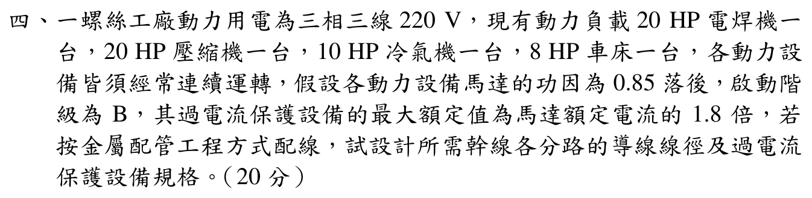

# 111 年工業配電第 4 題｜多台連續運轉馬達配線與保護（人工複核）

## 官方題目（逐題裁切）

一螺絲工廠動力用電為三相三線 \(220\,\mathrm{V}\)，現有動力負載 \(20\,\mathrm{HP}\) 電焊機一
台，\(20\,\mathrm{HP}\) 壓縮機一台，\(10\,\mathrm{HP}\) 冷氣機一台，\(8\,\mathrm{HP}\) 車床一台，各動力設
備皆須經常連續運轉，假設各動力設備馬達的功因為0.85 落後，啟動階
級為B，其過電流保護設備的最大額定值為馬達額定電流的1.8 倍，若
按金屬配管工程方式配線，試設計所需幹線各分路的導線線徑及過電流
保護設備規格。（20 分）

## 校驗狀態

官方裁切圖為完整題幹，但未提供導線材質、絕緣耐熱等級、配管內載流導線數、環境修正係數、採用的導線安培容量表版本，也未明示馬達效率。故可核對計算規則與條件式結果，但無法唯一核定導線線徑及保護設備規格，保留 `needs_manual_review`。

## 題目資料與共同計算

題目可確認的資料為：三相三線 \(220\,\mathrm{V}\)、四台負載 \(20\,\mathrm{HP}\)、\(20\,\mathrm{HP}\)、\(10\,\mathrm{HP}\)、\(8\,\mathrm{HP}\)，各馬達功率因數 \(0.85\) 落後，連續運轉，啟動階級 B，過電流保護設備最大額定值為馬達額定電流的 \(1.8\) 倍，採金屬配管工程方式配線。

若以輸出馬力換算輸入電流，必須知道效率 \(\eta\)：

\[
I_{\mathrm{FL}}=\frac{P_{\mathrm{out}}}{\sqrt{3}V\,\eta\,\mathrm{pf}},
\qquad P_{\mathrm{out}}=0.746\times\mathrm{HP}\ \mathrm{kW}.
\]

官方裁切未給 \(\eta\)，因此不能把未說明的效率假設成唯一答案。以下列出兩種可追溯解讀。

## 解讀 A：只使用題目明示資料，取未指定效率 \(\eta=1\)

以 \(V=220\,\mathrm{V}\)、\(\mathrm{pf}=0.85\) 計算：

\[
I_{20}=\frac{20\times746}{\sqrt{3}\times220\times0.85}
 =46.0645\,\mathrm{A},
\]

\[
I_{10}=\frac{10\times746}{\sqrt{3}\times220\times0.85}
 =23.0323\,\mathrm{A},
\qquad
I_{8}=\frac{8\times746}{\sqrt{3}\times220\times0.85}
 =18.4258\,\mathrm{A}.
\]

兩台 \(20\,\mathrm{HP}\) 馬達的額定電流均為 \(46.0645\,\mathrm{A}\)。連續運轉馬達分路導線的最低熱安培容量通常按 \(1.25I_{\mathrm{FL}}\) 檢核，因此最低值為：

\[
I_{w,20}\ge57.5807\,\mathrm{A},
\qquad I_{w,10}\ge28.7903\,\mathrm{A},
\qquad I_{w,8}\ge23.0323\,\mathrm{A}.
\]

若只依題目給出的 \(1.8I_{\mathrm{FL}}\) 計算保護設備上限，則：

\[
I_{\mathrm{OCP,max},20}=82.9161\,\mathrm{A},
\quad I_{\mathrm{OCP,max},10}=41.4581\,\mathrm{A},
\quad I_{\mathrm{OCP,max},8}=33.1665\,\mathrm{A}.
\]

這些是安培數上限，不等於可直接決定的標準斷路器額定值；仍須依採用的標準額定系列向下選擇並檢核啟動脫扣特性。

共同幹線若採「最大馬達 (1.25I_{\mathrm{FL}}) 加其餘馬達額定電流」的連續運轉規則：

\[
I_{w,\mathrm{main}}\ge1.25I_{20}+I_{20}+I_{10}+I_{8}
 =1.25(46.0645)+46.0645+23.0323+18.4258
 =145.1033\,\mathrm{A}.
\]

## 解讀 B：採年度詳解使用的馬達滿載電流表

既有年度詳解採用 \(I_{20}=54\,\mathrm{A}\)、\(I_{10}=28\,\mathrm{A}\)、\(I_{8}=22\,\mathrm{A}\)。這組數值約等於在上式另採 \(\eta\approx0.85\)，但官方裁切沒有明示效率或該滿載電流表，故只能列為條件式解讀，不能視為由題幹唯一推出。

在此解讀下，分路導線最低熱安培容量為

\[
I_{w,20}\ge1.25(54)=67.5\,\mathrm{A},
\quad I_{w,10}\ge1.25(28)=35\,\mathrm{A},
\quad I_{w,8}\ge1.25(22)=27.5\,\mathrm{A}.
\]

分路過電流保護設備上限為

\[
I_{\mathrm{OCP,max},20}=1.8(54)=97.2\,\mathrm{A},
\quad I_{\mathrm{OCP,max},10}=50.4\,\mathrm{A},
\quad I_{\mathrm{OCP,max},8}=39.6\,\mathrm{A}.
\]

共同幹線最低熱安培容量為

\[
I_{w,\mathrm{main}}\ge1.25(54)+54+28+22
 =171.5\,\mathrm{A}.
\]

共同幹線保護設備的計算上限（以最大一台馬達採 (1.8I_{\mathrm{FL}})，其餘採額定電流）為

\[
I_{\mathrm{OCP,max,main}}
 \le1.8(54)+54+28+22
 =201.2\,\mathrm{A}.
\]

因此年度詳解所列 \(80\,\mathrm{mm^2}\) 銅導線、\(200\,\mathrm{AT}/225\,\mathrm{AF}\) 只能在「該版本安培容量表確認 \(80\,\mathrm{mm^2}\) 載流量至少 \(171.5\,\mathrm{A}\)，且採用 \(200\,\mathrm{A}\) 標準額定系列」的前提下成立；不能由裁切圖單獨驗證。

## 法規表 258-3 對照（現行版本）

為避免把年度詳解的隱含電流當成題幹明示值，再以經濟部《用戶用電設備裝置規則》表 258-3 交叉檢查：三相感應電動機
在 220 V 的現行列值為 \(20\,\mathrm{HP}=55\,\mathrm A\)、\(10\,\mathrm{HP}=28\,\mathrm A\)，而表中列有
\(7.5\,\mathrm{HP}=21\,\mathrm A\)，沒有題目 \(8\,\mathrm{HP}\) 的精確列值。若暫以 20/10 HP 的現行列值取代解讀 B，
分路導線最低值分別為 \(68.75\,\mathrm A\)、\(35\,\mathrm A\)；但 8 HP 仍需製造廠資料或指定插值規則，且導線線徑還受材質、
配管內載流導線數、環境修正與法規年度影響。因此此官方表只能作範圍核對，不能讓本題升格為唯一解。

## 線徑與保護規格的人工複核界線

要把上述最低安培容量換成唯一導線線徑，至少還需要指定：銅或鋁導線、導線絕緣溫度等級、金屬管內載流導線數、環境溫度與修正係數、接地／中性線是否計入，以及採用的法規安培容量表。要把 \(1.8I_{\mathrm{FL}}\) 換成唯一過電流保護設備，還需要標準額定系列、熔絲或斷路器型式及馬達啟動時限／脫扣曲線。

因此本題目前可可靠核對的是上述馬達電流公式、\(1.25I_{\mathrm{FL}}\) 導線最低值、幹線加總規則與 \(1.8I_{\mathrm{FL}}\) 保護上限；線徑和最終標準規格仍保留 `needs_manual_review`，避免將年度詳解的隱含假設誤標為官方唯一答案。
