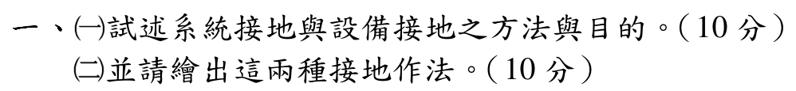

# 112 年工業配電第 1 題｜系統接地與設備接地



## 題目要求

分別說明系統接地與設備接地的方法、目的，並畫出兩種接地的實務接線。兩者的接地對象、故障電流路徑與保護目的不同，作答時不可把中性線（N）和保護接地線（PE）混成同一條線。

## 一、系統接地（system grounding）

### 方法

系統接地是把發電機或變壓器的中性點（或人工中性點）接至接地電極。依故障電流限制方式，可採：

1. **直接／固態接地**：中性點以低阻抗直接接地，故障電流大、保護容易偵測。
2. **電阻接地**：中性點串入低電阻或高電阻，限制接地故障電流並控制設備熱損壞。
3. **電抗接地**：以電抗器限制故障電流，適用於特定中高壓系統。
4. **不接地或經接地變壓器接地**：限制第一線接地故障電流，但必須搭配絕緣監視與暫態過電壓控制；是否採用須依系統規範決定。

### 目的

- 固定相對地電位，避免中性點漂移及過高對地電壓。
- 限制接地故障電流與暫態過電壓，降低絕緣與設備損壞。
- 建立可計算、可偵測的故障回路，使 50/51N、接地電驛或保護裝置能選擇性切除故障。
- 使系統的絕緣協調、避雷器額定值與保護協調有明確基準。

示意圖（以電阻接地為例）：

```text
      三相母線 ─── 變壓器一次／二次繞組
                         Y 中性點 N
                              |
                         接地電阻 R_N
                              |
                        接地母排／電極
                              |
                             ⏚ 大地
```

## 二、設備接地（equipment grounding）

### 方法

設備接地是把正常不帶電、但絕緣失效時可能帶電的外露導電部分，使用連續且足夠截面的 PE 導體連到接地母排，再連到接地電極或規範允許的低阻抗故障回路。對馬達外殼、配電盤、金屬導管、電纜鎧裝及變壓器外殼均應作等電位連結。

```text
  L1 ────────────────┐
  L2 ─────── 馬達繞組 ├── 馬達外殼
  L3 ────────────────┘       |
                              | PE（保護接地導體）
                       配電盤 PE 母排
                              |
                         接地電極 ⏚

  絕緣破損時：L1 → 外殼 → PE → 故障回路 → 保護裝置跳脫
```

設備接地導體須具備機械保護、連續性及低阻抗；金屬管路可作為 PE 的一部分，但只有在法規允許且接續可靠時才可採用。PE 與 N 的連接點應依接地系統（例如 TN、TT 或 IT）及規範指定，不能在下游任意重複相接。

### 目的

- 降低設備外殼對地及人員的接觸電壓，避免感電。
- 在相線碰殼時提供低阻抗故障路徑，使斷路器、熔斷器或漏電保護裝置迅速動作。
- 使所有可觸及金屬部件等電位，降低跨步電壓與電弧風險。

## 三、兩種接地的比較

| 項目 | 系統接地 | 設備接地 |
|---|---|---|
| 接地對象 | 中性點／人工中性點 | 外露金屬外殼、導管、盤體 |
| 正常是否有電流 | 中性線可能有負載電流 | PE 正常不應有負載電流 |
| 主要目的 | 控制系統對地電位與接地故障電流 | 降低接觸電壓並促成保護跳脫 |
| 設計重點 | 接地方式、阻抗與保護協調 | PE 連續性、截面、等電位連結 |

## 結論與校驗紀錄

- 已依官方 Q1 文字逐項回答方法與目的，並用中性點接地及外殼 PE 接地兩張示意圖對應題目要求。
- 系統接地和設備接地的對象、故障路徑與保護功能均明確區分；沒有把 N 當作 PE，也沒有在下游任意重複連接。
- 本題為定義與標準拓撲題，無缺少數值或唯一解歧義，完成獨立校核，狀態升級為 `verified`。
