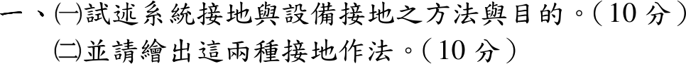

# 112 年工業配電第 1 題｜系統接地與設備接地



## 已知與所求

（一）試述系統接地與設備接地之方法與目的（10 分）；（二）繪出兩種接地作法（10 分）。

## 考場標準作答

### （一）方法與目的

**系統接地**：將發電機或變壓器中性點（或以接地變壓器建立的人工中性點）接至接地電極。方法有直接（低阻抗）接地、低／高電阻接地、電抗接地，以及不接地系統（須配絕緣監視）。目的：

- 固定系統對地電位，抑制中性點漂移與暫態過電壓；
- 限制並確定接地故障電流，使 51N／接地電驛能選擇性跳脫；
- 作為絕緣協調與避雷器額定的依據。

**設備接地**：以連續、足夠截面的設備接地導線（PE）把馬達外殼、配電盤體、金屬管、電纜鎧裝等正常不帶電的金屬部分連到接地母排與接地電極，並作等電位連結。目的：

- 絕緣破壞時降低外殼對地電壓，防止感電；
- 提供低阻抗故障回路，使斷路器、熔絲或漏電斷路器迅速動作；
- 降低接觸電壓與跨步電壓，減少火災與電弧危害。

\[
\boxed{\text{系統接地：中性點接地，控制系統電位與故障電流；設備接地：外殼經 PE 接地，保護人員並促成跳脫}}
\]

### （二）接線作法

```text
系統接地（以電阻接地為例）          設備接地
  變壓器二次 Y 接                   L1 L2 L3 ─── 馬達繞組
   a  b  c                                         │ 外殼
   │  │  │                                         │
   └──┼──┘ N ── R_N ── 接地母排 ── 電極 ⏚          PE（綠色接地線）
      │                                            │
   負載中性線 N（帶負載電流）       配電盤 PE 母排 ── 接地電極 ⏚
```

\[
\boxed{\text{系統接地：中性點 N 經 }R_N\text{ 接地；設備接地：外殼以 PE 連至接地母排與電極}}
\]

## 驗算

故障路徑檢查：相線碰殼時電流 L→外殼→PE→接地母排→變壓器中性點接地→回到電源，兩種接地共同構成迴路；若缺系統接地，碰殼電流無回路，保護不動作；若缺設備接地，外殼帶相電壓。

## 失分點

- 把中性線 N 當作 PE 使用；N 正常有負載電流，PE 正常無電流。
- 只寫「接地」而未分開接地對象（中性點 vs. 外殼）。
- 圖中在下游多處重複連接 N 與 PE，形成並聯迴流路徑。
