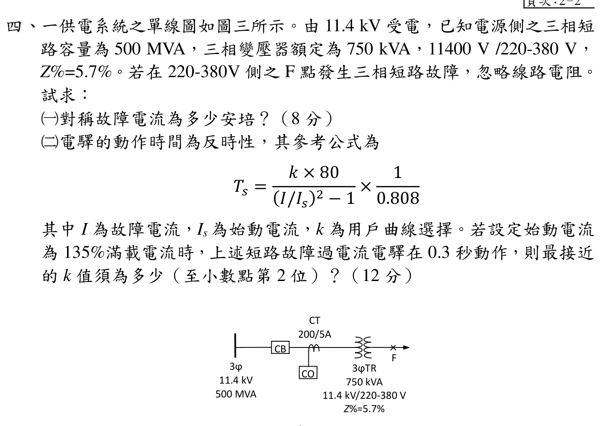

# 112 年工業配電第 4 題｜低壓側三相短路與反時性電驛

## 官方題目（逐題裁切）

一供電系統之單線圖如圖三所示。由 \(11.4\,\mathrm{kV}\) 受電，已知電源側之三相短路容量為 \(500\,\mathrm{MVA}\)，三相變壓器額定為 \(750\,\mathrm{kVA}\)，\(11400\,\mathrm{V}/220\text{-}380\,\mathrm{V}\)，\(Z\%=5.7\%\)。若在 \(220\text{-}380\,\mathrm{V}\) 側之 F 點發生三相短路故障，忽略線路電阻。試求：（20 分）
* **(一)** 對稱故障電流為多少安培？（8 分）
* **(二)** 電驛的動作時間為反時性，其參考公式為 \(T_s=\dfrac{k\times80}{(I/I_s)^2-1}\times\dfrac{1}{0.808}\)，其中 \(I\) 為故障電流，\(I_s\) 為始動電流，\(k\) 為用戶曲線選擇。若設定始動電流為 \(135\%\) 滿載電流時，上述短路故障過電流電驛在 \(0.3\,\mathrm{s}\) 動作，則最接近的 \(k\) 值須為多少（至小數點第 2 位）？（12 分）

## 校驗狀態

官方裁切圖、單線圖拓撲、電壓等級、變壓器阻抗與 CT 比值均已核對；以下以標么值法獨立推導，並用歐姆值法及 CT 二次側比值交叉驗算。

## 題圖與電壓基準核對

官方圖可確認：電源為三相 \(11.4\,\mathrm{kV}\)，電源側三相短路容量為 \(500\,\mathrm{MVA}\)；變壓器為 \(750\,\mathrm{kVA}\)、\(11.4\,\mathrm{kV}/220\text{-}380\,\mathrm{V}\)、\(Z=5.7\%\)；F 點在低壓側；CT 裝在高壓側且變流比為 \(200/5\)。題目指示忽略線路電阻，因此電源與變壓器阻抗以純電抗處理。

三相短路使用線電壓 \(380\,\mathrm{V}\)（\(220\,\mathrm{V}\) 為相電壓），低壓側與高壓側的基準電壓依變壓器額定比取 \(380\,\mathrm{V}\) 與 \(11.4\,\mathrm{kV}\)。

## (一) F 點三相對稱故障電流

選擇變壓器額定容量作基準：

\[
S_b=0.75\,\mathrm{MVA},\qquad V_{b,H}=11.4\,\mathrm{kV},
\qquad V_{b,L}=0.380\,\mathrm{kV}.
\]

電源短路阻抗的標么值為

\[
X_{s,\mathrm{pu}}=\frac{S_b}{S_{\mathrm{sc}}}
 =\frac{0.75}{500}=0.0015\,\mathrm{pu}.
\]

變壓器漏抗由題給百分阻抗直接得到

\[
X_{T,\mathrm{pu}}=\frac{Z\%}{100}=0.057\,\mathrm{pu}.
\]

故 F 點至理想電源的總標么電抗為

\[
X_{\mathrm{eq,pu}}=X_{s,\mathrm{pu}}+X_{T,\mathrm{pu}}
 =0.0015+0.057=0.0585\,\mathrm{pu}.
\]

低壓側基準電流為

\[
I_{b,L}=\frac{S_b}{\sqrt{3}V_{b,L}}
 =\frac{750\,000}{\sqrt{3}\times380}
 =1\,139.507\,\mathrm{A}.
\]

三相對稱故障電流（rms）為

\[
I_{F,L}=\frac{I_{b,L}}{X_{\mathrm{eq,pu}}}
 =\frac{1\,139.507}{0.0585}
 =19\,478.754\,\mathrm{A}
 \approx\boxed{19.48\,\mathrm{kA}}.
\]

### 歐姆值交叉驗算

低壓側基準阻抗為

\[
Z_{b,L}=\frac{V_{b,L}^2}{S_b}
 =\frac{380^2}{750\,000}=0.192533\,\Omega.
\]

電源短路阻抗折算至低壓側為

\[
X_{s,L}=\frac{(11\,400)^2/500\,000\,000}{(11\,400/380)^2}
 =0.0002888\,\Omega,
\]

變壓器阻抗為

\[
X_{T,L}=0.057Z_{b,L}=0.0109744\,\Omega.
\]

因此

\[
X_{\mathrm{eq},L}=0.0002888+0.0109744
 =0.0112632\,\Omega,
\]

\[
I_{F,L}=\frac{380}{\sqrt{3}\,X_{\mathrm{eq},L}}
 =19\,478.754\,\mathrm{A},
\]

與標么值結果一致。

## (二) 反時性電驛的 \(k\) 值

電驛 CT 位於 \(11.4\,\mathrm{kV}\) 高壓側，因此先將故障電流及滿載電流換算至高壓側。高壓側滿載電流為

\[
I_{\mathrm{FL},H}=\frac{750\,000}{\sqrt{3}\times11\,400}
 =37.98357\,\mathrm{A}.
\]

高壓側故障電流為

\[
I_{F,H}=I_{F,L}\frac{380}{11\,400}
 =19\,478.754\times\frac{1}{30}
 =649.29180\,\mathrm{A}.
\]

始動電流設定為滿載電流的 \(135\%\)，故

\[
I_s=1.35I_{\mathrm{FL},H}
 =1.35\times37.98357
 =51.27782\,\mathrm{A}.
\]

因故障電流與始動電流均經同一 CT，使用 CT 一次側或二次側安培數，\(I/I_s\) 比值相同。以一次側表示：

\[
\frac{I}{I_s}=\frac{649.29180}{51.27782}
 =12.6622349,
\qquad
\left(\frac{I}{I_s}\right)^2-1=160.3321923.
\]

代入 \(T_s=0.3\,\mathrm{s}\)：

\[
0.3=\frac{k\times80}{160.3321923}\times\frac{1}{0.808}.
\]

解得

\[
k=0.3\times0.808\times\frac{160.3321923}{80}
 =0.4827765
 \approx\boxed{0.48}.
\]

### CT 二次側交叉驗算

CT 變流比為 \(200/5=40\)：

\[
I_{\mathrm{FL},H,sec}=37.98357\times\frac{5}{200}
 =0.949589\,\mathrm{A},
\]

\[
I_{s,sec}=1.35\times0.949589=1.281945\,\mathrm{A},
\qquad
I_{F,sec}=649.29180\times\frac{5}{200}=16.232295\,\mathrm{A}.
\]

\[
\frac{I_{F,sec}}{I_{s,sec}}=12.6622349,
\]

與一次側比值完全相同，故 \(k\approx0.48\) 的計算不受 CT 換算側別影響。

## 最終校驗結論

官方裁切圖、單線圖拓撲、電壓等級、變壓器阻抗與 CT 比值均足以支持唯一計算；標么值法與歐姆值法交叉回算一致。答案為：

\[
\boxed{I_F\approx19.48\,\mathrm{kA}},
\qquad
\boxed{k\approx0.48}.
\]
