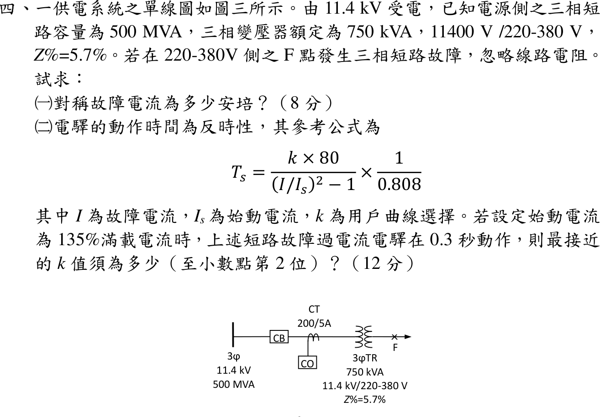

# 112 年工業配電第 4 題｜低壓側三相短路與反時性電驛

## 已知與所求

11.4 kV 受電，電源三相短路容量 \(500\,\mathrm{MVA}\)；變壓器 \(750\,\mathrm{kVA}\)、\(11400\,\mathrm V/220\text{-}380\,\mathrm V\)、\(Z\%=5.7\%\)；CT \(200/5\) 與 CO 電驛在高壓側；F 點在低壓側三相短路，忽略線路電阻。求（一）對稱故障電流（8 分）；（二）始動電流 \(135\%\) 滿載、\(0.3\,\mathrm s\) 動作時的 \(k\)（至小數第 2 位，12 分）。

### 官方題目公式

\[
T_s=\dfrac{k\times80}{(I/I_s)^2-1}\times\dfrac{1}{0.808}
\]

## 考場標準作答

### （一）對稱故障電流

取 \(S_b=750\,\mathrm{kVA}\)、低壓線電壓 \(380\,\mathrm V\)（220 V 為相電壓）：
\[
X=\frac{0.75}{500}+0.057=0.0585\,\mathrm{pu},\qquad I_b=\frac{750\,000}{\sqrt3(380)}=1139.507\,\mathrm A
\]
\[
I_F=\frac{1139.507}{0.0585}=19\,478.754\,\mathrm A\approx\boxed{19.48\,\mathrm{kA}}
\]

### （二）\(k\) 值

CT 在高壓側，故障電流與始動電流都換到 11.4 kV 側：
\[
I_{F,H}=19\,478.754\times\frac{380}{11\,400}=649.292\,\mathrm A,\qquad
I_s=1.35\times\frac{750\,000}{\sqrt3(11\,400)}=1.35(37.9836)=51.2778\,\mathrm A
\]
\[
\frac{I}{I_s}=12.6622349,\qquad \left(\frac{I}{I_s}\right)^2-1=159.3321923
\]
\[
k=\frac{0.3\times0.808\times159.3321923}{80}=0.4827765\Rightarrow\boxed{0.48}
\]

## 驗算

歐姆法（380 V 側）：\(X_s=380^2/(500\times10^6)=0.000289\,\Omega\)、\(X_T=0.057(380^2/750\,000)=0.010974\,\Omega\)，\(I_F=380/[\sqrt3(0.011263)]=19\,479\,\mathrm A\)。比值與側別無關：\(I/I_s=1/(0.0585\times1.35)=12.662\)，回代 \(T_s=0.48(80)/159.33/0.808=0.298\,\mathrm s\approx0.3\,\mathrm s\)。

## 失分點

- 用相電壓 220 V 計算三相故障電流（會放大 \(\sqrt3\) 倍）。
- 故障電流用低壓側、始動電流用高壓側，\(I/I_s\) 差 30 倍。
- 把 \(\times\dfrac{1}{0.808}\) 看成 \(\times0.808\)。
