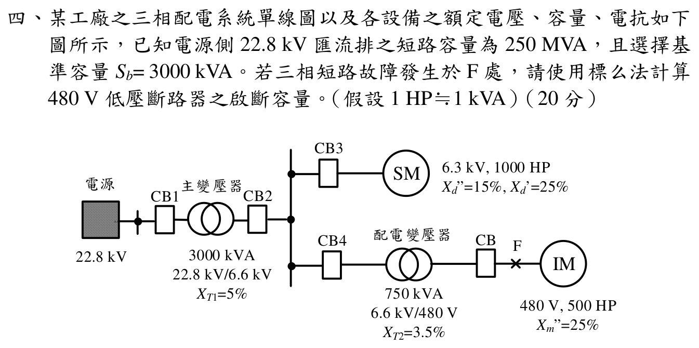

# 113 年第 4 題｜480 V 匯流排三相短路啟斷容量

## 官方題目（逐題裁切）

某工廠之三相配電系統單線圖以及各設備之額定電壓、容量、電抗如下圖所示，已知電源側 \(22.8\,\mathrm{kV}\) 匯流排之短路容量為 \(250\,\mathrm{MVA}\)，且選擇基準容量 \(S_b=3000\,\mathrm{kVA}\)。若三相短路故障發生於 F 處，請使用標么法計算 \(480\,\mathrm{V}\) 低壓斷路器之啟斷容量。（假設 \(1\,\mathrm{hp}\approx1\,\mathrm{kVA}\)）（20 分）

## 考場標準作答

取 \(S_b=3\,\mathrm{MVA}\)。各元件換至共同基準：

\[
X_s=\frac{3}{250}=0.012,\quad
X_{T1}=0.05,\quad
X_{SM}=0.15\frac{3000}{1000}=0.45\quad(\mathrm{pu}),
\]

\[
X_u=(0.012+0.05)\parallel0.45
+0.035\frac{3000}{750}
=0.194492\,\mathrm{pu},
\]

\[
X_{IM}=0.25\frac{3000}{500}=1.50\,\mathrm{pu}.
\]

若計算 F 點的總短路電流，故障點戴維寧電抗

\[
X_{th}=X_u\parallel X_{IM}=0.172169\,\mathrm{pu}.
\]

\[
\boxed{S_{sc}=\frac{3}{0.172169}=17.42\,\mathrm{MVA}},
\]

相當於

\[
\boxed{I_{sc}=\frac{17.42\times10^6}{\sqrt3(480)}=20.96\,\mathrm{kA}}.
\]

按考題常用的「以 F 點總短路容量保守選用」口徑，可選額定對稱啟斷容量不低於 \(17.42\,\mathrm{MVA}\)（\(20.96\,\mathrm{kA}\)）的斷路器。但原圖中低壓 CB 在 F 左側、感應馬達在 F 右側；馬達向 F 的倒灌不流過該 CB 接點。若問此 CB 在所示 F 故障時實際須開斷的支路電流，應取

\[
\boxed{S_{\mathrm{CB},F}=\frac{3}{X_u}=15.42\,\mathrm{MVA}},\qquad
\boxed{I_{\mathrm{CB},F}=\frac{15.4248\times10^6}{\sqrt3(480)}=18.55\,\mathrm{kA}}.
\]

這兩組數字分別是「F 點總故障量」與「此位置 CB 接點所流電流」，不可混稱；以總量選用屬較保守的考題答案。

## 得分點拆解

- 明定共同基準 \(S_b=3\,\mathrm{MVA}\)，並依變壓器比選各電壓基準。
- 電源短路容量要換成 \(X_s=S_b/S_{sc}\)，兩部馬達的百分電抗要換到 3 MVA 基準。
- 先在 6.6 kV 匯流排做電源支路與同步馬達支路並聯，再串聯 \(T_2\)，最後與低壓感應馬達並聯。
- 以 \(S_b/X_{th}\) 求短路容量；若再換算 kA，必須使用 \(480\,\mathrm V\) 線電壓與 \(\sqrt3\)。
- 依原圖辨別 F 點總故障電流與左側低壓 CB 的接點電流；感應馬達支路在 CB 的負載側，不穿過 CB 注入 F。

## 完整教學推導

取 \(S_b=3000\,\mathrm{kVA}=3\,\mathrm{MVA}\)，電壓基準依變壓器比為 \(22.8\,\mathrm{kV}\)、\(6.6\,\mathrm{kV}\)、\(480\,\mathrm{V}\)。電源短路容量換成基準電抗：

\[
X_s=\frac{S_b}{S_{sc}}=\frac{3}{250}=0.012\,\mathrm{pu},
\qquad X_{T1}=0.05\,\mathrm{pu}.
\]

同步馬達為 \(1000\,\mathrm{hp}\approx1000\,\mathrm{kVA}\)，其 (X_d''=15\%) 換至 3 MVA 基準（按考題常用的 6.3/6.6 kV 額定電壓近似）為

\[
X_{SM}=0.15\frac{3000}{1000}=0.45\,\mathrm{pu}.
\]

6.6 kV 匯流排上游等效電抗為

\[
X_{6.6}=(X_s+X_{T1})\parallel X_{SM}
 =0.062\parallel0.45
 =0.0544922\,\mathrm{pu}.
\]

配電變壓器換至 3 MVA 基準：

\[
X_{T2}=0.035\frac{3000}{750}=0.14\,\mathrm{pu},
\qquad X_u=0.0544922+0.14=0.1944922\,\mathrm{pu}.
\]

感應馬達為 \(500\,\mathrm{hp}\approx500\,\mathrm{kVA}\)，故

\[
X_{IM}=0.25\frac{3000}{500}=1.50\,\mathrm{pu}.
\]

在 F 點三相短路，電源與兩部馬達的次暫態電勢按 \(1\,\mathrm{pu}\) 同相估算，故 F 點戴維寧電抗為

\[
X_{th}=X_u\parallel X_{IM}
 =0.1944922\parallel1.50
 =0.1721686\,\mathrm{pu}.
\]

短路視在容量與故障電流為

\[
S_{\mathrm{sc},F}=\frac{S_b}{X_{th}}
 =\frac{3}{0.1721686}=17.4248\,\mathrm{MVA},
\]
\[
I_{\mathrm{sc},F}=\frac{17.4248\times10^6}{\sqrt3(480)}
 =20.96\,\mathrm{kA}.
\]

## 結論

\[
\boxed{S_{\mathrm{sc},F}\approx17.42\,\mathrm{MVA}},
\qquad
\boxed{I_{\mathrm{sc},F}\approx20.96\,\mathrm{kA}}.
\]

上列為 F 點兩側來源相加的總短路量，作為低壓 CB 的保守選用基準。就圖示 F 故障而言，流過左側 CB 的只有上游支路，為 \(15.42\,\mathrm{MVA}\) 或 \(18.55\,\mathrm{kA}\)；右側感應馬達的 \(2.00\,\mathrm{MVA}\) 倒灌直接流向 F，不由該 CB 開斷。

6.3 kV 是同步馬達銘牌值；若精確保留其與 6.6 kV 基準的不一致，還需題目另給故障前馬達次暫態電勢才能修正電流相量。本題依配電短路題的標準 \(1\,\mathrm{pu}\) 同相近似，故採上述可重現的 17.42 MVA。

## 獨立驗算

把兩條故障電流來源改用短路 MVA 相加：

\[
S_{sc,u}=\frac{3}{0.1944922}=15.4248\,\mathrm{MVA},
\qquad
S_{sc,IM}=\frac{3}{1.50}=2.0000\,\mathrm{MVA}.
\]

\[
S_{sc,F}=S_{sc,u}+S_{sc,IM}=17.4248\,\mathrm{MVA},
\]

與 \(3/X_{th}\) 的結果一致。此加法只驗證 F 點總量；原圖路徑另顯示 CB 接點電流為上游支路 \(S_{sc,u}=15.4248\,\mathrm{MVA}\)。

## 常見失分

- 把 \(250\,\mathrm{MVA}\) 電源短路容量直接與設備容量相加，沒有先換成標么電抗。
- 百分電抗換基準時把新舊容量比寫反。
- 忽略馬達對故障點的倒灌電流，或錯把感應馬達支路與上游電抗串聯。
- 題目問啟斷容量時只寫 \(20.96\,\mathrm{kA}\)，沒有同時給出 \(17.42\,\mathrm{MVA}\) 及選用下限結論。
- 把 F 點總故障電流當成左側 CB 在此故障時實際開斷的接點電流；前者包含右側感應馬達倒灌，後者不包含。
