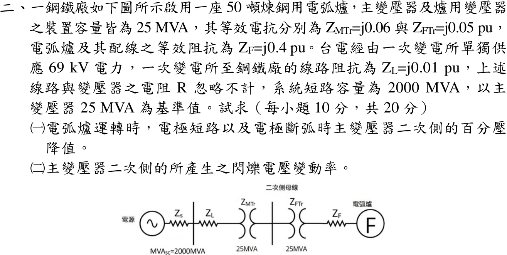

# 114 年工業配電第 2 題｜電弧爐壓降與閃爍電壓變動

## 已知與所求

基準 \(25\,\mathrm{MVA}\)；系統短路容量 \(2000\,\mathrm{MVA}\)，\(Z_L=j0.01\)、\(Z_{MTr}=j0.06\)、\(Z_{FTr}=j0.05\)、電弧爐及其配線 \(Z_F=j0.4\,\mathrm{pu}\)，電阻忽略。圖示串聯順序：電源—\(Z_s\)—\(Z_L\)—主變—二次側母線—爐變—\(Z_F\)—爐 F。求（一）電極短路與斷弧時主變二次側百分壓降；（二）二次側閃爍電壓變動率。

本題 \(Z_F\) 在電極短路時剩餘多少未明定，以下為條件主解，見「條件與疑義」。

## 考場標準作答

### （一）百分壓降

\(X_s=25/2000=0.0125\,\mathrm{pu}\)。量測點上游、下游電抗：
\[
X_u=0.0125+0.01+0.06=0.0825,\qquad X_d=0.05+0.4=0.45\ \mathrm{pu}
\]
電極短路（電弧電壓為零、\(Z_F\) 全數保留），取 \(\underline E=1\angle0^\circ\)：
\[
\underline I_{sc}=\frac1{j0.5325}=-j1.87793\,\mathrm{pu},\qquad
\underline V_2=1-\underline I_{sc}(j0.0825)=0.84507\,\mathrm{pu}
\]
電極短路時壓降 \(\boxed{15.49\%}\)；斷弧時 \(I=0\)、\(V_2=1\,\mathrm{pu}\)，壓降 \(\boxed{0\%}\)。

### （二）閃爍電壓變動率

以額定電壓為分母，兩狀態電壓差：
\[
\boxed{\Delta V\%=\frac{1-0.84507}{1}\times100\%=15.49\%}
\]
此為最大電壓變動率，不是閃爍嚴重度 \(P_{st}\)。

## 驗算

下游分壓：\(V_2=\dfrac{j0.45}{j0.5325}=0.84507\,\mathrm{pu}\)；\(IX_u+IX_d=1.87793(0.0825+0.45)=1.0000\,\mathrm{pu}\)，KVL 成立。

## 失分點

- \(X_s\) 寫成 \(2000/25\)，或未換到 \(25\,\mathrm{MVA}\) 共同基準。
- 把爐變算在量測點上游；量測點在主變二次側，分子只含 \(X_s+X_L+X_{MTr}\)。
- 把母線電壓誤當電極電壓；短路時電極電壓為零，母線電壓為 \(0.845\,\mathrm{pu}\)。

## 條件與疑義

原題稱 \(Z_F\) 為「電弧爐及其配線之等效阻抗」，未拆分固定配線與隨電弧狀態改變的部分，因此不能據此宣稱唯一答案。官方圖將 \(Z_F\) 畫在爐 F 前方，且沒有畫出繞過 \(Z_F\) 的短接支路，支持全部保留的條件主解 \(15.49\%\)（總電抗 \(0.5325\,\mathrm{pu}\)）。

令短路時剩餘電抗為 \(X_{F,sc}\)，共同式為
\[
\Delta V\%=\frac{0.0825}{0.0825+0.05+X_{F,sc}}\times100\%
\]
\(X_{F,sc}=0.4\) 得 \(15.49\%\)；\(X_{F,sc}=0\) 得 \(62.26\%\)。兩值都不是取得官方評分答案；取得 \(Z_F\) 的短路定義後應依該證據定案。
