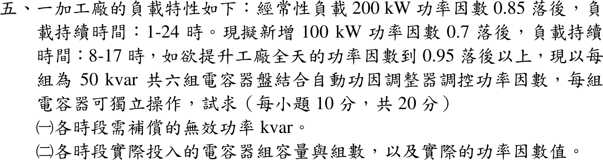

# 114 年工業配電第 5 題｜APFR 電容器分段投入

## 已知與所求

經常性負載 \(200\,\mathrm{kW}\)、PF \(0.85\) 落後（1–24 時）；新增 \(100\,\mathrm{kW}\)、PF \(0.7\) 落後（8–17 時）。目標全天 PF \(\ge0.95\) 落後；電容器 \(6\times50\,\mathrm{kvar}\) 可獨立投切。求（一）各時段需補償 kvar；（二）各時段實際投入組數、容量與實際 PF。

## 考場標準作答

### （一）需補償無效功率

\(\tan\theta_t=\tan(\cos^{-1}0.95)=0.32868\)，\(\tan(\cos^{-1}0.85)=0.61974\)，\(\tan(\cos^{-1}0.7)=1.02020\)。

8–17 時以外（\(P=200\,\mathrm{kW}\)）：
\[
Q_c=200(0.61974-0.32868)=\boxed{58.21\,\mathrm{kvar}}
\]
8–17 時（\(P=300\,\mathrm{kW}\)，\(Q=123.95+102.02=225.97\,\mathrm{kvar}\)）：
\[
Q_c=225.97-300(0.32868)=\boxed{127.36\,\mathrm{kvar}}
\]

### （二）實際投入與 PF

取不小於需求的最少組數（且不過補償）：

8–17 時以外：投 \(\boxed{2\text{ 組}=100\,\mathrm{kvar}}\)，\(Q'=123.95-100=23.95\,\mathrm{kvar}\)，
\[
\mathrm{PF}=\frac{200}{\sqrt{200^2+23.95^2}}=\boxed{0.9929\text{ 落後}}
\]
8–17 時：投 \(\boxed{3\text{ 組}=150\,\mathrm{kvar}}\)，\(Q'=225.97-150=75.97\,\mathrm{kvar}\)，
\[
\mathrm{PF}=\frac{300}{\sqrt{300^2+75.97^2}}=\boxed{0.9694\text{ 落後}}
\]

## 驗算

少投一組：200 kW 時 \(Q'=73.95\)，PF \(=0.9379<0.95\)；300 kW 時 \(Q'=125.97\)，PF \(=0.9220<0.95\)。故 2 組、3 組為最少組數，且 \(Q'>0\) 未過補償。

## 失分點

- 8–17 時只算新增 100 kW 的 kvar，漏掉原 200 kW 的 \(123.95\,\mathrm{kvar}\)。
- 把 \(127.36\) 四捨五入成 2 組（100 kvar），PF 僅 \(0.922\)，未達 0.95。
- 只答理論 kvar，未答實際組數與投入後 PF。
