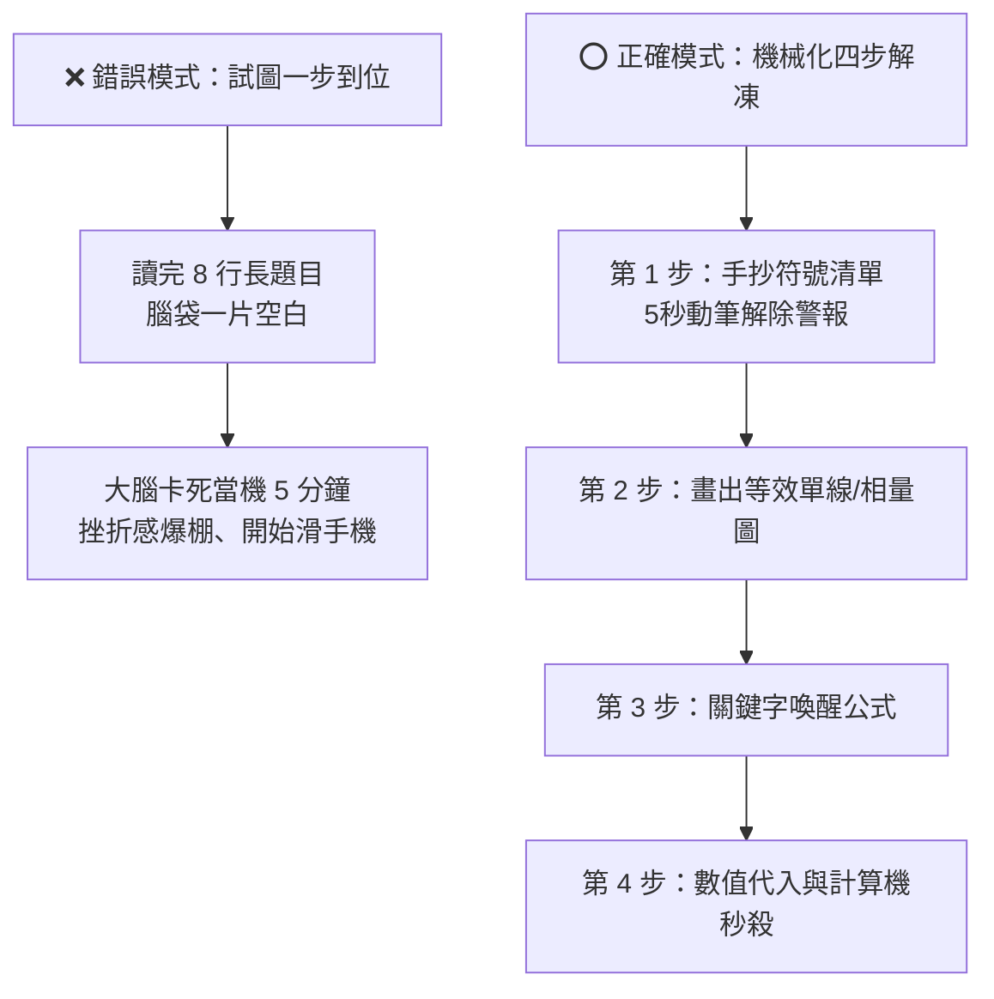

# 💡 電機工程技師 — 看到題目「不再發呆」的秒解破題 SOP 與速效備考法

> **寫在前面**：
> 「看到題目發呆 5 分鐘」**是 99% 上班族工程師剛開始備考時都會經歷的正常大腦保護機制！**
> 這不是因為你笨，而是因為你的大腦試圖「從題目文字一口氣跳到最終答案」，造成瞬間認知超載（Cognitive Overload）而當機。
> 頂尖考生的解題從來不是靠現場臨場發揮，而是靠**「標準化肌肉反射 SOP」**！

---

## 🛑 為什麼會發呆？大腦當機的 3 大真凶

---

## ⚡ 破解發呆：考場必備的「下意識 4 步解凍 SOP」

拿到任何一道題目（不論多長多複雜），**強迫自己立刻執行以下 4 步，一秒都不要猶豫思考**：

### 第 1 步：抄錄物理量符號清單（5 秒動筆・手動破冰）
- **不要去想怎麼解！只要把題目裡的數字轉成代數符號抄在計算紙左側**：
  - 看見「額定 100 MVA, 24 kV」 ➔ 寫下 $S_{base} = 100\text{ MVA}, V_{base} = 24\text{ kV}$
  - 看見「感抗 0.2 pu」 ➔ 寫下 $X_d'' = 0.20\text{ pu}$
  - 看見「負載 150 MW，功因 0.8 落後」 ➔ 寫下 $P = 150\text{ MW}, \theta = -\cos^{-1}(0.8) = -36.87^\circ, \mathbf{S} = 150 + j112.5\text{ MVA}$
- 💡 **心理學原理**：只要筆尖接觸紙張開始寫字，大腦的恐懼中樞（杏仁核）就會解除警報，理性運算區立刻被強行喚醒！

---

### 第 2 步：畫出「等效簡圖 / 單線圖 / 相量圖」（視覺化定錨）
- 電機考試 $85\%$ 的題目本質上都可以簡化為 **「電源 $E \to$ 阻抗 $jX \to$ 端電壓 $V$」**：
  - 遇到電力潮流 ➔ 畫兩顆圓圈（Bus 1, Bus 2）中間拉一條線寫 $y_{12} = -j10$。
  - 遇到變壓器 ➔ 畫兩條平行線與漏電抗 $X_T$。
  - 遇到故障分析 ➔ 畫出戴維寧等效電壓源 $V_f$ 串聯等效阻抗 $Z_{th}$。
- 💡 **只要圖畫出來，公式就會直接從圖上跳出來！**

---

### 第 3 步：關鍵字「條件反射」調用公式模組（見招拆招）
將題目中的關鍵字，直接對應到你腦中的核心公式小抄：

| 題目出現的關鍵字 | 大腦第一秒必須反射的「核心公式」 |
| :--- | :--- |
| **發電機 + 功角 $\delta$** | $P = \frac{EV}{X}\sin\delta, \quad Q = \frac{EV\cos\delta - V^2}{X}$ |
| **三相短路故障 / 戴維寧** | $I_f = \frac{V_f}{Z_{th} + Z_f}, \quad V_i^{(f)} = V_f - Z_{ik} I_f$ |
| **單線接地故障 (SLG)** | 序網路串聯：$I_{a1} = \frac{V_f}{Z_1 + Z_2 + Z_0 + 3Z_n}, \quad I_f = 3I_{a1}$ |
| **線間短路故障 (L-L)** | 正負序並聯：$I_{a1} = \frac{V_f}{Z_1 + Z_2}, \quad I_f = \sqrt{3}|I_{a1}|$ |
| **經濟調度 / 燃料成本** | 等微增準則：$\text{IC}_1 = \text{IC}_2 = \lambda, \quad \sum P_{Gi} = P_D + P_L$ |
| **暫態穩定度 / 等面積準則** | 加速面積 = 減速面積：$\int_{\delta_0}^{\delta_{cr}} (P_m - P_{e2}) d\delta = \int_{\delta_{cr}}^{\delta_{max}} (P_{e3} - P_m) d\delta$ |
| **調速機 / 速度調節率 $R$** | $\beta = \frac{S_{rated}}{R \cdot f_0}\ (\text{MW/Hz}), \quad \Delta P = -\beta \Delta f$ |
| **變壓器分接頭 $a:1$** | $Y_{11} = y/a^2, \quad Y_{12} = Y_{21} = -y/a, \quad Y_{22} = y$ |
| **長程輸電線 ABCD** | $A = \cosh(\gamma l), \quad B = Z_c \sinh(\gamma l), \quad Z_c = \sqrt{z/y}, \quad \gamma = \sqrt{zy}$ |

---

### 第 4 步：數值代入與 CASIO 計算機極速連按
- 列出純代數式 ➔ 代入數值 ➔ 按出答案並加上**正確物理單位（$\text{MW}, \text{Mvar}, \text{kA}, \Omega, \angle\theta^\circ$）**。

---

## 🏃 上班族 3 階段「無痛脫敏」刷題法（從發呆到秒解）

### 階段一：開卷抄寫推導法（前 2 ~ 3 週・建立肌肉記憶）
* **做法**：**不要強迫自己空想！**
  - 看到題目如果 30 秒內沒想法，**立刻大方打開我們的【旗艦版題解】**。
  - 拿出計算紙，**親手從第一行字、第一條算式「手抄推導到最後一個數字」**。
  - 邊抄邊在心裡問自己：「為什麼這一步要除以 $\sqrt{3}$？」「為什麼共軛電流的角度要變號？」。
* **效果**：抄完 20 題，大腦就會形成強大的工程神經迴路，徹底治好發呆症！

### 階段二：半遮半掩填空法（第 4 ~ 6 週・半自主推導）
* **做法**：
  - 遮住詳解的【計算推導過程】，只看【題目】與【核心考點】提示。
  - 自己在紙上列出關鍵的 2 條方程式，然後才看解答核對。
  - 只要方程式列對，計算機按下去就過關！

### 階段三：限時全真盲推法（考前 1 個月・考場無敵）
* **做法**：
  - 隨機抽 1 卷（4~5 題），設定手機倒數計時 100 分鐘。
  - 完全不看書，全靠肌肉記憶與計算機秒殺。
