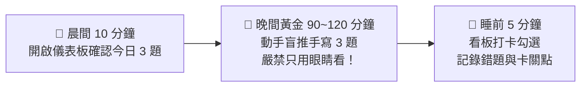

# 🏆 電機工程技師 — 每日上榜作戰追蹤看板（消除怠惰・勝率最大化）

> **作戰誓言**：
> 「技師執照是通往國際大型專案與澳洲高薪的第一張骨牌。每天前進 3 題，絕不拖延，一戰定乾坤！」

---

## 📊 全科 321 題 攻堅進度即時儀表板

| 考科名稱 | 總官方題數 | 今日目標題數 | 目前已攻克題數 | 掌握進度百分比 | 狀態燈號 |
| :--- | :---: | :---: | :---: | :---: | :---: |
| **01. 電路學** | 48 題 | 3 題 / 日 | 0 / 48 | 0.0% | ⚪ 待啟動 |
| **02. 電子學（含電力電子）** | 49 題 | 3 題 / 日 | 0 / 49 | 0.0% | ⚪ 待啟動 |
| **03. 工程數學** | 64 題 | 3 題 / 日 | 0 / 64 | 0.0% | ⚪ 待啟動 |
| **04. 電機機械** | 58 題 | 3 題 / 日 | 0 / 58 | 0.0% | ⚪ 待啟動 |
| **05. 電力系統** | 49 題 | 3 題 / 日 | 0 / 49 | 0.0% | 🟡 核心攻堅中 |
| **06. 工業配電** | 53 題 | 3 題 / 日 | 0 / 53 | 0.0% | ⚪ 待啟動 |
| **🔥 全庫總計** | **321 題** | **每日 3~5 題** | **0 / 321** | **0.0%** | 🚀 **即刻啟動** |

---

## ⏰ 每日「消除怠惰」3 步作戰節奏（Daily Discipline Protocol）

1. **🌅 晨間/通勤 10 分鐘（建立大腦預期）**：
   - 打開 [⚡ 知識庫儀表板 (index.html)](file:///Users/a/技師考試/歷屆試題_104-114年/index.html)，快速掃過今日預計練習的 3 道題目題目與電路圖，讓大腦潛意識在白天思考解題架構。
2. **🌆 晚間黃金 90 ~ 120 分鐘（動筆實戰盲推）**：
   - **核心鐵律**：**「絕對不要只用眼睛看詳解！」** 拿出計算紙與 CASIO 計算機，先遮住解答自己動手從第一步推導到最後數值。
   - 若遇到卡關 $\ge 15$ 分鐘，立刻打開對應詳解或隨時在對話中呼叫我深度剖析。
3. **🌙 睡前 5 分鐘（進度同步與錯題打卡）**：
   - 在下方日誌表中勾選完成題號，寫下 1 句今日心得或錯題盲點。

---

## 📅 本週攻堅衝刺任務日誌表（週計劃範例）

### 🗓️ 第一週：電力系統 & 工業配電 核心突破（114 ~ 110 年）

- [ ] **Day 1（週一）**：【電力系統】114 年 第 1、2 題（交流相量、二匯流排 NR 潮流 PV 轉 PQ）
  - *心得記錄/錯題註記*：
- [ ] **Day 2（週二）**：【電力系統】114 年 第 3、4、5 題（火力經濟調度、戴維寧短路阻抗、轉子搖擺方程）
  - *心得記錄/錯題註記*：
- [ ] **Day 3（週三）**：【電力系統】113 年 第 1、2 題（三相並聯負載阻抗、同步機短路次暫態電流）
  - *心得記錄/錯題註記*：
- [ ] **Day 4（週四）**：【電力系統】113 年 第 3、4 題（容量約束經濟調度、調速機速度調節率 $\beta$）
  - *心得記錄/錯題註記*：
- [ ] **Day 5（週五）**：【電力系統】112 年 第 1、2 題（四分裂導線 GMD/GMR 電感電容、調度係數反求）
  - *心得記錄/錯題註記*：
- [ ] **Day 6（週六 - 加速日）**：【電力系統】112 年 第 3、4 題 + 111 年 第 1、2 題（分接頭 $\mathbf{Y}_{bus}$、等面積 $\delta_{cr}$、串聯補償、$\mathbf{Z}_{bus}$ 短路）
  - *心得記錄/錯題註記*：
- [ ] **Day 7（週日 - 錯題週復盤）**：重新盲寫本週 6 天內有任何卡關或猶豫的題目，確保 $100\%$ 零猶豫秒解！

---

## 🛑 克服怠惰的三大心理防線（Procrastination Killers）

1. **「兩分鐘啟動法則」**：
   - 當晚上不想讀書時，告訴自己：「我只坐下來寫第一小題的已知條件與相量圖，寫完 2 分鐘就可以停。」通常只要一旦動筆，大腦就會自然進入解題心流！
2. **「零零碎碎也是分」**：
   - 加班太累時，不需要強求一次讀 3 小時；哪怕只算 1 題電力系統短路電流，今天就是前進了一步！
3. **「隨時呼叫 AI 陪練教練」**：
   - 任何時候覺得題目卡住、心情浮躁或想偷懶，直接在對話中輸入：  
     👉 **「我今天想練 3 題，請出題盯我！」** 或 **「`/grill-me` 抽測我剛讀完的題目觀念！」**  
     我會立刻化身您的專屬總教練，陪您一步一步推導完成！
