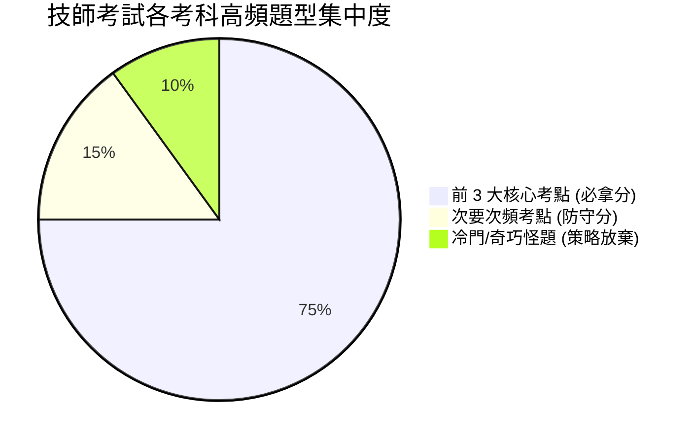
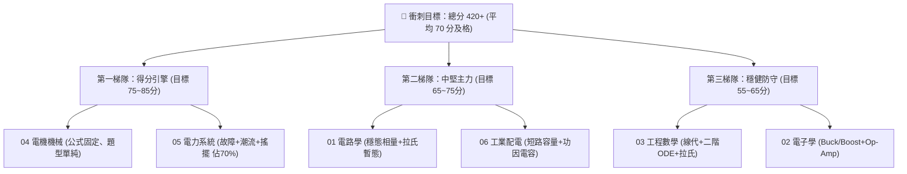

# 📊 電機工程技師 — 6 大考科 11 年（104 ~ 114 年）高頻考點統計與命題規律分析

> **統計樣本**：民國 104 年至 114 年（共 11 個年度、66 份完整試卷、330 道大題）  
> **及格門檻**：總分 600 分，平均 60 分及格（不論各科最低分限制，無單科 0 分即可）  
> **備考核心戰略**：掌握各科**前 3 大高頻考點（佔分 $70\% \sim 80\%$）**，即可穩拿 $65 \sim 75$ 分輕鬆跨過及格線！

---

## 🧭 6 大考科 80/20 投報率與命題核心總覽表

| 考科代號與名稱 | 每年題數 | 前三大核心考點佔比 | 投資報酬率 | 備考黃金目標 | 核心破局關鍵 |
| :--- | :---: | :---: | :---: | :---: | :--- |
| **01. 電路學** | 5 題 / 100分 | **$69.1\%$** | ⭐⭐⭐⭐⭐ (極高) | **$75 \sim 85$ 分** | 熟練交流穩態相量、二階暫態拉氏轉換、三相功率。 |
| **02. 電子學（含電力電子）** | 5 題 / 100分 | **$72.7\%$** | ⭐⭐⭐⭐ (高) | **$55 \sim 65$ 分** | 鎖定 Buck/Boost 轉換器、Op-Amp 放大器，掌握基本分。 |
| **03. 工程數學** | 5 題 / 100分 | **$72.8\%$** | ⭐⭐⭐⭐ (高) | **$60 \sim 70$ 分** | 拿下矩陣線性代數、二階 ODE 與拉氏轉換。 |
| **04. 電機機械** | 5 題 / 100分 | **$76.4\%$** | ⭐⭐⭐⭐⭐ (最高) | **$70 \sim 80$ 分** | 變壓器等效電路、感應機戴維寧轉矩、同步機相量圖。 |
| **05. 電力系統** | 5 題 / 100分 | **$70.9\%$** | ⭐⭐⭐⭐⭐ (最高) | **$70 \sim 80$ 分** | 對稱成分故障計算、電力潮流牛頓法、搖擺方程等面積。 |
| **06. 工業配電** | 5 題 / 100分 | **$70.9\%$** | ⭐⭐⭐⭐⭐ (極高) | **$65 \sim 75$ 分** | 標么短路電流與啟斷容量、功因改善電容、壓降計算。 |

---

## ⚡ 01. 電路學（Circuit Theory）

* **總題數統計**：55 題（每年 5 題，每題 20 分）
* **考點分佈與出現頻率**：

| 排名 | 核心考點模組 | 11年出現次數 | 佔總題數比 | 出題頻率與考驗年度 | 滿分必備公式與考點核心 |
| :---: | :--- | :---: | :---: | :--- | :--- |
| **1** | **交流穩態、相量、功率與功因改善** | **14 次** | **$25.5\%$** | ⭐⭐⭐⭐⭐ (每年必考 1~2 題) `104~114 年年出現` | $\mathbf{S} = \mathbf{V}\mathbf{I}^* = P + jQ$ 功因改善：$Q_c = P(\tan\theta_1 - \tan\theta_2)$ 最大功率轉移：$\mathbf{Z}_L = \mathbf{Z}_{th}^*$ |
| **2** | **一階與二階暫態響應與拉氏轉換** | **13 次** | **$23.6\%$** | ⭐⭐⭐⭐⭐ (每年必考 1~2 題) `104~114 年年出現` | 三要素公式：$x(t) = x(\infty) + [x(0^+) - x(\infty)]e^{-t/\tau}$ $s$ 域等效模型（電感 $sL$ 並/串初始值，電容 $1/sC$） |
| **3** | **三相平衡與不平衡電路、二瓦特計法** | **11 次** | **$20.0\%$** | ⭐⭐⭐⭐ (幾乎年年考) `114, 113, 111, 110, 109, 108, 107, 106, 104` | 線/相電壓關係：$V_L = \sqrt{3}V_\phi \angle 30^\circ$ 二瓦特計法：$P_{3\phi} = W_1 + W_2, \ Q_{3\phi} = \sqrt{3}(W_1 - W_2)$ |
| **4** | **直流電路、節點/迴路法與戴維寧等效** | **9 次** | **$16.4\%$** | ⭐⭐⭐⭐ (高頻基礎題) `114, 112, 110, 109, 108, 107, 106, 105` | 節點電壓法矩陣形式、戴維寧等效電阻（外加測試電源法 $V_{test}/I_{test}$） |
| **5** | **雙埠網路矩陣（Z/Y/h/ABCD）與頻率共振** | **8 次** | **$14.5\%$** | ⭐⭐⭐ (輪流出題) `113, 111, 109, 108, 106, 105, 104` | 串聯共振 $\omega_0 = 1/\sqrt{LC}$、品質因數 $Q = \omega_0 L / R$ 雙埠參數互換與對稱/互易條件 |

---

## 📻 02. 電子學（包括電力電子學）

* **總題數統計**：55 題（傳統電子學佔 $40\%$，電力電子學佔 $60\%$）
* **考點分佈與出現頻率**：

| 排名 | 核心考點模組 | 11年出現次數 | 佔總題數比 | 出題頻率與考驗年度 | 滿分必備公式與考點核心 |
| :---: | :--- | :---: | :---: | :--- | :--- |
| **1** | **電力電子 DC-DC 轉換器 (Buck / Boost / Buck-Boost)** | **18 次** | **$32.7\%$** | ⭐⭐⭐⭐⭐ (近 5 年第一大題型！每年 1~2 題) `105~114 年年出現` | 伏秒平衡法與電荷平衡法 Buck：$V_o = D V_d$；Boost：$V_o = \frac{V_d}{1-D}$ 電感漣波電流 $\Delta I_L = \frac{V_d - V_o}{L} D T_s$ |
| **2** | **運算放大器應用電路 (Op-Amp & Active Filters)** | **12 次** | **$21.8\%$** | ⭐⭐⭐⭐⭐ (送分主力・幾乎年年考) `114, 113, 112, 110, 109, 108, 107, 106, 104` | 虛擬短路 $v_+ = v_-$ 與虛擬斷路 $i_+ = i_- = 0$ 差動放大器、儀表放大器、反相/非反相積分器 |
| **3** | **電力電子整流器與變流器 (Rectifier & Inverter / SPWM)** | **10 次** | **$18.2\%$** | ⭐⭐⭐⭐ (電力組核心) `114, 113, 111, 109, 108, 107, 105, 104` | 全橋整流平均輸出：$V_{dc} = \frac{2V_m}{\pi}\cos\alpha$ SPWM 調變比 $m_a = \hat{V}_{control}/\hat{V}_{tri}$、$V_{o1,rms} = \frac{m_a V_{dc}}{2\sqrt{2}}$ |
| **4** | **BJT 與 MOSFET 小訊號放大電路** | **9 次** | **$16.4\%$** | ⭐⭐⭐ (傳統必修題) `112, 110, 108, 107, 106, 105, 104` | 跨導 $g_m = I_C/V_T$ 或 $2\sqrt{k I_D}$、小訊號模型 ($r_\pi, g_m v_\pi$) 共射/共源電壓增益 $A_v = -g_m R_L'$ |
| **5** | **CMOS 數位電路、頻率響應與回授安定度** | **6 次** | **$10.9\%$** | ⭐⭐ (防守型考點) `111, 109, 106, 105` | CMOS 靜態/動態功耗 $P = f C V_{DD}^2$ 密勒效應等效電容 $C_M = C(1 - A_v)$ |

---

## 📐 03. 工程數學（Engineering Mathematics）

* **總題數統計**：55 題（每年 5 題，每題 20 分）
* **考點分佈與出現頻率**：

| 排名 | 核心考點模組 | 11年出現次數 | 佔總題數比 | 出題頻率與考驗年度 | 滿分必備公式與考點核心 |
| :---: | :--- | :---: | :---: | :--- | :--- |
| **1** | **線性代數：矩陣、線性方程組、特徵值對角化與 SVD** | **16 次** | **$29.1\%$** | ⭐⭐⭐⭐⭐ (近 5 年出題率第一！每年必考 1~2 題) `104~114 年年出現` | 特徵方程 $\det(\mathbf{A} - \lambda\mathbf{I}) = 0$ 零空間 (Null Space) 與自由變數求解 奇異值分解：$\mathbf{A} = \mathbf{U}\mathbf{\Sigma}\mathbf{V}^T$ |
| **2** | **常微分方程 ODE (1st & 2nd Order Linear ODE, Cauchy-Euler)** | **14 次** | **$25.5\%$** | ⭐⭐⭐⭐⭐ (基本盤必拿！每年 1 題) `104~114 年年出現` | 二階特徵根（實根、重根、複數根）齊次解 $y_h$ 待定係數法/參數變更法求特解 $y_p$ 尤拉-柯西方程：令 $x = e^t$ 降階 |
| **3** | **拉氏轉換及其在微分方程/系統之應用** | **10 次** | **$18.2\%$** | ⭐⭐⭐⭐ (解系統強大工具) `114, 112, 110, 109, 108, 106, 105, 104` | $\mathcal{L}\{f'(t)\} = sF(s) - f(0)$ 單位步階函數 $u(t-a)$ 與頻移/時移定理 部分分式展開法求反轉換 |
| **4** | **複變函數、圍道積分與留數定理 (Residue Theorem)** | **8 次** | **$14.5\%$** | ⭐⭐⭐ (拉開分數關鍵題) `113, 111, 109, 107, 106, 104` | 柯西-黎曼方程式 (C-R Equation) 留數定理：$\oint_C f(z)dz = 2\pi j \sum \text{Res}(f, z_k)$ |
| **5** | **傅立葉級數/轉換、向量微積分與 PDE** | **7 次** | **$12.7\%$** | ⭐⭐⭐ (輪流出現) `113, 111, 108, 107, 105` | 傅立葉級數係數 $a_0, a_n, b_n$ 散度定理 (Divergence) 與斯托克斯定理 (Stokes) |

---

## ⚙️ 04. 電機機械（Electric Machinery）

* **總題數統計**：55 題（每年 5 題，每題 20 分）
* **考點分佈與出現頻率**：

| 排名 | 核心考點模組 | 11年出現次數 | 佔總題數比 | 出題頻率與考驗年度 | 滿分必備公式與考點核心 |
| :---: | :--- | :---: | :---: | :--- | :--- |
| **1** | **變壓器：實體等效電路、自耦變壓器、試驗與效率** | **15 次** | **$27.3\%$** | ⭐⭐⭐⭐⭐ (投報率之王・每年必考 1~2 題) `104~114 年年出現` | 自耦變壓器容量放大：$S_{auto} = \frac{V_H}{V_H - V_X} S_{2w}$ 開路試驗 ($R_c, X_m$)、短路試驗 ($R_{eq}, X_{eq}$) 電壓調整率：$\text{VR} = R_{pu}\cos\theta + X_{pu}\sin\theta$ |
| **2** | **三相感應電動機：戴維寧等效、轉矩-轉差率曲線與啟動** | **14 次** | **$25.5\%$** | ⭐⭐⭐⭐⭐ (每年必考 1~2 題) `104~114 年年出現` | 轉差率 $s = \frac{n_s - n_r}{n_s}$、功率流向 ($P_{in} \to P_{ag} \to P_{conv} \to P_{out}$) 最大轉矩轉差率：$s_{max} = \frac{R_2'}{\sqrt{R_{TH}^2 + X_{eq}^2}}$ |
| **3** | **同步電機：相量圖、短路比 SCR、功角特性與 V 形曲線** | **13 次** | **$23.6\%$** | ⭐⭐⭐⭐⭐ (每年必考 1 題) `104~114 年年出現` | 內生電壓：$\mathbf{E}_f = \mathbf{V}_\phi + \mathbf{I}_a(R_a + jX_s)$ 短路比 $\text{SCR} = 1/X_s(pu)$ 凸極機雙反應理論 ($I_d, I_q, X_d, X_q$) |
| **4** | **直流電機：反電動勢常數、轉矩平衡與調速控制** | **9 次** | **$16.4\%$** | ⭐⭐⭐⭐ (標準高頻題) `104~113 年年出現` | $E_a = K\Phi\omega_m = V_t - I_a R_a$、$T = K\Phi I_a$ 降壓調速（額定轉速以下）、弱磁調速（額定轉速以上） |
| **5** | **磁路基礎定律、電磁吸力與磁阻/特殊馬達** | **4 次** | **$7.2\%$** | ⭐⭐⭐ (近年新興熱門題) `114, 111, 110, 106, 104` | 磁阻：$\mathcal{R} = \frac{l}{\mu A}$、電感：$L = \frac{N^2}{\mathcal{R}}$ 電磁吸力：$F = \frac{B^2 A}{2\mu_0}$、磁阻轉矩：$T = -\frac{1}{2}\Phi^2 \frac{d\mathcal{R}}{d\theta}$ |

---

## 🏢 05. 電力系統（Power Systems）

* **總題數統計**：55 題（每年 5 題，每題 20 分）
* **考點分佈與出現頻率**：

| 排名 | 核心考點模組 | 11年出現次數 | 佔總題數比 | 出題頻率與考驗年度 | 滿分必備公式與考點核心 |
| :---: | :--- | :---: | :---: | :--- | :--- |
| **1** | **對稱成分法與故障分析 (3-Phase, SLG, L-L, 2LG)** | **16 次** | **$29.1\%$** | ⭐⭐⭐⭐⭐ (第一殺手級考點！每年必考 1~2 題) `104~114 年年出現` | 三相短路：$I_f = V_f / Z_1$ 單線接地 (SLG)：$I_{a1} = \frac{V_f}{Z_1 + Z_2 + Z_0 + 3Z_n}$ 線間短路 (L-L)：$I_{a1} = \frac{V_f}{Z_1 + Z_2}$ |
| **2** | **電力潮流與導納矩陣 (Ybus, Newton-Raphson & FDLF)** | **12 次** | **$21.8\%$** | ⭐⭐⭐⭐⭐ (每年必考 1 題) `114, 113, 112, 110, 109, 107, 106, 105, 104` | 帶分接頭變壓器 $a:1$ 之 $\mathbf{Y}_{bus}$ 元素建立 牛頓法 Jacobian 矩陣 $\mathbf{J}$ 計算 快速解耦法 (FDLF)：$\Delta\boldsymbol{\theta} = -[\mathbf{B}']^{-1}[\Delta\mathbf{P}/|V|]$ |
| **3** | **發電機功角特性、搖擺方程式與暫態穩定度 (Equal Area)** | **11 次** | **$20.0\%$** | ⭐⭐⭐⭐⭐ (每年必考 1 題) `114, 113, 110, 109, 108, 107, 106, 105, 104` | 搖擺方程式：$M\frac{d^2\delta}{dt^2} = P_m - P_e = P_m - P_{max}\sin\delta$ 等面積準則求臨界清除角：$\int_{\delta_0}^{\delta_c} (P_m - P_{e1})d\delta = \int_{\delta_c}^{\delta_{max}} (P_{e2} - P_m)d\delta$ |
| **4** | **發電機最佳經濟調度 (Economic Dispatch with/without Loss)** | **9 次** | **$16.4\%$** | ⭐⭐⭐⭐ (送分主力) `114, 112, 110, 109, 107, 106, 104` | 等微增燃料成本準則：$\text{IC}_1 \cdot L_1 = \text{IC}_2 \cdot L_2 = \dots = \lambda$ 懲罰因數：$L_i = \frac{1}{1 - \frac{\partial P_L}{\partial P_i}}$ |
| **5** | **輸電線模型（短/中/長程 ABCD）與負載頻率控制 (LFC)** | **7 次** | **$12.7\%$** | ⭐⭐⭐ (輪替出現) `113, 111, 108, 106, 105` | 輸電線 ABCD 參數矩陣、突波阻抗負載 $\text{SIL} = V_L^2 / Z_c$ 調速機下垂特性 (Droop) 與系統頻率偏差 $\Delta f$ |

---

## 🏭 06. 工業配電（Industrial Power Distribution）

* **總題數統計**：55 題（每年 5 題，每題 20 分）
* **考點分佈與出現頻率**：

| 排名 | 核心考點模組 | 11年出現次數 | 佔總題數比 | 出題頻率與考驗年度 | 滿分必備公式與考點核心 |
| :---: | :--- | :---: | :---: | :--- | :--- |
| **1** | **工廠短路電流計算與斷路器啟斷容量選定 (Short Circuit)** | **16 次** | **$29.1\%$** | ⭐⭐⭐⭐⭐ (第一大題型！佔分 30%) `104~114 年年出現` | 標么法短路容量：$S_{sc} = \frac{S_{base}}{X_{pu,total}}$ (MVA) 三相對稱短路電流：$I_{sc} = \frac{S_{sc}}{\sqrt{3}V_L}$ 感應電動機短路反饋電流貢獻 ($4\sim 6 I_{FL}$) |
| **2** | **功率因數改善、並聯電容器計算與諧波抑制 (PF & Harmonics)** | **13 次** | **$23.6\%$** | ⭐⭐⭐⭐⭐ (每年必考 1 題) `105~114 年年出現` | 電容器容量：$Q_c = P(\tan\theta_1 - \tan\theta_2)$ 串聯電抗器 $6\%$ 抑制 5 次諧波，防止與系統並聯諧振 |
| **3** | **電壓降與導線線徑選定計算 (Voltage Drop & Feeder Sizing)** | **10 次** | **$18.2\%$** | ⭐⭐⭐⭐ (實務計算必備) `113, 111, 110, 109, 108, 107, 105, 104` | 三相三線/四線壓降：$\Delta V = \sqrt{3} I (R\cos\theta + X\sin\theta)$ 法規限制：幹線壓降率 $< 3\%$，分路壓降率 $< 2\%$，合計 $< 5\%$ |
| **4** | **工廠負載特性、契約容量與需量管理 (Load Factor & Demand)** | **9 次** | **$16.4\%$** | ⭐⭐⭐⭐ (概念與計算兼備) `114, 112, 110, 108, 107, 106, 104` | 負載因數 $\text{LF} = \frac{P_{avg}}{P_{max}} \times 100\%$ 參差因數 $\text{DF} = \frac{\sum P_{max,i}}{P_{max,sys}} > 1$（永遠大於 1） 需量因數 $\text{Demand Factor} = \frac{P_{max}}{\text{Connected Load}}$ |
| **5** | **過電流保護協調 (CO / LVI) 標置與接地工程 (Grounding)** | **7 次** | **$12.7\%$** | ⭐⭐⭐ (工程實務關鍵題) `114, 113, 109, 108, 106, 105` | 電驛動作時間反時限方程式：$t = \text{TDM} \times \left( \frac{A}{(I/I_p)^p - 1} + B \right)$ 前後級保護時間差 (CTI) 常取 $0.3 \sim 0.4\text{ s}$ 特種/第一種/第二種接地電阻規範 |

---

## 🎯 衝刺最後 90 天：拿分效率最大化「搶分作戰策略」

1. **每天 60% 時間給「第一梯隊」【電機機械】+【電力系統】**：
   * 這兩科題型高度標準化（變壓器等效、感應機轉矩、同步機功角、三相/SLG故障、電力潮流、搖擺方程），只要做完 104~114 年這 110 道題目，考場上 $80\%$ 都是看過的題型！
2. **用計算機 E-MORE fx-127 達到極速相量運算**：
   * 在電路學、電力系統、工業配電中，善用 `[a]`、`[b]`、`[2ndF][→rθ]`、`[2ndF][→xy]`，節省手算開根號與 arctan 時間，每題可省下 5~8 分鐘！
3. **策略性放棄極端冷門題**：
   * 如工數偏微分方程 (PDE)、電子學高階雙極性振盪器、電路學複雜非線性時變電路，遇到先跳過，將時間集中於前三大高頻考點確保 100% 算對！
